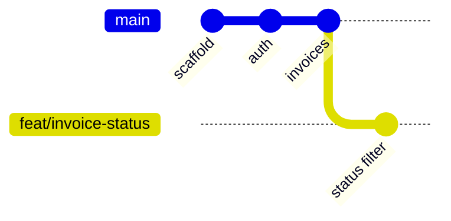
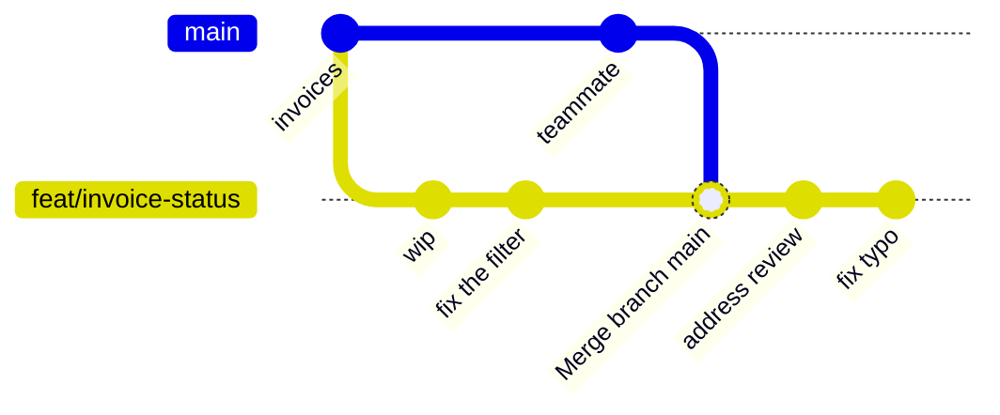
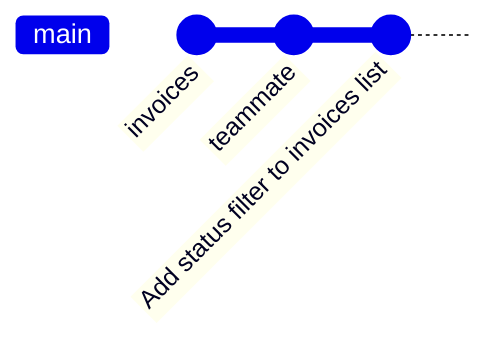
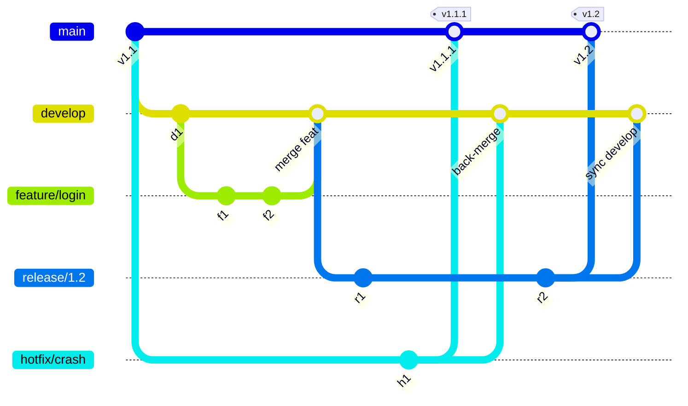
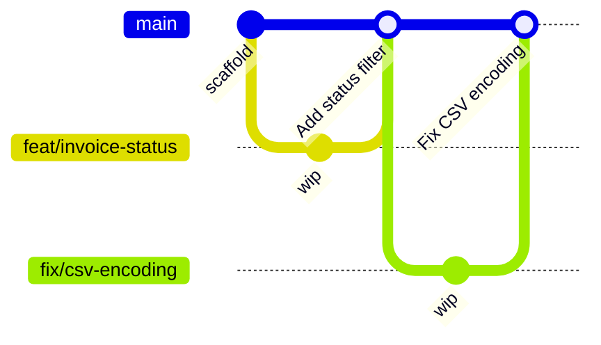

import CourseProgressBar from '../../../components/ui/CourseProgressBar.astro';
import Figure from '../../../components/figures/Figure.astro';
import { Steps } from '@astrojs/starlight/components';
import { CardGrid } from '@astrojs/starlight/components';
import Term from '../../../components/ui/Term.astro';
import ExternalResource from '../../../components/ui/ExternalResource.astro';
import AnnotatedCode from '../../../components/code/annotated-code/AnnotatedCode.astro';
import AnnotatedStep from '../../../components/code/annotated-code/AnnotatedStep.astro';
import CodeVariants from '../../../components/code/code-variants/CodeVariants.astro';
import CodeVariant from '../../../components/code/code-variants/CodeVariant.astro';
import DiagramSequence from '../../../components/figures/diagram-sequence/DiagramSequence.astro';
import DiagramStep from '../../../components/figures/diagram-sequence/DiagramStep.astro';
import TabbedContent from '../../../components/figures/tabbed-content/TabbedContent.astro';
import TabbedItem from '../../../components/figures/tabbed-content/TabbedItem.astro';
import GitBranchingEmbed from '../../../components/embeds/GitBranchingEmbed.astro';
import VideoCallout from '../../../components/embeds/VideoCallout.astro';
import Buckets from '../../../components/exercises/buckets/Buckets.astro';
import Bucket from '../../../components/exercises/buckets/Bucket.astro';
import Item from '../../../components/exercises/buckets/Item.astro';
import MultipleChoice from '../../../components/exercises/multiple-choice/MultipleChoice.astro';
import McqChoice from '../../../components/exercises/multiple-choice/McqChoice.astro';
import McqWhy from '../../../components/exercises/multiple-choice/McqWhy.astro';
import RebaseVsMerge from '../../../components/lessons/096/1/RebaseVsMerge.astro';

<CourseProgressBar value={frontmatter['course-progress']} />

You have typed `git add`, `git commit`, and `git push` since the very beginning of this course. They've been bookkeeping — the thing you do *after* the real work, to save your place. And when you're the only person touching a repository, that's all they need to be. The history can be a swamp of "wip", "fix", and "ok now it works" and nobody is hurt, because you're the only one reading it.

The moment a second person commits to the same repository, the *shape* of how you use Git stops being bookkeeping and starts deciding things. It decides whether merging to `main` means "this is deployable" or "this might be integrated, who knows." It decides what a reviewer has to wade through to approve your change. It decides whether the automated checks you'll add next chapter can actually block a bad merge, or just decorate it. None of that is about new commands — it's about the handful you already know, used with intent. By the end of this lesson you'll run the everyday team loop end to end, set five configuration lines once and never think about them again, and understand why `main`'s history should read like a changelog. This chapter builds from there: the next lesson is the rescue tools for when something goes wrong, the one after is the pull request as a reviewable artifact, and the last makes the team's rules mechanical instead of merely agreed.

## The four objects you've been using all along

Before the workflow, four words. You already touch all four every day — the goal here isn't to teach them, it's to pin down what each *is* structurally, because every decision later in the lesson leans on these definitions.

A <Term definition="A snapshot of your whole project at a moment in time, plus author, message, and a link to its parent commit. The unit of change in Git.">commit</Term> is a snapshot of your entire project at a point in time, stamped with an author, a message, and a pointer to its parent. The word that trips people up is *snapshot*. It's tempting to picture a commit as a diff — a list of the lines that changed — but that's not what Git stores. Git stores the full tree of files as it stood, and *computes* the diff when you ask to see one. This sounds like a pedantic distinction until later in the lesson, when you'll move commits around and the fact that each one is a complete, self-contained snapshot is exactly what makes that safe.

A <Term definition="A movable pointer to one commit. Creating a branch writes a 40-character commit hash into a small file — it copies nothing.">branch</Term> is a movable pointer to one commit. That's the whole thing. When you create a branch, Git does not copy your files, duplicate your history, or do any heavy work — it writes a single line into a small file: the 40-character hash of the commit you're pointing at. Making a branch is as cheap as making a bookmark. Hold onto this, because it's *why* the workflow you're about to learn works at all: if branches were expensive, you'd hoard them and keep them around for weeks. Because they cost nothing, you can treat them as disposable scratchpads — create one for a day's work, collapse it onto the mainline, throw it away.

The <Term definition="The set of changes that will go into your next commit. Also called the index. You move changes into it with git add.">staging area</Term> — also called the <Term definition="Another name for the staging area: the set of changes queued for the next commit.">index</Term> — is the set of changes that *will* go into your next commit. When you run `git add`, you're not saving anything; you're choosing what the next commit will contain. Most people treat this as a redundant rubber stamp before `git commit`, an extra keystroke between them and saving. It is not. It's a slicing tool, and it has its own section below, because using it well is one of the clearest tells of someone who understands Git.

A <Term definition="A named URL pointing at a hosted copy of the repository, conventionally called origin and usually on GitHub. push and fetch move commits between your machine and it.">remote</Term> is a named URL pointing at a hosted copy of the repository — conventionally named `origin`, and for this course, living on GitHub. Your local repository and the remote are *separate* repositories that happen to share history; `push` and `fetch` are how commits travel between them. Nothing you do locally is visible to anyone until you push, and nothing a teammate does reaches you until you fetch.

<Figure>

  <Fragment slot="caption">
    A branch is a label pointing at a commit. `feat/invoice-status` and `main` share every commit up to the fork — creating the branch copied nothing, it just wrote one commit hash into a small file. The remote on GitHub mirrors this same shape; `push` and `fetch` move commits between the two.
  </Fragment>
</Figure>

Two more terms you'll see used without further fanfare: your <Term definition="The files as they exist on disk in your project folder right now — what your editor shows you, including changes not yet staged or committed.">working tree</Term> is the files as they sit on disk right now, including edits you haven't staged; and <Term definition="A pointer to the commit (and usually the branch) you currently have checked out — where your next commit will attach.">HEAD</Term> is the pointer to wherever you currently are — the commit your next commit will attach to. With those four objects named, the workflow has vocabulary to stand on.

## The everyday loop

Here is the full cycle, start to finish, for shipping one change on a team. Read it once now even though a couple of steps won't be fully justified yet — the rest of the lesson is mostly the *why* behind these steps, and it helps to have the skeleton in your head first. Throughout the lesson we'll follow one running example: adding a status filter to the invoices list, on a branch called `feat/invoice-status`.

<Steps>
1. Branch off `main` for the change you're about to make.

   ```bash
   git checkout -b feat/invoice-status
   ```

2. Do the work — edit files, run it, get it right.

3. Stage the changes that belong to *this* change, then commit them.

   ```bash
   git add -p
   git commit -m "Add status filter to invoices list"
   ```

4. Push the branch to GitHub.

   ```bash
   git push -u origin feat/invoice-status
   ```

5. Open a pull request from `feat/invoice-status` into `main`, and get it reviewed.

6. While it waited for review, `main` moved on. Catch your branch up to it.

   ```bash
   git pull --rebase origin main
   git push --force-with-lease
   ```

7. Squash-merge the pull request. Your branch's work lands on `main` as a single commit, and the branch is deleted.
</Steps>

That's it — that's the loop you'll run dozens of times a week on a real team. The single reflex underneath all of it: **one branch per pull request, one pull request per logical change.** A "logical change" is one thing a reviewer can hold in their head and approve in a sitting — a feature, a fix, a focused refactor. Not three unrelated things bundled because they happened to be in your working tree at the same time.

Opening and reviewing that pull request is a craft of its own — the description, what reviewers look for, how the back-and-forth works — and it's the subject of a later lesson in this chapter. For now, treat step 5 as a black box: a button on GitHub that proposes merging your branch into `main`. The interesting parts of *this* lesson are steps 3, 6, and 7, so let's take them in turn.

## The staging area is a slicing tool

Start with step 3. You probably learned `git add .` — stage everything — and `git add path/to/file` — stage one file. Both are coarse. The tool that earns the staging area its place is `git add -p`, where `-p` is for *patch*.

The situation it solves comes up constantly. You sit down to add the status filter, and while you're in there you spot a date that's formatting wrong two functions up. You fix it, because you're already looking at it. Now your working tree holds two unrelated changes in the same neighborhood — maybe even the same file. If you `git add .` and commit, they land together: one commit, two stories, and a reviewer who now has to untangle "is this date fix part of the filter feature or not?" If the filter later needs to be reverted, the date fix goes with it.

`git add -p` lets you split them. Instead of staging whole files, Git walks you through each <Term definition="A contiguous block of changed lines that Git treats as a single unit when staging in patch mode.">hunk</Term> — each contiguous block of changed lines — and asks whether to stage it. You say yes to the hunks that belong to the filter, no to the date fix, and commit. The filter is now one clean commit. The date fix is still sitting in your working tree, ready to become its own commit or even its own pull request.

<AnnotatedCode lang="bash" code={`
$ git add -p
diff --git a/components/invoice-row.tsx b/components/invoice-row.tsx
@@ -8,7 +8,7 @@ export function InvoiceRow({ invoice }: Props) {
-  <td>{invoice.dueDate.toString()}</td>
+  <td>{formatDate(invoice.dueDate)}</td>
Stage this hunk [y,n,q,a,d,j,J,g,/,e,?]? n

@@ -20,6 +20,9 @@ export function InvoiceList({ invoices }: Props) {
+  const [status, setStatus] = useState<Status | 'all'>('all');
+  const visible =
+    status === 'all'
+      ? invoices
+      : invoices.filter((invoice) => invoice.status === status);
Stage this hunk [y,n,q,a,d,j,J,g,/,e,?]? y

$ git commit -m "Add status filter to invoices list"
`}>
  <AnnotatedStep meta="{1}" color="blue">
    Two unrelated edits are sitting in your working tree — the date-format fix and the status filter. Patch mode walks them one hunk at a time so you can separate them.
  </AnnotatedStep>

  <AnnotatedStep meta="{2-6}" color="orange">
    The first hunk is the date fix — it doesn't belong to this feature. Answer `n` to skip it; it stays unstaged in your working tree, ready to become its own commit later.
  </AnnotatedStep>

  <AnnotatedStep meta="{8-14}" color="green">
    The second hunk is the actual filter work. Answer `y` to stage it. Only this slice is now queued for the commit.
  </AnnotatedStep>

  <AnnotatedStep meta="{16}" color="green">
    The commit captures only the staged (green) hunk — one commit that is exactly the status filter, nothing else. The date fix is untouched, still waiting in your working tree.
  </AnnotatedStep>
</AnnotatedCode>

This is what people mean when they say a commit should be "one logical change." It isn't a rule handed down from on high — it's something the staging area makes *possible*, and `git add -p` is the tool that makes it easy. Once it's a habit, you stop thinking of staging as ceremony and start thinking of it as the moment you decide what story each commit tells.

## Rebase vs. merge, made visual

Now step 6 — the part where beginner intuition reliably breaks. While your branch sat in review, teammates merged their own work, so `main` has moved forward and your branch is built on an older version of it. Your branch has *fallen behind*. Before merging, you need to bring `main`'s new commits into your branch and resolve any conflicts. There are two ways to do that, and they produce very different shapes of history.

The first is **merge**. `git merge main` (from your branch) takes the two diverged lines of history and ties them together with a new commit — a *merge commit* — that has two parents, one from each side. Nothing is moved; both histories are preserved exactly as they happened, and the graph forks and then rejoins at the merge commit.

The second is **rebase**. `git rebase main` sets your commits aside, moves your branch to sit on top of `main`'s latest commit, and then *replays* your commits one at a time onto that new base. The result is a straight line: `main`'s history, then your commits, no fork. The catch — and it's the catch that explains everything in the rest of this lesson — is that replayed commits are brand *new* commits. Same changes, same messages, but new parents and therefore new hashes. Rebasing doesn't move your commits; it makes copies of them in a new place and abandons the originals. Watch the motion in the sequence below.

<DiagramSequence>
  <DiagramStep>
    <RebaseVsMerge step={1} />
    <Fragment slot="caption">
      **Step 1 — the divergence.** While your branch waited for review, `main` gained two commits (`C4`, `C5`) from teammates. Your `feat/invoice-status` branch (`a1`, `b2`) still forks from the older `C2` — it has *fallen behind*.
    </Fragment>
  </DiagramStep>

  <DiagramStep>
    <RebaseVsMerge step={2} />
    <Fragment slot="caption">
      **Step 2 — the merge option.** `git merge` ties the two histories together with a merge commit `M` that has two parents, one from each side. Both lines are preserved exactly as they happened: the graph forks and rejoins, and your commits keep their original hashes.
    </Fragment>
  </DiagramStep>

  <DiagramStep>
    <RebaseVsMerge step={3} />
    <Fragment slot="caption">
      **Step 3 — the rebase option.** `git rebase` *replays* your commits on top of the latest `main`, leaving a straight line. The originals (faded) are abandoned — the replayed `a1'` and `b2'` are brand *new* commits with new hashes.
    </Fragment>
  </DiagramStep>
</DiagramSequence>

Both end states are correct — both have `main`'s changes integrated with yours. The difference is the shape they leave behind, and shape is what you'll optimize for in the next section. For now, the takeaway is just the picture: merge forks and rejoins; rebase stays in a line.

<VideoCallout videoId="0chZFIZLR_0" videoTitle="Git MERGE vs REBASE: Everything You Need to Know">
  ByteByteGo animates the same merge / rebase / squash distinction in 4 minutes — a second pass on the graph shapes you just saw.
</VideoCallout>

Reading about rebase is not the same as doing one. Git is muscle memory, and the way "the graph stays linear" actually sticks is by watching the graph linearize under your own command. The sandbox below is a real Git environment running in your browser, set up with exactly the divergence from the sequence above: a `feature` branch built on an older `main`, with `main` having moved ahead.

<GitBranchingEmbed
  command="git commit; git checkout -b feature; git commit; git commit; git checkout main; git commit"
  title="Learn Git Branching — rebase a feature branch onto main"
>
  `main` has moved ahead of your `feature` branch. Type `git rebase main` and watch your two `feature` commits lift off and replay on top of `main` — the tree goes from a fork to a straight line.
</GitBranchingEmbed>

One more term while it's in front of you. When `main` *hasn't* moved since you branched, there's nothing to replay and nothing to tie together — your commits already sit directly on top of `main`'s tip. Integrating in that case is a <Term definition="When the target branch hasn't diverged, integrating is just sliding its pointer forward to your commits — no merge commit, no replay needed.">fast-forward</Term>: Git just slides `main`'s pointer forward to your commits. No merge commit, no rebase, nothing. It's the cleanest case, and it's what the workflow you're about to learn arranges for on `main` almost every time.

## The 2026 team default: rebase locally, squash-merge on the PR

This is the load-bearing idea of the entire lesson. If you remember one thing, remember this rule and the picture that justifies it:

:::tip
**Rebase locally, squash-merge on the pull request.** Keep your feature branch current with `git pull --rebase`, and land it on `main` with GitHub's "Squash and merge" button. The result: `main`'s history is exactly one commit per shipped change.
:::

Take the two halves in turn.

**Rebase locally** is step 6 of the loop, and you now know what it does to the graph. `git pull --rebase origin main` fetches `main`'s new commits and replays your branch's commits on top of them — keeping your branch a straight line built on the latest `main`. The alternative, a plain `git pull`, would *merge* `main` into your branch, scattering "Merge branch 'main' into feat/invoice-status" commits through your history every single time you sync. Rebase keeps your branch clean while you work on it.

**Squash-merge on the pull request** is step 7, and it's where the magic happens. While you were working, your branch accumulated honest, messy commits: "wip", "actually fix the filter", "address review comments", "fix typo". That mess is *fine* — it's your branch, it's a scratchpad, nobody is grading it. But you don't want that mess on `main`. GitHub's "Squash and merge" button takes your entire pull request — however many commits it contains — and collapses it into a *single* commit on `main`, with a message you write. The internal noise evaporates. What lands is one commit that says "Add status filter to invoices list," and that's the only trace of your branch that `main` ever sees.

<TabbedContent syncKey="squash-before-after">
  <TabbedItem label="Your PR branch">

    <Fragment slot="caption">
      What your branch actually looks like — honest, messy, and yours. The "wip" / "fix typo" commits and even the stray `Merge branch main` from a careless `git pull` (no `--rebase`) are all noise. Nobody grades this.
    </Fragment>
  </TabbedItem>

  <TabbedItem label="main after squash-merge">

    <Fragment slot="caption">
      What lands on `main` — one commit per shipped change. The entire branch above collapsed into a single commit; the internal noise never crosses over.
    </Fragment>
  </TabbedItem>
</TabbedContent>

Now the payoff, stated plainly, because it's why this is the default and not just one option among several. When `main`'s history is one commit per shipped change, every line of `git log` reads like a changelog entry — a scannable record of what shipped and when. Every commit on `main` is a complete, deployable change, so there's never a "broken intermediate state" sitting in the mainline between two halves of a feature. And it pays off the day something breaks: the tools you'll meet next lesson for finding *which* change introduced a bug, and for *undoing* a change cleanly, both work on whole commits — so they land on a single pull request's worth of work instead of getting lost in a thicket of "wip" commits. Clean history isn't tidiness for its own sake; it's what makes every recovery tool in the next lesson actually usable.

When does the *other* option — a real merge commit, preserving your branch's individual commits on `main` — earn its weight? Rarely. The case is a deliberate, multi-commit refactor where each commit is itself a meaningful, self-contained step you genuinely want recorded separately on `main` — "rename the type," then "move the file," then "update the call sites," each one a clean checkpoint. That's the exception. In normal feature work, where your branch's commits are scratchpad noise, the default is squash, every time.

## Make it automatic with `git pull --rebase`

There's a sharp edge hiding in step 6 that's worth defusing before you ever hit it. By default, `git pull` is a fetch followed by a *merge*. So every time you sync a branch that has local commits, a plain `git pull` manufactures one of those "Merge branch 'main' into feat/invoice-status" commits — the exact clutter the last section warned about, except now it's automatic and multiplied by every sync you do all day.

The fix is one line, set once, globally:

```bash
git config --global pull.rebase true
```

With that set, `git pull` becomes fetch-then-*rebase* everywhere. Your local commits replay on top of whatever you pulled, your branch stays linear, and you never manufacture a stray merge commit again. This is the single most valuable Git setting most developers never flip — it turns the team default from "something you have to remember" into "the thing that happens automatically."

There's a natural worry: what if I have uncommitted changes when I pull? Rebase needs a clean working tree to replay onto. The companion setting handles it:

```bash
git config --global rebase.autoStash true
```

That tells Git, before a rebase, to automatically tuck away your uncommitted changes, do the rebase, then put them back — so `git pull --rebase` just works even with a dirty working tree. We'll gather both of these (and three more) into one copy-paste block near the end; for now, know that the team default is one config line away from being effortless.

## The trunk-based workflow (and why not Git Flow)

Step back and look at the loop as a whole, because it has a name. Everything you've done — one long-lived `main`, short feature branches that live for hours or days and then collapse back in — is the <Term definition="A workflow with one long-lived mainline branch (the trunk) and short-lived feature branches that merge back quickly. No long-lived develop/release/hotfix branches.">trunk-based</Term> workflow, and its practical, GitHub-shaped form is called <Term definition="The lightweight trunk-based workflow on GitHub: branch off main, open a pull request, squash-merge, deploy. No develop or release branches.">GitHub Flow</Term>.

The model is deliberately small. There is exactly one long-lived branch, the <Term definition="The single shared mainline branch — here, main. The one branch that is always deployable and that everyone integrates into.">trunk</Term>, which is `main`. Every other branch is short-lived and branches off `main`. There is no `develop` branch, no `release/*` branches, no `hotfix/*` branches. Releasing isn't a separate ceremony on a separate branch — releasing is deploying `main`. A hotfix isn't a special branch type — it's a normal feature branch with a fast pull request against `main`. The whole system is "branch off `main`, do the work, squash-merge back, deploy `main`."

If you read older Git tutorials, you will run into a more elaborate scheme called **Git Flow** — a permanent `develop` branch alongside `main`, plus `release/*` and `hotfix/*` branches with rules about which merges into which. This course doesn't take historical detours, but Git Flow is worth naming exactly once, so that when you meet it in an old blog post you recognize it as a tool from a different era rather than the way things are done. Git Flow was designed for a world where shipping was a quarterly event gated behind a manual QA team — those long-lived branches were the staging ground for a release that took weeks to assemble. In 2026, every problem those branches solved is solved better somewhere else: a preview deployment per pull request (covered in the chapter after CI) gives you a live, testable URL for every change; automated checks per pull request (the next chapter) gate quality on every merge; and feature flags let you merge risky code to `main` switched off. With those in place, `develop` / `release` / `hotfix` are pure overhead — three extra long-lived branches to keep in sync for no benefit. Named, understood, set aside.

<VideoCallout videoId="GQQqf-C2ha4" videoTitle="3 Git Workflows Every Developer Should Know (And When to Use Each)">
  TechWorld with Nana walks through Git Flow, GitHub Flow, and trunk-based side by side, and explains why teams shipping web apps continuously moved off Git Flow.
</VideoCallout>

<TabbedContent syncKey="gitflow-vs-trunk">
  <TabbedItem label="Git Flow">

    <Fragment slot="caption">
      Git Flow: five long-lived lanes (`main`, `develop`, `release/*`, `feature/*`, `hotfix/*`) and cross-merges to keep them in sync — built for quarterly, QA-gated releases.
    </Fragment>
  </TabbedItem>

  <TabbedItem label="Trunk-based">

    <Fragment slot="caption">
      Trunk-based: one mainline, short-lived feature branches that squash-merge back as a single commit each. Releases are deploys of `main` — no `develop`, `release`, or `hotfix` lanes.
    </Fragment>
  </TabbedItem>
</TabbedContent>

## Branch names and commit messages: convention, not enforcement

Two habits to adopt, and the framing matters as much as the habits: **nothing technical hangs on either of these.** Git does not care what you name a branch or how you phrase a commit. These are conventions for *human* readability — for the teammate reviewing your pull request and the future engineer running `git log`.

For branch names, prefix with the kind of work, then a kebab-case description, optionally with a ticket ID: `feat/invoice-status`, `fix/csv-export-encoding`, `chore/bump-deps`, `refactor/extract-invoice-form`, `docs/api-readme`. With a ticket: `feat/INV-412-status-filter`. The prefix lets anyone scan a list of branches and know at a glance what each is. You *can* enforce the shape with a hook or a repository rule, but the experienced call is almost always: don't bother, just agree on it.

For commit messages, three things. Write the subject in <Term definition="Phrased as a command, completing the sentence 'This commit will…'. 'Add status filter', not 'Added status filter' or 'Adds status filter'.">imperative mood</Term> — "Add status filter," not "Added status filter" — as if completing the sentence "This commit will…". Keep the subject under about 72 characters with no trailing period. And if the change needs explanation, add a blank line and a body that explains *why*, not *what* — the diff already shows what changed; what it can't show is the reasoning. Compare the two below.

<CodeVariants>
  <CodeVariant label="Good">
    ```text
    Add status filter to invoices list

    The list got unusable past ~50 invoices; users asked to narrow by
    status. Filters client-side for now — server-side filtering lands
    when pagination does.
    ```
    **Imperative subject, then the *why*.** A reviewer understands the change and the reasoning in one read, and the body survives in `git log` long after the pull request is forgotten.
  </CodeVariant>

  <CodeVariant label="Bare">
    ```text
    fixed stuff
    ```
    **Tells the next person nothing.** Past tense, no subject discipline, no reasoning. Technically a valid commit — and useless six months from now.
  </CodeVariant>
</CodeVariants>

You may also hear about **Conventional Commits** — a stricter convention that puts a machine-readable type at the front of every subject (`feat:`, `fix:`, `chore:`, and so on). It's a fine convention, but it only earns its weight when something *consumes* that structure: automated changelog generation, or automatic version-number bumping for a published package. For an internal SaaS app that doesn't ship a public package, it's structure with no consumer — so skip it and just write good messages. If the team later adopts changelog tooling, revisit it then. Named, deferred to the team.

## `.gitignore`, `.gitattributes`, and the `.env` rule

Your project already has two repository files that quietly do important work — the scaffold from early in the course shipped them. The experienced move isn't authoring these from scratch; it's knowing what's in them and why.

<Term definition="A file listing path patterns Git should never track — build output, dependencies, secrets, OS junk.">`.gitignore`</Term> lists path patterns Git refuses to track. It keeps the noise out of your repository: `node_modules/` (reinstallable, enormous), `.next/` (build output), `*.log`, coverage reports, OS junk like `.DS_Store` — and, critically, `.env*`, your environment files, with a single exception for `.env.example`.

<Term definition="A file that sets per-path Git behaviors — most importantly, normalizing line endings across operating systems.">`.gitattributes`</Term> sets per-path behaviors. The line that matters most is `* text=auto eol=lf`, which normalizes line endings: it ensures a teammate on Windows doesn't commit `\r\n` line endings into a repository that deploys to Linux, which would otherwise show up as spurious whole-file diffs and the occasional broken shell script.

```gitignore title=".gitignore" {6-7}
node_modules/
.next/
*.log
coverage/
.DS_Store
.env*
!.env.example
```

```ini title=".gitattributes"
* text=auto eol=lf
```

Now the one part of this section that a beginner gets *catastrophically* wrong, so it gets a callout.

:::caution
If a secret ever lands in a commit — an API key, a database password — deleting the file from your working tree does **not** remove it from history. Git keeps every snapshot; the secret is still sitting in the commit where you added it, and the instant that commit reaches the remote, the secret is leaked. Removing the file afterward is theater. The only real fix is to **rotate the secret** — revoke the leaked one and issue a new one — and treat the old value as compromised forever.
:::

That `!.env.example` line in `.gitignore` is the prevention: it keeps `.env.local` (your real secrets) untracked while letting you commit `.env.example` (the same keys with placeholder values) so teammates know what to fill in. The prevention is the gitignore line; the cure, when prevention fails, is rotation — and there's a full rotation playbook earlier in the course, in the security hardening chapter. (There's also a way to scrub a secret out of history retroactively; it's a blunt, last-resort tool, and it's a one-line mention in the next lesson — but rotation comes first regardless, because the secret was already exposed the moment it hit the remote.)

## Set these five defaults once

Most of the Git settings that smooth out team work are global — set them on your machine once and every repository you ever clone inherits them. Here are the five worth setting today.

```bash
git config --global init.defaultBranch main
git config --global pull.rebase true
git config --global push.autoSetupRemote true
git config --global rebase.autoStash true
git config --global rerere.enabled true
```

Line by line:

- `init.defaultBranch main` — new repositories you create start on `main` instead of the historical `master`.
- `pull.rebase true` — the everyday hygiene from earlier: `git pull` rebases instead of merging, so you never manufacture stray merge commits.
- `push.autoSetupRemote true` — the first `git push` on a new branch automatically sets its upstream, so you can drop the `-u origin <branch>` dance and just type `git push`.
- `rebase.autoStash true` — `git pull --rebase` works even with a dirty working tree, by stashing and restoring your changes around the rebase.
- `rerere.enabled true` — short for <Term definition="'Reuse recorded resolution.' Git records how you resolved a merge conflict and replays that resolution automatically the next time the identical conflict appears.">rerere</Term>, "reuse recorded resolution." Git remembers how you resolved a given conflict and replays that resolution automatically if the identical conflict shows up again — which it does, constantly, when you rebase a long-lived branch repeatedly. You'll feel this one pay off in the next lesson.

Set these and forget them. The payoff is lifelong and the cost is thirty seconds.

## Never `--force`, always `--force-with-lease`

Back to step 6 one last time, for the one push-safety reflex this lesson has to leave you with. After you rebase your branch, its history no longer matches what's on the remote — you rewrote it, remember, the commits have new hashes. So a normal `git push` is *rejected*: Git sees the remote has commits your local branch doesn't recognize and refuses to overwrite them. To push a rebased branch, you have to force.

There are two ways to force, and the difference between them is the difference between a non-event and silently deleting a teammate's work.

<CodeVariants>
  <CodeVariant label="--force — dangerous">
    <div data-mark-color="red">

    ```bash "--force"
    git push --force
    ```

    </div>
    **Overwrites the remote unconditionally.** If a teammate pushed to this branch since you last fetched, `--force` silently destroys their commits. There is no check and no warning.
  </CodeVariant>

  <CodeVariant label="--force-with-lease — safe">
    <div data-mark-color="green">

    ```bash "--force-with-lease"
    git push --force-with-lease
    ```

    </div>
    **Overwrites only if the remote hasn't moved.** Git first checks the remote branch still points where you last saw it; if a teammate pushed in between, the push *aborts* instead of clobbering their work.
  </CodeVariant>
</CodeVariants>

`--force` overwrites the remote unconditionally. If a teammate happened to push a commit to your branch since you last fetched — rare on a personal feature branch, but not impossible — `--force` erases it, no questions asked, no way to know it happened. `--force-with-lease` adds one safety check: it confirms the remote branch is still where you last saw it, and if it isn't — if someone pushed in between — it *aborts* the push instead of destroying their commit. The reflex is simple and absolute: **never `--force`, always `--force-with-lease`.** On your own feature branch the practical risk is usually low, but the habit costs you nothing and saves a teammate's afternoon the one day it actually matters.

## The Git GUI question

A fair question at this point: do you have to do all of this in the terminal? No. VS Code's source-control panel, GitHub Desktop, GitKraken, Lazygit, Tower — all of them are legitimate, and the commands you've learned map directly onto buttons in every one of them. There's no virtue in the terminal for its own sake. The experienced split is this: terminal for almost everything, because it's fast and scriptable and identical on every machine — but reach for a GUI for the two things where a visual surface is genuinely faster, namely line-by-line staging (VS Code's diff editor is a nicer `git add -p`) and resolving merge conflicts (a three-pane visual merge beats editing conflict markers by hand). The commands are what you must understand; the interface on top of them is interchangeable. Two related notes, equally brief: this course teaches GitHub, but the concepts port directly to GitLab or Bitbucket if your team uses those; and signed commits (cryptographically proving who authored a commit) are a reasonable posture for sensitive enterprise repositories but aren't part of a minimum-viable setup, so we name them and move on.

## Check your understanding

The whole lesson rests on one mental model — local history is messy and yours, `main`'s history is clean and shared — and two reflexes: rebase to sync, lease not force. The checks below probe exactly those.

First, the mental model. Each item below either lives on your scratchpad feature branch, where it's allowed to be messy and you can rewrite it freely, or it lives on `main`, where history is clean and shared and nobody rewrites it. Sort them.

<Buckets twoCol instructions="Each item below belongs to one of two kinds of history. Sort them.">
  <Bucket name="branch" label="Your feature branch" description="Messy and yours — rewrite freely" />
  <Bucket name="main" label="`main`" description="Clean and shared — never rewritten" />

  <Item bucket="branch">A `wip` commit</Item>
  <Item bucket="branch">A `fix typo` commit</Item>
  <Item bucket="branch">A merge commit from a careless `git pull`</Item>
  <Item bucket="branch">History you can rebase and force-push</Item>
  <Item bucket="main">One commit per shipped change</Item>
  <Item bucket="main">The single squashed pull-request commit</Item>
  <Item bucket="main">History that reads like a changelog</Item>
</Buckets>

Next, the sync reflex.

<MultipleChoice>
  Your `feat/invoice-status` branch has fallen behind `main` while it sat in review. You're about to merge, but first you need `main`'s newer commits in your branch. Which command catches your branch up the way the team default wants?

  <McqChoice>
    ```bash
    git merge main
    ```
  </McqChoice>
  <McqChoice correct>
    ```bash
    git pull --rebase origin main
    ```
  </McqChoice>
  <McqChoice>
    ```bash
    git pull origin main
    ```
  </McqChoice>
  <McqChoice>
    ```bash
    git push --force
    ```
  </McqChoice>

  <McqWhy>`git pull --rebase origin main` is the team default. It fetches `main`'s new commits and *replays* your branch's commits on top of them, so your branch stays a straight line built on the latest `main`. `git merge main` and a plain `git pull origin main` (no `--rebase`) both tie in a "Merge branch 'main' into…" commit — exactly the clutter the workflow avoids. `git push --force` doesn't integrate `main`'s changes at all, and force-pushing in its place would be destructive.</McqWhy>
</MultipleChoice>

Finally, the push-safety reflex.

<MultipleChoice>
  After rebasing your branch, a normal `git push` is rejected and you have to force. Why is `--force-with-lease` the reflex instead of plain `--force`?

  <McqChoice>It compresses the upload, so a rebased branch pushes faster than it would with plain `--force`.</McqChoice>
  <McqChoice correct>If a teammate pushed to this branch since your last fetch, the push aborts rather than erasing their commit.</McqChoice>
  <McqChoice>It pops up a yes/no confirmation that plain `--force` skips, giving you one last chance to back out.</McqChoice>
  <McqChoice>GitHub rejects plain `--force` on protected branches, so `--force-with-lease` is the only flag that gets through.</McqChoice>

  <McqWhy>`--force` overwrites the remote unconditionally — if a teammate pushed in between, their commit is gone with no warning. `--force-with-lease` first checks the remote branch still points where you last saw it and refuses if it moved. It isn't faster, shows no prompt, and has nothing to do with branch protection — its whole job is turning a silent clobber into a safe abort.</McqWhy>
</MultipleChoice>

## External resources

If you want to go deeper on the mechanics behind the workflow, these are the references worth your time — including one you can practise in.

<CardGrid>
  <ExternalResource
    title="Learn Git Branching"
    href="https://learngitbranching.js.org/"
    icon="simple-icons:git"
    iconColor="#F05032"
    description="The interactive sandbox from this lesson, in full — work through every level and watch the commit graph move under your own commands."
  />
  <ExternalResource
    title="Trunk Based Development"
    href="https://trunkbaseddevelopment.com/"
    icon="lucide:git-branch"
    iconColor="#22863A"
    description="The canonical reference site for the exact workflow this lesson teaches — one trunk, short-lived branches, no develop or release lanes."
  />
  <ExternalResource
    title="Pro Git — Branching and Rebasing"
    href="https://git-scm.com/book/en/v2/Git-Branching-Rebasing"
    icon="simple-icons:gitbook"
    iconColor="#BBDDE5"
    description="The official Git book's chapter on rebasing — the authoritative explanation of what replaying commits actually does."
  />
  <ExternalResource
    title="GitHub Docs — About merge methods"
    href="https://docs.github.com/en/repositories/configuring-branches-and-merges-in-your-repository/configuring-pull-request-merges/about-merge-methods-on-github"
    icon="simple-icons:github"
    description="GitHub's reference on squash vs. merge vs. rebase merging — the three buttons and what each does to history."
  />
</CardGrid>
