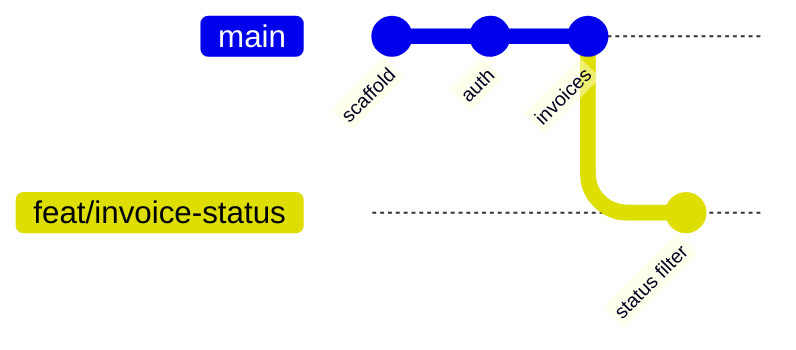
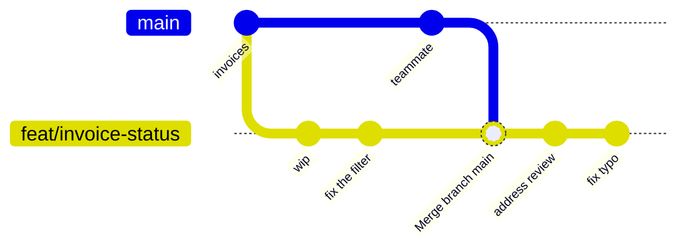
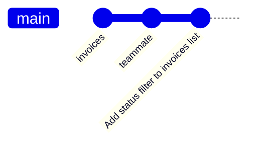
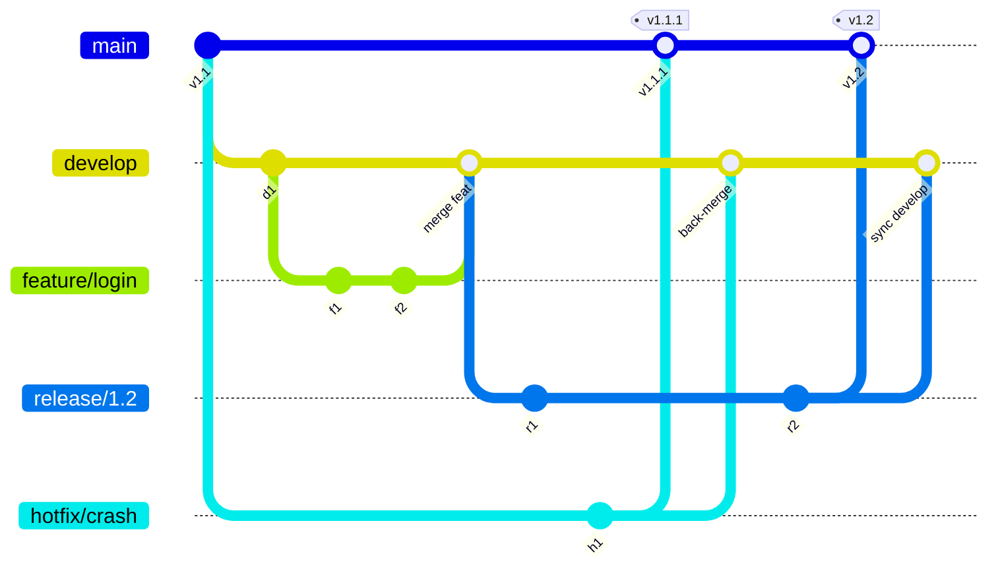
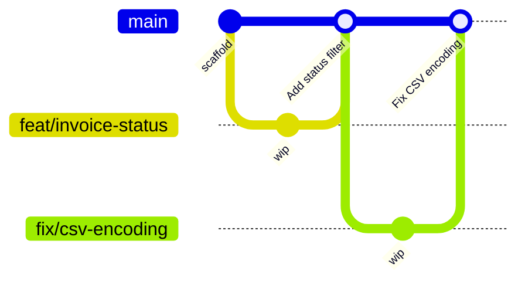

import CourseProgressBar from '../../../components/ui/CourseProgressBar.astro';
import Figure from '../../../components/figures/Figure.astro';
import { Steps } from '@astrojs/starlight/components';
import { CardGrid } from '@astrojs/starlight/components';
import Term from '../../../components/ui/Term.astro';
import ExternalResource from '../../../components/ui/ExternalResource.astro';
import AnnotatedCode from '../../../components/code/annotated-code/AnnotatedCode.astro';
import AnnotatedStep from '../../../components/code/annotated-code/AnnotatedStep.astro';
import CodeVariants from '../../../components/code/code-variants/CodeVariants.astro';
import CodeVariant from '../../../components/code/code-variants/CodeVariant.astro';
import DiagramSequence from '../../../components/figures/diagram-sequence/DiagramSequence.astro';
import DiagramStep from '../../../components/figures/diagram-sequence/DiagramStep.astro';
import TabbedContent from '../../../components/figures/tabbed-content/TabbedContent.astro';
import TabbedItem from '../../../components/figures/tabbed-content/TabbedItem.astro';
import GitBranchingEmbed from '../../../components/embeds/GitBranchingEmbed.astro';
import VideoCallout from '../../../components/embeds/VideoCallout.astro';
import MultipleChoice from '../../../components/exercises/multiple-choice/MultipleChoice.astro';
import McqChoice from '../../../components/exercises/multiple-choice/McqChoice.astro';
import McqWhy from '../../../components/exercises/multiple-choice/McqWhy.astro';
import RebaseVsMerge from '../../../components/lessons/096/1/RebaseVsMerge.astro';

<CourseProgressBar value={frontmatter['course-progress']} />

You have typed `git add`, `git commit`, and `git push` since the start of this course.
So far they've been bookkeeping: the thing you do *after* the real work, to save your place.
When you're the only person in a repository, that's all they need to be.
The history can be a swamp of "wip", "fix", and "ok now it works", and no one is hurt, because you're the only one reading it.

The moment a second person commits to the same repository, Git stops being bookkeeping and starts deciding things.
It decides whether merging to `main` means "this is deployable" or "this might integrate, who knows."
It decides how much a reviewer has to wade through to approve your change.
It decides whether the automated checks you add next chapter can block a bad merge or merely decorate it.
None of that needs new commands; it needs the handful you already know, used with intent.
By the end of this lesson you'll run the everyday team loop end to end, set five lines of configuration once and forget them, and understand why `main`'s history should read like a changelog.

## The four Git objects behind the workflow

You run these commands every day, so this isn't about the commands.
It's about what each object *is* structurally, because every decision later in the lesson rests on these four definitions.

A <Term definition="A snapshot of your whole project at a moment in time, plus author, message, and a link to its parent commit. The unit of change in Git.">commit</Term> is a snapshot of your entire project at one point in time, stamped with an author, a message, and a pointer to its parent.
The word to hold onto is *snapshot*.
A commit is not a diff, a list of changed lines; Git stores the full tree of files as it stood and computes a diff only when you ask to see one.
That matters later when you move commits around: each one is a complete, self-contained snapshot, which is exactly what makes moving it safe.

A <Term definition="A movable pointer to one commit. Creating a branch writes a 40-character commit hash into a small file — it copies nothing.">branch</Term> is a movable pointer to one commit.
Creating a branch copies no files and duplicates no history; it writes one line into a small file, the 40-character hash of the commit you're pointing at.
A branch is as cheap as a bookmark, and that is why the workflow works.
If branches were expensive you'd hoard them for weeks; because they cost nothing, you can treat them as disposable scratchpads, create one for a day's work, fold it onto the mainline, and throw it away.

The <Term definition="The set of changes that will go into your next commit. Also called the index. You move changes into it with git add.">staging area</Term>, also called the <Term definition="Another name for the staging area: the set of changes queued for the next commit.">index</Term>, is the set of changes that *will* go into your next commit.
Running `git add` saves nothing; it chooses what the next commit will contain.
It's easy to treat this as a rubber stamp before `git commit`, but it's a slicing tool, and using it well is one of the clearest signs of someone who understands Git.
It gets its own section below.

A <Term definition="A named URL pointing at a hosted copy of the repository, conventionally called origin and usually on GitHub. push and fetch move commits between your machine and it.">remote</Term> is a named URL pointing at a hosted copy of the repository, conventionally named `origin` and, for this course, on GitHub.
Your local repository and the remote are *separate* repositories that share history; `push` and `fetch` carry commits between them.
Nothing you do locally reaches a teammate until you push, and nothing they do reaches you until you fetch.

<Figure>

  <Fragment slot="caption">
    A branch is a label pointing at a commit. `feat/invoice-status` and `main` share every commit up to the fork. The remote on GitHub mirrors this shape, and `push` and `fetch` move commits between the two.
  </Fragment>
</Figure>

Two more terms you'll see without further fanfare.
Your <Term definition="The files as they exist on disk in your project folder right now — what your editor shows you, including changes not yet staged or committed.">working tree</Term> is the files on disk right now, including edits you haven't staged.
<Term definition="A pointer to the commit (and usually the branch) you currently have checked out — where your next commit will attach.">HEAD</Term> is the pointer to where you currently are, the commit your next commit will attach to.

## The everyday team loop

Here is the full cycle for shipping one change on a team.
We'll follow one running example throughout the lesson: adding a status filter to the invoices list, on a branch called `feat/invoice-status`.

<Steps>
1. Branch off `main` for the change you're about to make.

   ```bash
   git checkout -b feat/invoice-status
   ```

2. Do the work: edit files, run it, get it right.

3. Stage the changes that belong to *this* change, then commit them.

   ```bash
   git add -p
   git commit -m "Add status filter to invoices list"
   ```

4. Push the branch to GitHub.

   ```bash
   git push -u origin feat/invoice-status
   ```

5. Open a pull request from `feat/invoice-status` into `main`, and get it reviewed.

6. While the branch waits for review, `main` moves on. Catch your branch up to it.

   ```bash
   git pull --rebase origin main
   git push --force-with-lease
   ```

7. Squash-merge the pull request. Your branch's work lands on `main` as a single commit, and the branch is deleted.
</Steps>

You'll run this loop dozens of times a week.
The reflex underneath all of it is **one branch per pull request, one pull request per logical change.**
A logical change is one thing a reviewer can hold in their head and approve in a sitting: a feature, a fix, a focused refactor.
It is not three unrelated things bundled together because they happened to share your working tree.

Opening and reviewing that pull request is a craft of its own, covered in a later lesson; for now, treat step 5 as a black box, a button on GitHub that proposes merging your branch into `main`.
Steps 3, 6, and 7 are where the real work is, so we'll take them in turn.

## Stage by hunk with `git add -p`

You probably know `git add .` to stage everything and `git add path/to/file` to stage one file.
Both are coarse.
To stage less than a whole file, use `git add -p`, where `-p` is for *patch*.

This comes up constantly.
You sit down to add the status filter and spot a date formatting wrong two functions up, so you fix it while you're there.
Now your working tree holds two unrelated changes in the same file.
If you `git add .` and commit, they land together: one commit doing two things, and a reviewer who can't tell whether the date fix belongs to the filter feature.
If the filter is later reverted, the date fix goes with it.

`git add -p` lets you split them.
Instead of staging whole files, Git walks you through each <Term definition="A contiguous block of changed lines that Git treats as a single unit when staging in patch mode.">hunk</Term> and asks whether to stage it.
Say yes to the hunks that belong to the filter, no to the date fix, then commit.
The filter is now one clean commit, and the date fix is still in your working tree, ready to become its own commit or pull request.

<AnnotatedCode lang="bash" code={`
$ git add -p
diff --git a/components/invoice-row.tsx b/components/invoice-row.tsx
@@ -8,7 +8,7 @@ export function InvoiceRow({ invoice }: Props) {
-  <td>{invoice.dueDate.toString()}</td>
+  <td>{formatDate(invoice.dueDate)}</td>
Stage this hunk [y,n,q,a,d,j,J,g,/,e,?]? n

@@ -20,6 +20,9 @@ export function InvoiceList({ invoices }: Props) {
+  const [status, setStatus] = useState<Status | 'all'>('all');
+  const visible =
+    status === 'all'
+      ? invoices
+      : invoices.filter((invoice) => invoice.status === status);
Stage this hunk [y,n,q,a,d,j,J,g,/,e,?]? y

$ git commit -m "Add status filter to invoices list"
`}>
  <AnnotatedStep meta="{1}" color="blue">
    Two unrelated edits sit in your working tree: the date-format fix and the status filter. Patch mode walks them one hunk at a time so you can separate them.
  </AnnotatedStep>

  <AnnotatedStep meta="{2-6}" color="orange">
    The first hunk is the date fix, which doesn't belong to this feature. Answer `n` to skip it; it stays in your working tree for its own commit later.
  </AnnotatedStep>

  <AnnotatedStep meta="{8-14}" color="green">
    The second hunk is the filter work. Answer `y` to stage it; only this slice is queued for the commit.
  </AnnotatedStep>

  <AnnotatedStep meta="{16}" color="green">
    The commit captures only the staged (green) hunk: one commit that is exactly the status filter. The date fix is untouched, still in your working tree.
  </AnnotatedStep>
</AnnotatedCode>

This is what "one logical change per commit" means in practice.
The staging area makes it possible, and `git add -p` makes it easy: staging becomes the moment you decide what each commit contains.

## Merge, rebase, and fast-forward

Now step 6.
While your branch sat in review, teammates merged their own work, so `main` moved forward and your branch is now built on an older version of it: it has *fallen behind*.
Before you can merge, you have to bring `main`'s new commits into your branch and resolve any conflicts.
There are two ways to do that, and they leave very different shapes of history.

The first is **merge**.
Run from your branch, `git merge main` ties the two diverged lines of history together with a new *merge commit* that has two parents, one from each side.
Nothing moves; both histories are preserved exactly as they happened, and the graph forks and then rejoins at the merge commit.

The second is **rebase**.
`git rebase main` sets your commits aside, moves your branch on top of `main`'s latest commit, and *replays* your commits one at a time onto that new base.
The result is a straight line: `main`'s history, then your commits, no fork.
The catch is that replayed commits are brand *new* commits: same changes, same messages, but new parents and therefore new hashes.
Rebase doesn't move your commits, it copies them onto a new base and abandons the originals.

<DiagramSequence>
  <DiagramStep>
    <RebaseVsMerge step={1} />
    <Fragment slot="caption">
      **Step 1, the divergence.** While your branch waited for review, `main` gained two commits (`C4`, `C5`) from teammates. Your `feat/invoice-status` branch (`a1`, `b2`) still forks from the older `C2`, so it has *fallen behind*.
    </Fragment>
  </DiagramStep>

  <DiagramStep>
    <RebaseVsMerge step={2} />
    <Fragment slot="caption">
      **Step 2, merge.** `git merge` ties the two histories together with a merge commit `M` that has two parents, one from each side. Both lines are preserved exactly as they happened: the graph forks and rejoins, and your commits keep their original hashes.
    </Fragment>
  </DiagramStep>

  <DiagramStep>
    <RebaseVsMerge step={3} />
    <Fragment slot="caption">
      **Step 3, rebase.** `git rebase` *replays* your commits on top of the latest `main`, leaving a straight line. The originals (faded) are abandoned: the replayed `a1'` and `b2'` are brand *new* commits with new hashes.
    </Fragment>
  </DiagramStep>
</DiagramSequence>

Both end states are correct: both integrate `main`'s changes with yours.
They differ only in the shape they leave behind, which is what the next section optimizes for.
Merge forks and rejoins; rebase stays in a line.

<VideoCallout videoId="0chZFIZLR_0" videoTitle="Git MERGE vs REBASE: Everything You Need to Know">
  ByteByteGo animates the same merge, rebase, and squash distinction in 4 minutes, a second pass on the graph shapes you just saw.
</VideoCallout>

Reading about rebase is not the same as doing one.
The sandbox below is a real Git environment in your browser, set up with the same divergence as the sequence above: a `feature` branch on an older `main`, with `main` already moved ahead.

<GitBranchingEmbed
  command="git commit; git checkout -b feature; git commit; git commit; git checkout main; git commit"
  title="Learn Git Branching — rebase a feature branch onto main"
>
  `main` has moved ahead of your `feature` branch. Type `git rebase main` and watch your two `feature` commits lift off and replay on top of `main`, turning the fork into a straight line.
</GitBranchingEmbed>

One more term.
When `main` *hasn't* moved since you branched, there's nothing to replay and nothing to tie together; your commits already sit directly on `main`'s tip.
Integrating then is a <Term definition="When the target branch hasn't diverged, integrating is just sliding its pointer forward to your commits — no merge commit, no replay needed.">fast-forward</Term>: Git just slides `main`'s pointer forward to your commits, no merge commit and no rebase.
It's the cleanest case, and the workflow you're about to learn arranges for it on `main` almost every time.

## Rebase locally, squash-merge on the PR

:::tip
**Rebase locally, squash-merge on the pull request.** Keep your feature branch current with `git pull --rebase`, and land it on `main` with GitHub's "Squash and merge" button. The result: `main`'s history is exactly one commit per shipped change.
:::

**Rebase locally** is step 6 of the loop.
`git pull --rebase origin main` fetches `main`'s new commits and replays your branch's commits on top of them, keeping your branch a straight line built on the latest `main`.
A plain `git pull` instead *merges* `main` into your branch, scattering a "Merge branch 'main' into feat/invoice-status" commit through your history every time you sync.
The rebase keeps your branch clean while you work.

**Squash-merge** is step 7, where the cleanup happens.
While you worked, your branch piled up honest, messy commits: "wip", "actually fix the filter", "address review comments", "fix typo".
That mess is fine on your own branch, but you don't want it on `main`.
GitHub's "Squash and merge" button collapses the whole pull request, however many commits it holds, into a *single* commit on `main` with a message you write.
What lands is one commit that says "Add status filter to invoices list," and that is the only trace of your branch `main` ever sees.

<TabbedContent syncKey="squash-before-after">
  <TabbedItem label="Your PR branch">

    <Fragment slot="caption">
      Your branch: honest, messy, and yours. The "wip" and "fix typo" commits, and the stray `Merge branch main` from a `git pull` without `--rebase`, are all noise nobody grades.
    </Fragment>
  </TabbedItem>

  <TabbedItem label="main after squash-merge">

    <Fragment slot="caption">
      `main`: one commit per shipped change. The whole branch above collapses into a single commit, and its internal noise never crosses over.
    </Fragment>
  </TabbedItem>
</TabbedContent>

When `main` is one commit per shipped change, every line of `git log` reads like a changelog entry, and every commit is a complete, deployable change with no broken half-feature sitting in the mainline.
It also pays off when something breaks: the recovery tools you'll meet next lesson operate on whole commits, so they act on a single pull request's worth of work instead of getting lost in a thicket of "wip" commits.
Clean history isn't tidiness for its own sake; it's what makes those tools usable.

When does a real merge commit, one that preserves your branch's individual commits on `main`, earn its weight?
Rarely.
The case is a deliberate, multi-commit refactor where each commit is a meaningful, self-contained step you want recorded separately: "rename the type," then "move the file," then "update the call sites."
In normal feature work, where your branch's commits are scratchpad noise, the default is squash, every time.

## The trunk-based workflow (and why not Git Flow)

That whole loop has a name.
One long-lived `main` with short feature branches that live for hours or days and then collapse back in is the <Term definition="A workflow with one long-lived mainline branch (the trunk) and short-lived feature branches that merge back quickly. No long-lived develop/release/hotfix branches.">trunk-based</Term> workflow, and its practical, GitHub-shaped form is called <Term definition="The lightweight trunk-based workflow on GitHub: branch off main, open a pull request, squash-merge, deploy. No develop or release branches.">GitHub Flow</Term>.

The model is deliberately small.
One branch lives forever, the <Term definition="The single shared mainline branch — here, main. The one branch that is always deployable and that everyone integrates into.">trunk</Term>, which is `main`; every other branch is short-lived and branches off it.
Releasing isn't a separate ceremony on a separate branch, it's deploying `main`.
A hotfix isn't a special branch type, it's a normal feature branch with a fast pull request against `main`.
The whole system is "branch off `main`, do the work, squash-merge back, deploy `main`."

Older Git tutorials describe a more elaborate scheme called **Git Flow**: a permanent `develop` branch alongside `main`, plus `release/*` and `hotfix/*` branches with rules about which merges into which.
It's worth recognizing when you meet it in an old post, but it belongs to a different era.
Git Flow was built for a world where shipping was a quarterly event gated behind a manual QA team, and those long-lived branches were the staging ground for a release that took weeks to assemble.
In 2026, every problem they solved is solved better elsewhere: a preview deployment gives every pull request a live, testable URL, automated checks gate quality on every merge (the next chapter), and feature flags let you merge risky code to `main` switched off.
With those in place, `develop`, `release`, and `hotfix` are three extra long-lived branches to keep in sync for no benefit.

<VideoCallout videoId="GQQqf-C2ha4" videoTitle="3 Git Workflows Every Developer Should Know (And When to Use Each)">
  TechWorld with Nana walks through Git Flow, GitHub Flow, and trunk-based side by side, and explains why teams shipping web apps continuously moved off Git Flow.
</VideoCallout>

<TabbedContent syncKey="gitflow-vs-trunk">
  <TabbedItem label="Git Flow">

    <Fragment slot="caption">
      Git Flow: five lanes (`main`, `develop`, `release/*`, `feature/*`, `hotfix/*`) and cross-merges to keep them in sync, built for quarterly, QA-gated releases.
    </Fragment>
  </TabbedItem>

  <TabbedItem label="Trunk-based">

    <Fragment slot="caption">
      Trunk-based: one mainline, short-lived feature branches that squash-merge back as one commit each. Releases are deploys of `main`, with no `develop`, `release`, or `hotfix` lanes.
    </Fragment>
  </TabbedItem>
</TabbedContent>

## Branch names and commit messages: convention, not enforcement

Nothing technical hangs on either of these: Git does not care what you name a branch or how you phrase a commit.
They are conventions for *human* readers, the teammate reviewing your pull request and the engineer running `git log` a year from now.

Name a branch with a prefix for the kind of work, then a kebab-case description, optionally a ticket ID: `feat/invoice-status`, `fix/csv-export-encoding`, `chore/bump-deps`, `refactor/extract-invoice-form`, `docs/api-readme`.
With a ticket it becomes `feat/INV-412-status-filter`.
The prefix lets anyone scanning a branch list see what each one is for.
You can enforce the shape with a hook or repository rule, but the experienced call is to skip that and just agree on it.

A commit message has three parts.
Write the subject in <Term definition="Phrased as a command, completing the sentence 'This commit will…'. 'Add status filter', not 'Added status filter' or 'Adds status filter'.">imperative mood</Term>, "Add status filter," not "Added status filter," as if completing "This commit will…".
Keep it under about 72 characters with no trailing period.
If the change needs explanation, add a blank line and a body that says *why*, not *what*: the diff already shows what changed but not the reasoning.

<CodeVariants>
  <CodeVariant label="Good">
    ```text
    Add status filter to invoices list

    The list got unusable past ~50 invoices; users asked to narrow by
    status. Filters client-side for now — server-side filtering lands
    when pagination does.
    ```
    **Imperative subject, then the *why*.** The reviewer gets the change and the reasoning in one read, and the body outlives the pull request in `git log`.
  </CodeVariant>

  <CodeVariant label="Bare">
    ```text
    fixed stuff
    ```
    **Tells the next person nothing.** Past tense, no subject discipline, no reasoning, and useless six months on.
  </CodeVariant>
</CodeVariants>

You may also hear about **Conventional Commits**, a stricter convention that puts a machine-readable type at the front of every subject (`feat:`, `fix:`, `chore:`, and so on).
It earns its weight only when something *consumes* that structure: automated changelog generation, or version bumps for a published package.
An internal web app that ships no public package has no such consumer, so skip it, write good messages, and revisit if the team later adopts changelog tooling.

## `.gitignore`, `.gitattributes`, and the `.env` rule

The scaffold from early in the course already shipped two repository files that do important work.
Your job isn't writing them from scratch, it's knowing what's in them and why.

<Term definition="A file listing path patterns Git should never track — build output, dependencies, secrets, OS junk.">`.gitignore`</Term> lists path patterns Git refuses to track, keeping noise out of your repository: `node_modules/` (reinstallable, enormous), `.next/` (build output), `*.log`, coverage reports, OS junk like `.DS_Store`, and, critically, your environment files `.env*`, with a single exception for `.env.example`.

<Term definition="A file that sets per-path Git behaviors — most importantly, normalizing line endings across operating systems.">`.gitattributes`</Term> sets per-path behaviors.
The line that matters is `* text=auto eol=lf`, which normalizes line endings so a teammate on Windows can't commit `\r\n` into a repository that deploys to Linux, where it would surface as spurious whole-file diffs and the occasional broken shell script.

```gitignore title=".gitignore" {6-7}
node_modules/
.next/
*.log
coverage/
.DS_Store
.env*
!.env.example
```

```ini title=".gitattributes"
* text=auto eol=lf
```

:::caution
Deleting a leaked secret from your working tree does **not** remove it from history.
Git keeps every snapshot, so an API key or database password stays in the commit where you added it, and it's exposed the moment that commit reaches the remote.
The only fix is to **rotate the secret**: revoke the leaked one, issue a new one, and treat the old value as compromised forever.
:::

The `!.env.example` line is what prevents this.
It keeps `.env.local` (your real secrets) untracked while letting you commit `.env.example` (the same keys with placeholder values) so teammates know what to fill in.
The gitignore line is the prevention; rotation is the cure when it fails.
A full rotation playbook lives in the security hardening chapter.

## Set these five defaults once

Most Git settings that smooth out team work are global: set them on your machine once and every repository you clone inherits them.
Five are worth setting today.

```bash
git config --global init.defaultBranch main
git config --global pull.rebase true
git config --global push.autoSetupRemote true
git config --global rebase.autoStash true
git config --global rerere.enabled true
```

Line by line:

- `init.defaultBranch main`: new repositories you create start on `main` instead of the historical `master`.
- `pull.rebase true`: a plain `git pull` fetches then merges, so on a branch with local commits it manufactures a stray "Merge branch 'main' into …" commit every time you sync; this makes `pull` fetch then rebase instead, keeping the branch linear.
- `push.autoSetupRemote true`: the first `git push` on a new branch sets its upstream automatically, so you drop the `-u origin <branch>` dance and just type `git push`.
- `rebase.autoStash true`: stashes uncommitted changes before a rebase and restores them after, so `git pull --rebase` works even with a dirty working tree.
- `rerere.enabled true`: short for <Term definition="'Reuse recorded resolution.' Git records how you resolved a merge conflict and replays that resolution automatically the next time the identical conflict appears.">rerere</Term>. Git records how you resolved a conflict and replays that resolution if the identical conflict reappears, which happens constantly when you rebase a long-lived branch repeatedly. The next lesson leans on it.

## Never `--force`, always `--force-with-lease`

After you rebase a branch, its history no longer matches the remote: the commits have new hashes.
A normal `git push` is then *rejected*, because Git sees commits on the remote your local branch doesn't recognize and refuses to overwrite them.
To push a rebased branch, you have to force.
There are two ways, and the difference between them is the difference between a non-event and silently deleting a teammate's work.

<CodeVariants>
  <CodeVariant label="--force — dangerous">
    <div data-mark-color="red">

    ```bash "--force"
    git push --force
    ```

    </div>
    **Overwrites the remote unconditionally.** If a teammate pushed to this branch since you last fetched, `--force` destroys their commits, with no check and no warning.
  </CodeVariant>

  <CodeVariant label="--force-with-lease — safe">
    <div data-mark-color="green">

    ```bash "--force-with-lease"
    git push --force-with-lease
    ```

    </div>
    **Overwrites only if the remote hasn't moved.** Git first checks that the remote branch still points where you last saw it; if a teammate pushed in between, the push *aborts* instead of clobbering their work.
  </CodeVariant>
</CodeVariants>

So the reflex is simple and absolute: **never `--force`, always `--force-with-lease`.**
On your own feature branch the risk is usually low, but the habit costs nothing and saves a teammate's afternoon the one day it matters.

## Terminal or GUI

You don't have to run Git from the terminal.
Every command you've learned maps onto a button in VS Code's source-control panel, GitHub Desktop, GitKraken, and others.
The common split is to stay in the terminal for most work, where it's fast and identical on every machine, and reach for a GUI for the two tasks where a visual surface wins: staging changes line by line, and resolving merge conflicts in a three-pane view instead of by hand.
What you must understand is the commands; the interface on top of them is interchangeable.

Two quick notes.
This course uses GitHub, but the concepts carry over to GitLab and Bitbucket.
Signed commits, which cryptographically prove who authored a commit, belong in sensitive enterprise repositories, not a minimum setup.

## Check your understanding

This lesson rests on one mental model and two reflexes.
The model: local history is messy and yours, while `main`'s is clean and shared.
The reflexes: rebase to sync, and lease not force.

First, the sync reflex — rebase your branch onto the latest `main`.

<MultipleChoice>
  Your `feat/invoice-status` branch has fallen behind `main` while it sat in review. You're about to merge, but first you need `main`'s newer commits in your branch. Which command catches your branch up the way the team default wants?

  <McqChoice>
    ```bash
    git merge main
    ```
  </McqChoice>
  <McqChoice correct>
    ```bash
    git pull --rebase origin main
    ```
  </McqChoice>
  <McqChoice>
    ```bash
    git pull origin main
    ```
  </McqChoice>
  <McqChoice>
    ```bash
    git push --force
    ```
  </McqChoice>

  <McqWhy>`git pull --rebase origin main` fetches `main`'s new commits and *replays* yours on top, so your branch stays a straight line built on the latest `main`. `git merge main` and a plain `git pull origin main` both tie in a "Merge branch 'main' into…" commit, the clutter this workflow avoids. `git push --force` integrates nothing from `main`, and force-pushing here would be destructive.</McqWhy>
</MultipleChoice>

Finally, the push-safety reflex.

<MultipleChoice>
  After rebasing your branch, a normal `git push` is rejected and you have to force. Why is `--force-with-lease` the reflex instead of plain `--force`?

  <McqChoice>It compresses the upload, so a rebased branch pushes faster than it would with plain `--force`.</McqChoice>
  <McqChoice correct>If a teammate pushed to this branch since your last fetch, the push aborts rather than erasing their commit.</McqChoice>
  <McqChoice>It pops up a yes/no confirmation that plain `--force` skips, giving you one last chance to back out.</McqChoice>
  <McqChoice>GitHub rejects plain `--force` on protected branches, so `--force-with-lease` is the only flag that gets through.</McqChoice>

  <McqWhy>`--force` overwrites the remote unconditionally, so if a teammate pushed in between, their commit is gone with no warning. `--force-with-lease` first checks the remote branch still points where you last saw it, and refuses if it moved. It isn't faster, shows no prompt, and has nothing to do with branch protection: its whole job is turning a silent clobber into a safe abort.</McqWhy>
</MultipleChoice>

## External resources

If you want to go deeper on the mechanics behind the workflow, these are the references worth your time, including one you can practise in.

<CardGrid>
  <ExternalResource
    title="Learn Git Branching"
    href="https://learngitbranching.js.org/"
    icon="simple-icons:git"
    iconColor="#F05032"
    description="The interactive sandbox from this lesson, in full — work through every level and watch the commit graph move under your own commands."
  />
  <ExternalResource
    title="Trunk Based Development"
    href="https://trunkbaseddevelopment.com/"
    icon="lucide:git-branch"
    iconColor="#22863A"
    description="The canonical reference site for the exact workflow this lesson teaches — one trunk, short-lived branches, no develop or release lanes."
  />
  <ExternalResource
    title="Pro Git — Branching and Rebasing"
    href="https://git-scm.com/book/en/v2/Git-Branching-Rebasing"
    icon="simple-icons:gitbook"
    iconColor="#BBDDE5"
    description="The official Git book's chapter on rebasing — the authoritative explanation of what replaying commits actually does."
  />
  <ExternalResource
    title="GitHub Docs — About merge methods"
    href="https://docs.github.com/en/repositories/configuring-branches-and-merges-in-your-repository/configuring-pull-request-merges/about-merge-methods-on-github"
    icon="simple-icons:github"
    description="GitHub's reference on squash vs. merge vs. rebase merging — the three buttons and what each does to history."
  />
</CardGrid>
