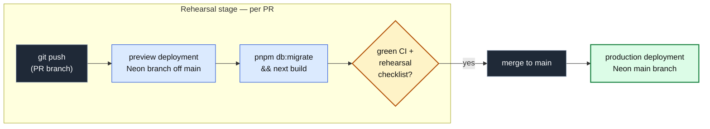

import { Card, CardGrid, FileTree, Steps } from '@astrojs/starlight/components';
import Figure from '../../../components/figures/Figure.astro';
import Screenshot from '../../../components/figures/screenshot/Screenshot.astro';
import TabbedContent from '../../../components/figures/tabbed-content/TabbedContent.astro';
import TabbedItem from '../../../components/figures/tabbed-content/TabbedItem.astro';
import CourseProgressBar from '../../../components/ui/CourseProgressBar.astro';

<CourseProgressBar value={frontmatter['course-progress']} />

Across the last few chapters you assembled the four pieces of a shipping discipline — small reviewable PRs, a CI gate that goes green before merge, Vercel deploying on every push against a Neon branch per PR, and the expand-migrate-contract cadence for changing a schema you cannot take offline. This project cashes all of it in on one running app. The starter is the invoices SaaS you have grown across the course — the URL-state list, soft delete, `version`-based concurrency, all of it now sitting behind a Better Auth sign-in — and your job is two-part. First you ship it to a live `*.vercel.app` URL where the git push *is* the deploy and production is just an alias over an immutable build. Then you fix a schema anti-pattern it ships with: a single `total numeric(12,2) NOT NULL` column that mashes the line subtotal and the tax together, with no way to compute or display them apart. You split it into separate `subtotal` and `tax` columns through three reviewed PRs — expand, migrate, contract — across a live database, with the running app and the live schema never once incompatible. The chapter ends by rehearsing the production rollback against the most dangerous of those PRs, not to undo anything, but so the gesture lives in your fingers before an incident demands it at 2am.

<Figure caption="The finished project, confirmed on two of the surfaces you drive yourself — the running app's invoices list, and the inspector's migration probes reading the contracted schema. The third surface, the Vercel dashboard's production deployments, is the one the prose below describes.">
  <TabbedContent syncKey="finished-project-surface">
    <TabbedItem label="/invoices · the carried-in list" caption="The seeded invoices list rendered against the final schema, signed in as the Acme admin — the Total column shows the derived subtotal + tax amount per row.">
      <Screenshot viewport="desktop">
        
      </Screenshot>
    </TabbedItem>

    <TabbedItem label="/inspector · the schema-state probe" caption="The read-only inspector reading the contracted schema: subtotal and tax both NOT NULL, no total column, split coverage at 100% with zero rows still null, and the data-integrity diff reading 'n/a — total dropped'.">
      <Screenshot viewport="desktop">
        
      </Screenshot>
    </TabbedItem>
  </TabbedContent>
</Figure>

The screenshot above is the destination, not a thing you read source to confirm. Each frame lives on a *different* surface — the running app, the provided inspector, and the Vercel dashboard — and you will not see them line up until you have shipped the first deploy and merged all three PRs. The inspector is the surface that makes the migration legible: a read-only observability panel, provided in full, that probes the live schema and the live data so every claim the cadence makes is something you can see rather than something you take on faith.

## What we'll practice

Everything below is a skill the later lessons build properly; this list is the map, not the teaching.

- Shipping a green repo to a live production URL where the git push is the deploy and production is an alias over an immutable deployment — no human ever clicks "deploy."
- Running a destructive schema change as the expand-migrate-contract cadence — additive expand, then app-layer dual-write plus backfill plus dual-read, then the contract drop — so the live app and the live schema are never incompatible.
- Rehearsing every migration on a copy-on-write Neon branch before merge, and reading the build-time migration log each time the way you would read a deploy you cannot take back.
- Rehearsing the two-layer production rollback, and internalizing why an alias re-point recovers the code instantly but does *not* undo a forward-only migration.
- Verifying that a launch checklist holds at the live URL — not as a ritual, but as the set of invariants that say the thing is actually up.

## Architecture

This is the shape of the machine, not its mechanics — the moving parts named, with the *how* left to the lessons that build each one. Six threads run through every lesson of this chapter.

- **The git push is the deploy.** Every PR commit produces a preview deployment on its own Neon branch off `main`; every merge to `main` produces a production deployment against the production database. No human clicks "deploy."
- **The preview branch is the rehearsal stage.** `pnpm db:migrate` runs inside the build command against the PR's Neon branch, so the build fails if the migration fails. You merge only after the rehearsal checklist is green on that preview.
- **Forward-only, three deploys minimum** for the destructive change — expand (old and new shapes coexist), migrate (dual-write keeps both columns populated), contract (drop the old shape only once nothing reads it).
- **Between PRs, production keeps working.** This is the load-bearing invariant of the whole project: each production deploy is verified against the in-flight schema before the next PR lands.
- **Rollback is the recovery primitive, not the apology.** An instant alias re-point plus a `git revert` on `main`, rehearsed against the contract PR while nothing is on fire.
- **The inspector** (`/inspector`, provided in full) — the read-only surface that makes all of the above visible: a schema-state probe, the split-coverage and dual-write panels, the data-integrity diff, and the deployment-environment plus build-source indicators.

<Figure caption="The deploy pipeline: a PR-branch push rehearses on a Neon branch off main; a merge to main deploys to production against the Neon main branch. The push is the deploy; the preview is the rehearsal.">

</Figure>

## Starting file tree

The starter is the full invoices app, so most of the tree is code you already know and will not touch — the Better Auth flow, the CI workflow, the env validator, every shadcn component, and the entire inspector all ship provided. The annotated files below are the only ones the migration touches: the schema column shape and the surfaces that read or write it, plus the runbook stubs you fill as you go. Everything bolded is your focus. You write **no** inspector code — it exists so you can watch the migration, not so you can build it.

<FileTree>
- src/
  - db/
    - **schema.ts** the money column — ships `total` only, with `TODO(L3/L4/L5)` markers
    - schema/auth.ts Better Auth generated tables
    - index.ts drizzle client, `db` + `dbUnpooled`
    - audit.ts audit_logs table + RLS
    - tenant.ts `withTenant` + `tenantDb` facade
    - ...
  - lib/
    - invoices/
      - **queries.ts** reads `total`; `TODO(L4)` dual-read coalesce, `TODO(L5)` drop total
      - **actions.ts** writes `total`; `TODO(L4)` dual-write, `TODO(L5)` contract
      - **money.ts** the `combinedAmount` helper — you create this in PR 2
      - ...
    - auth.ts betterAuth instance + `requireOrgUser`
    - result.ts the canonical `Result<T>` shape
    - ...
  - app/
    - (protected)/
      - invoices/
        - **table.tsx** renders the money shape in the Total column
        - **\[id\]/edit/edit-form.tsx** `TODO(L4)` split inputs, `TODO(L5)` retire combined
        - **\[id\]/edit/conflict-banner.tsx** renders the money shape in the conflict row
        - ...
      - inspector/ the migration verification surface — provided in full, you write none of it
    - (auth)/ sign-in / sign-up / org onboarding — provided
    - api/health/route.ts the `/api/health` db ping
    - ...
  - env.ts `@t3-oss/env-nextjs` boundary — fails the build on a missing var
  - proxy.ts cookie-presence guard for the protected routes
- scripts/
  - **backfill_subtotal_tax.ts** the by-hand backfill — you fill this in PR 2
  - seed.ts 2 orgs, 5 users, ~60 invoices
- drizzle/ migrations 0000–0004 (you generate 0005–0007)
- docs/
  - runbooks/
    - **launch-checklist.md** stub you fill at the live URL
    - **migration-subtotal-tax.md** stub you fill across the three PRs
    - **rollback.md** stub you fill in the rollback rehearsal
- .github/workflows/ci.yml the four-job CI gate + audit + actionlint — provided
- docker-compose.yml local Postgres 18 for development
- .env.example every key, valid local placeholders
- ...
</FileTree>

## Roadmap

<CardGrid>
  <Card title="Lesson 2 — From green repo to a live production URL">
    Wires Vercel, Neon, env validation, and preview deployment protection on the starter, and walks the launch checklist to produce the production URL the rest of the chapter targets.
  </Card>

  <Card title="Lesson 3 — PR 1 (Expand): add the nullable subtotal and tax columns">
    Ships an additive-only migration adding `subtotal` and `tax` as nullable columns, and verifies the unchanged app stays healthy against the expanded schema.
  </Card>

  <Card title="Lesson 4 — PR 2 (Migrate): dual-write, backfill, dual-read">
    Lands the dual-write in the actions, the `coalesce` fall-through in the queries, the bounded-idempotent backfill, and the `NOT NULL` promotion — all while production keeps serving.
  </Card>

  <Card title="Lesson 5 — PR 3 (Contract): drop the old column, promote the new pair">
    Drops `total`, removes every legacy reference, and lands production on the target schema with the cadence's safety claims intact.
  </Card>

  <Card title="Lesson 6 — Rollback rehearsal and the schema caveat">
    Promotes the previous deployment against the contract PR to make the "an alias rollback does not undo migrations" caveat concrete, then writes the durable runbook.
  </Card>
</CardGrid>

## Setup

This lesson ends when the starter runs locally against a Docker Postgres. No accounts, no deploy yet — the Vercel project, the Neon integration, and the real environment values are all wired in the next lesson. The `.env.example` carries every key with a valid local placeholder, so nothing here needs an external account to boot.

<Steps>
1. Get the starter codebase from the [project repository](https://github.com/terencicp/react-saas-course-projects), under `Chapter 100/start/`.

2. Install dependencies.

   ```sh
   pnpm install
   ```

3. Start the local Postgres container, copy the environment template, then migrate and seed the database.

   ```sh
   docker compose up -d
   cp .env.example .env
   pnpm db:migrate && pnpm db:seed
   ```

4. Start the dev server.

   ```sh
   pnpm dev
   ```
</Steps>

The local environment keys, all pre-filled with valid placeholders in `.env.example`:

| Variable | Purpose |
| --- | --- |
| `DATABASE_URL` / `DATABASE_URL_UNPOOLED` | The Docker Postgres connection — pooled and unpooled, identical locally. The split matters on Neon, where migrations want the direct connection. |
| `BETTER_AUTH_SECRET` / `BETTER_AUTH_URL` | The dev-mode auth secret and base URL. |
| `RESEND_API_KEY` | Required by the env validator and the launch checklist, but this project sends no email — the placeholder is never called. |
| `SENTRY_DSN` | A launch-checklist value, not a wired package; the dev placeholder is enough to boot. |
| `APP_URL` | The app's own base URL — `http://localhost:3000` locally. |
| `NEXT_PUBLIC_APP_NAME` / `NEXT_PUBLIC_APP_URL` | The two client-exposed values. |

**Expected result.** `pnpm dev` serves the app at `http://localhost:3000`. Sign in as a seeded user — the seed creates two orgs and five users, all with the password `inspector-password-12`; `alice@acme.test` is an Acme admin and a good default. The invoices surface lives at `/invoices` and the inspector at `/inspector`, both reading the seeded `total` column, since you have not split it yet. No feature is built and nothing is deployed; the app is simply up in its starting state, which is exactly what the rest of the chapter changes.
