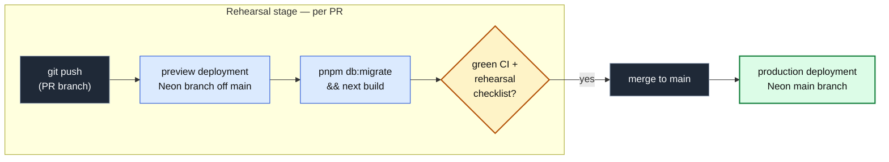

import { Card, CardGrid, FileTree, Steps } from '@astrojs/starlight/components';
import Figure from '../../../components/figures/Figure.astro';
import Screenshot from '../../../components/figures/screenshot/Screenshot.astro';
import TabbedContent from '../../../components/figures/tabbed-content/TabbedContent.astro';
import TabbedItem from '../../../components/figures/tabbed-content/TabbedItem.astro';
import CourseProgressBar from '../../../components/ui/CourseProgressBar.astro';

<CourseProgressBar value={frontmatter['course-progress']} />

The last few chapters built a shipping discipline: small reviewable PRs, a CI gate that goes green before merge, Vercel deploying every push against a per-PR Neon branch, and the expand-migrate-contract cadence for changing a schema you cannot take offline. This project puts all of it to work on the invoices SaaS you have grown across the course — a URL-state list, soft delete, and `version`-based concurrency, now behind a Better Auth sign-in. Your job has two parts. First, ship it to a live `*.vercel.app` URL, where the git push *is* the deploy and production is just an alias over an immutable build. Then fix a schema anti-pattern it ships with: a single `total numeric(12,2) NOT NULL` column fuses the line subtotal and the tax, with no way to read them apart. You split it into separate `subtotal` and `tax` columns through three reviewed PRs — expand, migrate, contract — against a live database, with the running app and the live schema never once incompatible. The chapter closes by rehearsing the production rollback against the most dangerous of those PRs, so the move is in your hands before an incident demands it.

<Figure caption="The finished project on two of the three surfaces you drive: the app's invoices list and the inspector's probes reading the contracted schema. The third, the Vercel dashboard's production deployments, is the one the prose below covers.">
  <TabbedContent syncKey="finished-project-surface">
    <TabbedItem label="/invoices · the carried-in list" caption="The seeded invoices list rendered against the final schema, signed in as the Acme admin. Each Total reads the derived subtotal + tax for that row.">
      <Screenshot viewport="desktop">
        
      </Screenshot>
    </TabbedItem>

    <TabbedItem label="/inspector · the schema-state probe" caption="The read-only inspector reading the contracted schema: subtotal and tax both NOT NULL, no total column, split coverage at 100% with zero null rows, and the data-integrity diff reading 'n/a — total dropped'.">
      <Screenshot viewport="desktop">
        
      </Screenshot>
    </TabbedItem>
  </TabbedContent>
</Figure>

The inspector is what makes the migration visible: a read-only panel, provided in full, that probes the live schema and live data, so every claim the cadence makes is something you can see rather than take on faith.

## How the deploy pipeline works

A few ideas recur in every lesson of this chapter.

- **The git push is the deploy.** A push to a PR branch builds a preview on its own Neon branch off `main`; a merge to `main` deploys to production against the production database. No one ever clicks "deploy."
- **The preview is the rehearsal.** `pnpm db:migrate` runs inside the build against the PR's Neon branch, so a failed migration fails the build. You merge only once the rehearsal checklist is green on that preview.
- **The destructive change is forward-only, three deploys minimum:** expand (old and new columns coexist), migrate (dual-write keeps both populated), contract (drop the old column once nothing reads it).
- **Production keeps working between PRs.** The project's load-bearing invariant: each production deploy is verified against the in-flight schema before the next PR lands.
- **Rollback is the recovery primitive:** an instant alias re-point plus a `git revert` on `main`, rehearsed against the contract PR. The alias recovers the code at once, but a forward-only migration does not roll back with it.
- **The inspector** makes all of this visible: a schema-state probe, the split-coverage and dual-write panels, the data-integrity diff, and the deployment-environment and build-source indicators.

<Figure caption="The deploy pipeline: a PR-branch push rehearses on a Neon branch off main, and a merge to main deploys to production.">

</Figure>

## Starting file tree

The starter is the full invoices app; most of the tree is code you already know and never touch. The bolded files are the only ones the migration touches: the money column, the surfaces that read or write it, and the runbook stubs you fill as you go. The inspector ships complete, so you watch the migration rather than build it.

<FileTree>
- src/
  - db/
    - **schema.ts** money column, ships `total` only, `TODO(L3/L4/L5)` markers
    - schema/auth.ts Better Auth generated tables
    - index.ts drizzle client, `db` + `dbUnpooled`
    - audit.ts audit_logs table + RLS
    - tenant.ts `withTenant` + `tenantDb` facade
    - ...
  - lib/
    - invoices/
      - **queries.ts** reads `total`; `TODO(L4)` dual-read coalesce, `TODO(L5)` drop total
      - **actions.ts** writes `total`; `TODO(L4)` dual-write, `TODO(L5)` contract
      - **money.ts** `combinedAmount` helper, you create it in PR 2
      - ...
    - auth.ts betterAuth instance + `requireOrgUser`
    - result.ts canonical `Result<T>` shape
    - ...
  - app/
    - (protected)/
      - invoices/
        - **table.tsx** renders the money shape in the Total column
        - **\[id\]/edit/edit-form.tsx** `TODO(L4)` split inputs, `TODO(L5)` retire combined
        - **\[id\]/edit/conflict-banner.tsx** renders the money shape in the conflict row
        - ...
      - inspector/ migration verification surface, provided in full
    - (auth)/ sign-in / sign-up / org onboarding, provided
    - api/health/route.ts the `/api/health` db ping
    - ...
  - env.ts `@t3-oss/env-nextjs` boundary, fails the build on a missing var
  - proxy.ts cookie-presence guard for protected routes
- scripts/
  - **backfill_subtotal_tax.ts** by-hand backfill, you fill it in PR 2
  - seed.ts 2 orgs, 5 users, ~60 invoices
- drizzle/ migrations 0000–0004 (you generate 0005–0007)
- docs/
  - runbooks/
    - **launch-checklist.md** stub you fill at the live URL
    - **migration-subtotal-tax.md** stub you fill across the three PRs
    - **rollback.md** stub you fill in the rollback rehearsal
- .github/workflows/ci.yml four-job CI gate + audit + actionlint, provided
- docker-compose.yml local Postgres 18 for development
- .env.example every key, valid local placeholders
- ...
</FileTree>

## Roadmap

<CardGrid>
  <Card title="Lesson 2 — From green repo to a live production URL">
    Wire Vercel, Neon, env validation, and preview-deploy protection onto the starter, then walk the launch checklist to ship the production URL the rest of the chapter targets.
  </Card>

  <Card title="Lesson 3 — PR 1 (Expand): add the nullable subtotal and tax columns">
    Ship an additive-only migration that adds `subtotal` and `tax` as nullable columns, and confirm the unchanged app stays healthy against the expanded schema.
  </Card>

  <Card title="Lesson 4 — PR 2 (Migrate): dual-write, backfill, dual-read">
    Add the dual-write to the actions, the `coalesce` fall-through to the queries, the idempotent backfill, and the `NOT NULL` promotion, all while production keeps serving.
  </Card>

  <Card title="Lesson 5 — PR 3 (Contract): drop the old column, promote the new pair">
    Drop `total`, remove every legacy reference, and land production on the target schema with the migration's safety guarantees intact.
  </Card>

  <Card title="Lesson 6 — Rollback rehearsal and the schema caveat">
    Roll back to the previous deployment against the contract PR to see why an alias rollback does not undo a migration, then write the durable runbook.
  </Card>
</CardGrid>

## Setup

This lesson ends with the starter running locally against a Docker Postgres. No accounts or deploy yet: the Vercel project, the Neon integration, and the real values come next lesson. Every key in `.env.example` ships with a working local placeholder, so nothing here needs an external account to boot.

<Steps>
1. Get the starter codebase from the [project repository](https://github.com/terencicp/react-saas-course-projects), under `Chapter 100/start/`.

2. Install dependencies.

   ```sh
   pnpm install
   ```

3. Start the local Postgres container, copy the environment template, then migrate and seed the database.

   ```sh
   docker compose up -d
   cp .env.example .env
   pnpm db:migrate && pnpm db:seed
   ```

4. Start the dev server.

   ```sh
   pnpm dev
   ```
</Steps>

The local environment keys, all pre-filled in `.env.example`:

| Variable | Purpose |
| --- | --- |
| `DATABASE_URL` / `DATABASE_URL_UNPOOLED` | Pooled and unpooled Postgres connections, identical locally; the split matters on Neon, where migrations need the direct one. |
| `BETTER_AUTH_SECRET` / `BETTER_AUTH_URL` | Dev auth secret and base URL. |
| `RESEND_API_KEY` | Required by the env validator and launch checklist, but the project sends no email, so the placeholder is never called. |
| `SENTRY_DSN` | A launch-checklist value, not a wired package; the placeholder is enough to boot. |
| `APP_URL` | The app's own base URL, `http://localhost:3000` locally. |
| `NEXT_PUBLIC_APP_NAME` / `NEXT_PUBLIC_APP_URL` | The two client-exposed values. |

**Expected result.** `pnpm dev` serves the app at `http://localhost:3000`. The seed creates two orgs and five users, all with the password `inspector-password-12`; sign in as `alice@acme.test`, an Acme admin and a good default. The invoices at `/invoices` and the inspector at `/inspector` both read the seeded `total` column, since you have not split it yet.
