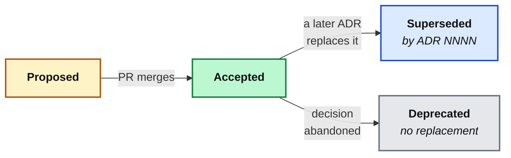

import AnnotatedCode from '../../../components/code/annotated-code/AnnotatedCode.astro';
import AnnotatedStep from '../../../components/code/annotated-code/AnnotatedStep.astro';
import Sequence from '../../../components/exercises/sequence/Sequence.astro';
import Step from '../../../components/exercises/sequence/Step.astro';
import Buckets from '../../../components/exercises/buckets/Buckets.astro';
import Bucket from '../../../components/exercises/buckets/Bucket.astro';
import Item from '../../../components/exercises/buckets/Item.astro';
import TabbedContent from '../../../components/figures/tabbed-content/TabbedContent.astro';
import TabbedItem from '../../../components/figures/tabbed-content/TabbedItem.astro';
import Figure from '../../../components/figures/Figure.astro';
import Term from '../../../components/ui/Term.astro';
import ExternalResource from '../../../components/ui/ExternalResource.astro';
import VideoCallout from '../../../components/embeds/VideoCallout.astro';
import { CardGrid } from '@astrojs/starlight/components';
import CourseProgressBar from '../../../components/ui/CourseProgressBar.astro';

<CourseProgressBar value={frontmatter['course-progress']} />

You join a team and open their invoicing app. Drizzle is wired through every query in the codebase. You ask the obvious question — why Drizzle and not Prisma? Prisma is the market default; someone here chose against it on purpose. So you go looking for the reason.

It isn't in the README. It isn't in `AGENTS.md`. The commit that added the database layer just says `add db layer`. You search Slack and find a thread from two years ago that's half-deleted and references a meeting you weren't in. The engineer who made the call left last spring. The decision is everywhere in the code and the reasoning is nowhere.

Now you're stuck with the worst version of a question: should you keep Drizzle, or was it a mistake you're about to inherit? You can't tell, because you can't reconstruct what was weighed. You either change it blind and risk re-learning a lesson someone already learned, or you leave it alone out of fear and call that "respecting the existing architecture."

Every engineer who has inherited a codebase has hit this wall. The fix is almost embarrassingly cheap: the reasoning behind an architectural decision is itself worth saving, and it has a standard shape. It's called an Architectural Decision Record, and it's the last of the four documentation jobs from earlier in this chapter — the *explanation* quadrant, which lives in `/docs/adr/`. By the end of this lesson you'll be able to write the record for any architectural decision in about fifteen minutes, and you'll have seen the records for six decisions this course already made on your behalf.

## Where decision rationale tries to hide

Before defining the artifact, it's worth asking why we need a *new* one at all. The reasoning behind a decision has to live somewhere — so let's walk the places it usually tries to live, and watch each one lose the *why*.

A commit message looks like a candidate. It travels with the code forever. But a good commit message records *what changed*, compressed to a line or two, and it's buried among thousands of siblings the moment the next commit lands. Worse, if your team uses a <Term definition="Merging a pull request by collapsing all its commits into one. The individual commit messages and their bodies are discarded in the process.">squash merge</Term> — and most do — every commit body on the branch is discarded at merge time. The reasoning, if it was ever there, is gone.

A pull request description is better: it's prose, and it sits next to the diff. But it's searchable only through your platform's own tooling, it's often a checklist rather than an argument, and once the PR is merged it sinks below the fold of a hundred newer ones. Nobody greps closed PRs to understand current architecture.

`git blame` answers a different question entirely. It tells you *who* last touched a line and *when* — never *why this whole pattern exists*. Blame points at a single line; an architectural decision is spread across a hundred files, and blame has nothing to say about the shape they share.

Chat is the most tempting and the most fragile. The real conversation usually does happen in Slack or Discord — but chat is ephemeral by design. It's unsearchable in practice, it scrolls away in days, and it vanishes entirely when the workspace is pruned or the person who said the key thing leaves.

That leaves the two documents you already met in this chapter, and they fail for the cleanest reasons of all. The README is written for first contact — wrong audience, and stuffing rationale into it dilutes its one job. And `AGENTS.md` states *what* the convention is so an agent or a teammate can follow it; it deliberately doesn't carry *why* the convention was chosen. That boundary is exactly the one the previous lesson kept pressing against.

Here's the whole landscape in one view:

| Where the reasoning tries to live | What it captures | What it loses |
| --- | --- | --- |
| Commit message / `git log` | *What* changed, one line | The *why*; erased by squash merges |
| Pull request description | Some prose, next to the diff | Buried after merge; platform-locked search |
| `git blame` | Who touched a line, and when | Why a whole pattern exists |
| Slack / chat | The live conversation | Everything, eventually — it's ephemeral |
| README | First-contact orientation | Wrong audience; rationale dilutes its job |
| `AGENTS.md` | *What* the convention is | *Why* it was chosen |

None of these is a durable, grep-able, single-purpose record of *one decision's reasoning*. That gap — and it's a real gap, not a missing feature of one tool — is precisely the job of the ADR.

## Anatomy of an ADR: the Nygard template

An <Term definition="Architectural Decision Record: a short markdown file documenting one architectural decision and the reasoning behind it.">ADR</Term> is a short markdown document — half a page to two pages — that captures *one* architectural decision: the context that forced it, the choice that was made, and the consequences accepted in return. The format comes from a 2011 post by Michael Nygard, and fifteen years later it's still the dominant template; you'll meet it in real repos under `/docs/adr/`, one numbered file per decision, like `0001-use-drizzle-not-prisma.md`.

That's the whole idea — but you'll absorb the shape far faster by reading a real one than by reading a definition of one. So here's the actual record for a decision you've already lived through this course: choosing Drizzle over Prisma. Step through its five sections. The decision itself needs no defense — you already use Drizzle — so let your attention go entirely to the *form*.

<AnnotatedCode lang="md" maxLines={18} code={`
# ADR 0001: Use Drizzle, not Prisma

## Status

Accepted

## Context

We need a typed ORM for all Postgres access. Prisma is the market
default but ships a heavier runtime, models the schema in its own DSL
rather than TypeScript, and its migration engine is hard to drop down
out of when we need raw SQL. We want SQL we can read, a small client,
and migrations we own as plain files.

## Decision

We will use Drizzle as the ORM for all database access.

## Consequences

- Leaner runtime and a raw-SQL escape hatch when we need it.
- Schema is TypeScript — one language, no separate DSL to learn.
- Relations are typed by hand via \`relations()\`; more boilerplate than
  Prisma's implicit relations.
- Smaller ecosystem: fewer plugins, fewer Stack Overflow answers.
- The team owns migration files directly; no generate-and-pray engine.
`}>
  <AnnotatedStep meta="{1}" color="blue">
    **The title.** Numbered, and a short *noun phrase of the decision itself* — "Use Drizzle, not Prisma." Not a question, not a vague label like "Database stuff." The number (`0001`) is a stable identifier you'll cite in PRs and in other ADRs that reference this one.
  </AnnotatedStep>

  <AnnotatedStep meta="{3-5}" color="violet">
    **Status.** The lifecycle field: one of Proposed, Accepted, Superseded, or Deprecated. Most live ADRs read "Accepted." When a later decision replaces this one, this single field is what changes — the full treatment comes shortly. Some templates add a *Date* line, but git already records the file's birth, so it isn't load-bearing.
  </AnnotatedStep>

  <AnnotatedStep meta={`{7-13} "DSL"`} color="blue">
    **Context.** The forces in play *at the time*: the problem, the constraints, the alternatives on the table, what wasn't yet known. Note the concrete reasons — a heavier runtime, a separate schema `DSL`, a migration engine hard to escape. Write it so a reader two years out can reconstruct the situation; one paragraph, maybe two, never a company history.
  </AnnotatedStep>

  <AnnotatedStep meta="{15-17}" color="green">
    **Decision.** One declarative sentence, crisp and unhedged: "We will use Drizzle." Not "we're considering" or "we should probably." The document records what was *decided*, not what was debated. That crispness is the tell of an experienced engineer.
  </AnnotatedStep>

  <AnnotatedStep meta="{19-26}" color="orange">
    **Consequences.** What this choice changes — the good (constraints released) *and* the costs (constraints imposed). Notice bullets three through five are downsides, included on purpose. That honest mix is the whole signal: a Consequences section listing only upsides is a sales pitch, not a record. This is the single most important quality bar in the lesson.
  </AnnotatedStep>
</AnnotatedCode>

A note on the Context section's wording: Prisma models its schema in its own <Term definition="Domain-Specific Language: a small purpose-built syntax. Here, Prisma's own .prisma schema file, which is separate from TypeScript.">DSL</Term> — a `.prisma` file you learn separately from the rest of your TypeScript. That's a real, concrete cost, and naming it concretely is what makes the Context useful to a future reader. Vague context ("Prisma felt heavy") helps no one; specific context ("a separate schema DSL, a heavier runtime, a migration engine hard to escape") lets the next maintainer judge whether your reasons still hold.

The canonical template has four named sections — Status, Context, Decision, Consequences — under that numbered title. We count the title too and call it a five-section template. Of those, three do the real work and you'll see them in every variant of this format: **Context, Decision, Consequences.** Hold onto those three; the rest of the lesson keeps coming back to them.

<VideoCallout videoId="6H6zfCNeqek" videoTitle="Architecture Decision Records (ADR) as a LOG that answers WHY">
  Derek Comartin (CodeOpinion) walks the Nygard template and frames ADRs as an append-only *log* of the *why* behind your code — 10 minutes.
</VideoCallout>

## One decision per file

Now that you've seen a complete record, the most important structural rule has a concrete referent: **one decision per file.** ADR 0001 is Drizzle. ADR 0002 is Better Auth. There is no "ADR 0001: our stack choices" bundling them together.

The reason is the per-decision history. Each decision has its *own* context, its *own* alternatives, its *own* consequences — and each gets revisited on its *own* schedule. Two years from now you might replace Drizzle while Better Auth stays exactly where it is. If both decisions share a file, you can't cleanly mark one as superseded without the other; the history of the change you *did* make gets tangled in the decision you *didn't*. Atomicity is what keeps each decision's timeline clean.

The filename carries the decision, too. `0001-use-drizzle-not-prisma.md` — the slug *is* the decision, in the kebab-case this course uses everywhere. You can read the folder listing and know what every decision was without opening a single file. Keep this atomicity in mind; it's exactly what makes the supersession mechanism later in the lesson work.

## Write the ADR while you decide, not after

Here's the discipline that separates ADRs that stay true from ADRs that quietly lie: you draft the record *while the team is having the conversation*, not afterward.

Concretely, the ADR starts life with status **Proposed**, as a file in the same pull request that ships the decision. The PR that introduces Drizzle is the PR that adds `0001-use-drizzle-not-prisma.md`. The reviewer reads the Context and Consequences against the actual diff. When it merges, you flip the status to **Accepted**. The record isn't a thing you do after the work — it's *part* of the work.

The reason to write it now rather than later is decay, and the decay is faster and nastier than people expect:

- A week later, the reasoning is already compressing. The three alternatives you weighed have collapsed to "we picked the right one."
- A month later, the alternatives get *rationalized*. You no longer remember what you actually weighed — you remember why you were right. Those aren't the same memory.
- Six months later, anyone reconstructing the ADR from memory writes one that is confidently, subtly **wrong**. And a wrong record is worse than no record, because the next maintainer trusts it.

This is the chapter's recurring thesis again, in its sharpest form: documentation discipline is *structural*, not aspirational. A doc that ships in the same PR as the code stays accurate because the reasoning is fresh and a reviewer is standing right there to check it. A doc deferred to "we'll write that up later" either rots or never gets written. (Catching a *missing* ADR during the review itself is a reviewer's job — that's the review surface, a couple of chapters out; here we just note that the reviewer is part of why writing-while-deciding works.)

To make the ordering concrete, put these five steps in the order they actually happen. The order *is* the lesson: the record threads *through* the decision, it doesn't trail behind it.

<Sequence instructions="Put the write-while-deciding flow in the order it actually happens.">
  <Step>The team debates Drizzle versus Prisma in the design discussion.</Step>
  <Step>Draft `0001-use-drizzle-not-prisma.md` with status **Proposed**.</Step>
  <Step>Open the pull request that adds Drizzle *and* the ADR together.</Step>
  <Step>The reviewer reads the Context and Consequences against the diff.</Step>
  <Step>Merge, then flip the ADR's status to **Accepted**.</Step>
</Sequence>

## What earns an ADR (and what doesn't)

If every decision became an ADR, the folder would be noise and nobody would read it. If no decision did, you'd be back at the opening scenario. The skill is the line between them, and it's three tests. A decision earns an ADR only when **all three** hold:

1. **Architectural reach** — it affects multiple files, or future PRs will have to live with it.
2. **Reasonable disagreement** — a competent engineer could genuinely have chosen differently.
3. **Costly to reverse** — undoing it costs more than one PR by one person.

Run "Use Drizzle" through them: it touches every query (reach), Prisma was a defensible alternative (disagreement), and ripping it out is weeks of work (costly). Three for three — it earns a record.

Now run "name this variable `userId`, not `uid`" through the same tests. Reach? One file. Disagreement? It's a style preference, not a fork. Cost to reverse? One find-and-replace. Zero for three. That's a code-review comment, not a decision record. Which gives you a clean heuristic to carry: **if it's reversible in one PR by one engineer, it isn't an architectural decision.**

A whole category of things fails these tests, and they have homes you've already met: variable names, how you decompose a function, how files are arranged inside a feature, a dependency bump that doesn't change the API, CSS class choices. Those are `AGENTS.md` conventions or plain code-review topics. Watch for the most common beginner mistake here — an ADR titled "Coding conventions." Conventions are `AGENTS.md` content. An ADR records a *decision between alternatives*, not a style rule you'd apply uniformly.

This cuts both ways, and both failure modes are real. **Under-documenting** is the pain from the opening: a genuine fork that nobody recorded, lost the moment the person leaves. **ADR sprawl** is the opposite — a record for every feature flag and every dependency bump, until the signal drowns. The three-test check exists to keep you off both rocks.

Sort the following decisions to practice the judgment. The line is meant to be instructive, not obvious — read each one against the three tests before you drop it.

<Buckets twoCol instructions="Sort each decision by whether it deserves its own ADR. Run all three tests — architectural reach, reasonable disagreement, costly to reverse — before you decide.">
  <Bucket name="earns" label="Earns an ADR" description="Reach + reasonable disagreement + costly to reverse" />
  <Bucket name="not" label="Not an ADR" description="Code review or AGENTS.md territory" />

  <Item bucket="earns">Use Drizzle instead of Prisma as the ORM</Item>
  <Item bucket="earns">Better Auth instead of a hosted auth provider</Item>
  <Item bucket="earns">Server Actions as the API surface instead of REST route handlers</Item>
  <Item bucket="earns">Run Postgres on the Node runtime instead of an edge database</Item>

  <Item bucket="not">Rename `uid` to `userId`</Item>
  <Item bucket="not">Extract this 40-line function into two helpers</Item>
  <Item bucket="not">Bump `zod` from `4.0.1` to `4.0.2`</Item>
  <Item bucket="not">Use `gap-4` instead of `space-y-4` in this layout</Item>
</Buckets>

## Numbering and the supersession lifecycle

ADRs are numbered sequentially, zero-padded, and **never reused**: `0001-`, `0002-`, `0003-`, and so on. The number is a stable identifier. It shows up in PR descriptions ("implements ADR 0007"), in other ADRs that reference it, and it survives if the file is ever renamed. Two anti-patterns to skip: don't number by date — git already owns the date — and don't number by category, because categories drift over time while a simple sequence never does.

The more important mechanic is what happens when a decision is later reversed. The instinct is to delete the old ADR, and that instinct is exactly wrong. You <Term definition="Replace an earlier decision with a newer one while keeping the original record. The old ADR's status becomes 'Superseded by ADR NNNN', and its file stays in the repo.">supersede</Term> in place — you never delete.

Picture it concretely. Two years on, the team replaces Drizzle. The move is two small edits:

- Write a *new* record, `0019-replace-drizzle-with-x.md`, status **Accepted**, whose Context explains what changed since 0001 — the new constraints that made the old decision no longer fit.
- Update ADR 0001's status to **Superseded by ADR 0019**, with a one-line pointer. Its body stays untouched.

Deletion is never the move because the historical record *is* the value. A future maintainer needs to see the whole chain: Drizzle was chosen deliberately, served for two years, and was replaced under specific new pressures. That chain is institutional memory. Delete 0001 and you erase the lesson — and you invite the next person to re-litigate a fork that was already settled once. (This clean, in-place supersession only works because 0001 held exactly *one* decision. There's the atomicity payoff.)

Beginners tend to picture "superseded" as the file disappearing, so it's worth seeing the lifecycle as what it actually is — a tiny state machine where the file never moves, only its status field does.

<Figure caption="An ADR's status moves through these states; the file itself is never deleted. 'Superseded' and 'Deprecated' are reached by an arrow, not removed.">

</Figure>

One supporting file ties the folder together. `/docs/adr/` carries a hand-maintained `README.md` that lists every ADR by number, title, and current status — a table of contents and a one-glance view of the whole decision history. It's maintained by hand on purpose: each new ADR's PR updates the index in the same commit. That's write-while-deciding once more, applied to the folder's own front page.

## Six decisions this course already made

Every architectural choice in this course had a reasonable alternative, and the next person to maintain the code benefits from seeing the reasoning. You've spent the whole course living inside these decisions — so here are the receipts. Drizzle you've already seen in full; the other five are below as *sketches* — Context, Decision, and Consequences compressed to a few lines each. The full form is the Drizzle record above. Flip through them and feel the same template repeat; the point isn't to learn the template again, it's to recognize it on choices you already trust.

<TabbedContent syncKey="six-course-decisions">
  <TabbedItem label="Drizzle" caption="Trade: a smaller ecosystem and hand-typed relations for a leaner runtime and owned migrations.">
    The fully-worked record above, in brief.

    ```md
    ## Context

    We need a typed ORM for all Postgres access. Prisma is the market
    default but is heavier, models the schema in its own DSL rather than
    TypeScript, and has a migration engine that's hard to escape.

    ## Decision

    We will use Drizzle as the ORM for all database access.

    ## Consequences

    - Leaner runtime and a raw-SQL escape hatch when we need it.
    - Schema is TypeScript — one language, no separate DSL.
    - Relations are typed by hand via `relations()`; more boilerplate.
    - Smaller ecosystem: fewer plugins, fewer Stack Overflow answers.
    - We own migration files directly; no generate-and-pray engine.
    ```
  </TabbedItem>

  <TabbedItem label="Better Auth" caption="Trade: operating auth ourselves, in exchange for data sovereignty and no per-seat billing.">
    ```md
    ## Context

    We need email+password, OAuth, sessions, RBAC, and org-scoped auth —
    inside *our* Next.js codebase, not a hosted provider's.

    ## Decision

    We will use Better Auth for authentication and authorization.

    ## Consequences

    - The users table is ours, in our Postgres (data sovereignty).
    - No per-active-user billing as the org count grows.
    - RBAC and organizations come in the plugin surface.
    - We now operate auth ourselves rather than outsourcing it.
    ```
  </TabbedItem>

  <TabbedItem label="Biome" caption="Trade: a smaller rule set, for one tool that runs in milliseconds.">
    ```md
    ## Context

    We want lint and format running in milliseconds in pre-commit and CI.
    ESLint + Prettier is two tools, two configs, and slower.

    ## Decision

    We will use Biome for both linting and formatting.

    ## Consequences

    - One config instead of two.
    - Roughly 10x faster on the same codebase.
    - Fewer rules than the union of ESLint plugins (the real downside).
    ```
  </TabbedItem>

  <TabbedItem label="R2" caption="Trade: a slightly newer ecosystem, for zero egress fees.">
    ```md
    ## Context

    We need object storage with predictable cost. The SaaS read/download
    pattern makes S3's egress fees bite as traffic grows.

    ## Decision

    We will use Cloudflare R2 for object storage.

    ## Consequences

    - Zero egress fees — the cost that was biting on S3.
    - An S3-compatible API, so the same SDK works.
    - One more account to manage.
    - A slightly newer, smaller ecosystem than S3's.
    ```
  </TabbedItem>

  <TabbedItem label="Node runtime" caption="Trade: a little cold-start latency, for compatibility with the whole stack.">
    ```md
    ## Context

    The edge runtime wins on latency but forbids Node APIs and persistent
    connections — and Drizzle, Postgres, Resend, Stripe, and Better Auth
    all want Node.

    ## Decision

    We will use the Node runtime by default; edge only where a route
    genuinely benefits.

    ## Consequences

    - The full Node ecosystem and simple module compatibility.
    - A slightly higher cold start than edge — fine for dashboards.
    ```
  </TabbedItem>

  <TabbedItem label="Native forms" caption="Trade: more lifting on heavy client validation, for fewer dependencies and platform-native forms.">
    ```md
    ## Context

    React 19 ships `useActionState`, native `<form action>` with
    progressive enhancement, and direct Server Action integration. React
    Hook Form adds a dependency and a second mental model.

    ## Decision

    We will use native forms by default; React Hook Form only past the
    complexity threshold.

    ## Consequences

    - Less code, fewer dependencies, direct action integration.
    - Complex client-only validation takes more work when it arrives.
    ```
  </TabbedItem>
</TabbedContent>

Two things to notice across all six. First, each one passes the three-test check on its own — real architectural reach, a genuinely defensible alternative, and a reversal that costs far more than one PR. That's *why* they earn records and a thousand smaller choices don't. Second — and this is the quality bar again — not one of these Consequences lists is all upside. Every sketch names a real cost: hand-typed relations, operating auth yourself, a smaller rule set, a newer ecosystem, a slower cold start, more work on heavy validation. A sketch that listed only wins would be the sales-pitch failure mode from the template section. The honesty is the point.

## What git blame and PR descriptions don't replace

There's a predictable objection from experienced engineers, and it's worth answering directly now that you've seen the full shape: *"our PR descriptions and `git blame` already capture this — why a separate file?"*

It's a fair challenge, and the answer is precision about what each tool actually does:

- A PR description is searchable only through your platform's tooling, and it's usually a checklist, not an argument. It answers "what did this PR do," not "why does this pattern exist."
- `git blame` answers "who wrote this line, and when." It is structurally incapable of answering "why does this whole pattern exist" — blame is per-line, and a decision is cross-file.
- A commit message compresses rationale to a line, and a squash merge discards even that.

The ADR is the one durable, grep-able, single-purpose artifact none of those three is. It's worth the fifteen minutes — *per architectural decision*, which the three-test check keeps to a small, slow trickle.

There's a connection here back to the comment rule from the course's code conventions. The one inline comment you're allowed to write is the reason behind a non-obvious choice that survived a code review — a `// why` note on a single line. An ADR is that same instinct at a larger scale: a `// why` justifies one *line*; an ADR justifies a *decision that spans the codebase*. Same reflex — record the reasoning behind a non-obvious choice — different blast radius.

One alternative template is worth recognizing in the wild. <Term definition="Markdown Any Decision Records: a more structured ADR template that adds 'Considered Options' and 'Decision Outcome' sections.">MADR</Term> (Markdown Any Decision Records) is more structured than Nygard's — it adds explicit *Considered Options* and *Decision Outcome* sections, and some teams prefer that extra rigor. This course uses **Nygard** because the three load-bearing sections — Context, Decision, Consequences — are the smallest shape that does the job, and the smallest shape that does the job is the default this chapter reaches for everywhere. Use MADR if your team wants more structure; just know the three sections underneath are the same.

## External resources

The original source of the template you now use, plus the MADR variant for when a team wants more structure:

<CardGrid>
  <ExternalResource
    title="Documenting Architecture Decisions"
    href="https://cognitect.com/blog/2011/11/15/documenting-architecture-decisions"
    icon="lucide:file-text"
    description="Michael Nygard's 2011 post that introduced the ADR format."
  />
  <ExternalResource
    title="Architectural Decision Records"
    href="https://adr.github.io/"
    icon="simple-icons:github"
    description="A community hub of ADR templates, tooling, and examples."
  />
  <ExternalResource
    title="MADR — Markdown Any Decision Records"
    href="https://adr.github.io/madr/"
    icon="simple-icons:markdown"
    iconColor="#000000"
    description="The more structured alternative this lesson mentions — full and minimal templates with Considered Options and Decision Outcome."
  />
</CardGrid>

## What you now have

An ADR is the receipt for an architectural decision: one file, one decision, written while you decide, kept forever even after it's superseded. Three sections carry the weight — Context, Decision, Consequences. Three tests decide whether a choice earns one — architectural reach, reasonable disagreement, costly to reverse. And one quality bar matters above the rest: **an honest Consequences section.** A list of only upsides is a pitch, not a record.

That completes the documentation surface this chapter set out to map. Four jobs, four homes: the README for first contact, `AGENTS.md` for the conventions an agent or a teammate follows, the source files for reference, and now `/docs/adr/` for the *why* behind the architecture. Each has exactly one audience and one job, and that's the entire documentation footprint a 2026 SaaS codebase actually needs to maintain. Next we go deeper into the reference quadrant — the TSDoc that turns a function signature into documentation the IDE surfaces on hover, filling in the source-as-reference cell the schema and Server Action examples have been gesturing at.
