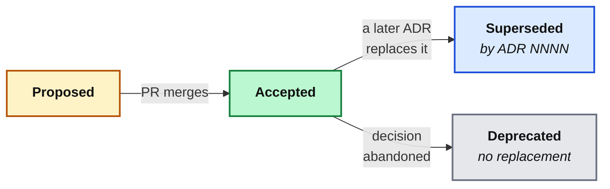

import AnnotatedCode from '../../../components/code/annotated-code/AnnotatedCode.astro';
import AnnotatedStep from '../../../components/code/annotated-code/AnnotatedStep.astro';
import Sequence from '../../../components/exercises/sequence/Sequence.astro';
import Step from '../../../components/exercises/sequence/Step.astro';
import Buckets from '../../../components/exercises/buckets/Buckets.astro';
import Bucket from '../../../components/exercises/buckets/Bucket.astro';
import Item from '../../../components/exercises/buckets/Item.astro';
import TabbedContent from '../../../components/figures/tabbed-content/TabbedContent.astro';
import TabbedItem from '../../../components/figures/tabbed-content/TabbedItem.astro';
import Figure from '../../../components/figures/Figure.astro';
import Term from '../../../components/ui/Term.astro';
import ExternalResource from '../../../components/ui/ExternalResource.astro';
import VideoCallout from '../../../components/embeds/VideoCallout.astro';
import { CardGrid } from '@astrojs/starlight/components';
import CourseProgressBar from '../../../components/ui/CourseProgressBar.astro';

<CourseProgressBar value={frontmatter['course-progress']} />

You join a team and open their invoicing app. Drizzle is wired through every query, so you ask the obvious question: why Drizzle and not Prisma, the market default? Someone here chose against the default on purpose, so you go looking for the reason.

It isn't in the README or `AGENTS.md`. The commit that added the database layer just says `add db layer`. Slack has a half-deleted thread from two years ago about a meeting you weren't in, and the engineer who made the call left last spring. The decision is everywhere in the code; the reasoning is nowhere. Now you're stuck: change Drizzle blind and risk re-learning a lesson someone already learned, or leave it untouched out of fear and call that respect for the existing architecture.

Every engineer who inherits a codebase hits this wall, and the fix is cheap. The reasoning behind an architectural decision is worth saving, and it has a standard shape: the Architectural Decision Record. It is the *explanation* quadrant from earlier in this chapter, and it lives in `/docs/adr/`. This lesson shows you how to write one.

## Where decision rationale tries to hide

The reasoning behind a decision has to live somewhere, so run through the obvious homes and watch each one lose the *why*.

A commit message records *what changed* in a line or two, then sinks under the next thousand commits; if your team uses a <Term definition="Merging a pull request by collapsing all its commits into one. The individual commit messages and their bodies are discarded in the process.">squash merge</Term>, the body is discarded at merge time anyway.
A pull request description is prose next to the diff, but it's locked behind your platform's search and sinks below a hundred newer PRs once merged, and nobody greps closed PRs to understand current architecture.
`git blame` tells you *who* touched a line and *when*, never why a pattern spread across a hundred files exists.
Chat is where the real conversation happens and the most fragile place to keep it: ephemeral by design, it scrolls away in days and vanishes when the workspace is pruned or the person who said the key thing leaves.
The README is written for first contact, so it's the wrong audience, and rationale dilutes its one job.
`AGENTS.md` states *what* the convention is so an agent or teammate can follow it, and deliberately not *why* it was chosen.

Here's the whole landscape in one view:

| Where the reasoning tries to live | What it captures | What it loses |
| --- | --- | --- |
| Commit message / `git log` | *What* changed, one line | The *why*; erased by squash merges |
| Pull request description | Some prose, next to the diff | Buried after merge; platform-locked search |
| `git blame` | Who touched a line, and when | Why a whole pattern exists |
| Slack / chat | The live conversation | Everything, eventually, since it's ephemeral |
| README | First-contact orientation | Wrong audience; rationale dilutes its job |
| `AGENTS.md` | *What* the convention is | *Why* it was chosen |

None of these is a durable, grep-able, single-purpose record of *one decision's reasoning*. The gap isn't a missing feature of any one tool, it's the job none of them does. Filling it is precisely the job of the ADR.

## Anatomy of an ADR: the Nygard template

An <Term definition="Architectural Decision Record: a short markdown file documenting one architectural decision and the reasoning behind it.">ADR</Term> is a short markdown document, half a page to two pages, that captures *one* architectural decision: the context that forced it, the choice made, and the consequences accepted in return. The format comes from a 2011 post by Michael Nygard and is still the standard. You'll meet it in real repos under `/docs/adr/`, one numbered file per decision, like `0001-use-drizzle-not-prisma.md`.

You'll absorb the shape faster from a real record than from a definition, so here's the one for a decision you've lived through this course: choosing Drizzle over Prisma. You already use Drizzle, so the decision needs no defense; read for the *form*.

<AnnotatedCode lang="md" maxLines={18} code={`
# ADR 0001: Use Drizzle, not Prisma

## Status

Accepted

## Context

We need a typed ORM for all Postgres access. Prisma is the market
default but ships a heavier runtime, models the schema in its own DSL
rather than TypeScript, and its migration engine is hard to drop down
out of when we need raw SQL. We want SQL we can read, a small client,
and migrations we own as plain files.

## Decision

We will use Drizzle as the ORM for all database access.

## Consequences

- Leaner runtime and a raw-SQL escape hatch when we need it.
- Schema is TypeScript — one language, no separate DSL to learn.
- Relations are typed by hand via \`relations()\`; more boilerplate than
  Prisma's implicit relations.
- Smaller ecosystem: fewer plugins, fewer Stack Overflow answers.
- The team owns migration files directly; no generate-and-pray engine.
`}>
  <AnnotatedStep meta="{1}" color="blue">
    **The title.** Numbered, and a short *noun phrase of the decision*: "Use Drizzle, not Prisma," not a question or a vague label like "Database stuff." The number (`0001`) is a stable identifier you'll cite in PRs and in other ADRs that reference this one.
  </AnnotatedStep>

  <AnnotatedStep meta="{3-5}" color="violet">
    **Status.** The lifecycle field: Proposed, Accepted, Superseded, or Deprecated. Most live ADRs read "Accepted"; when a later decision replaces this one, this single field is what changes. Some templates add a *Date* line, but git already records the file's birth.
  </AnnotatedStep>

  <AnnotatedStep meta={`{7-13} "DSL"`} color="blue">
    **Context.** The forces in play *at the time*: the problem, the constraints, the alternatives on the table, and what wasn't yet known. Name them concretely. "A heavier runtime, a separate schema <Term definition="Domain-Specific Language: a small purpose-built syntax. Here, Prisma's own .prisma schema file, which is separate from TypeScript.">DSL</Term>, a migration engine hard to escape" lets a reader two years out judge whether your reasons still hold; "Prisma felt heavy" helps no one. One paragraph, maybe two, never a company history.
  </AnnotatedStep>

  <AnnotatedStep meta="{15-17}" color="green">
    **Decision.** One declarative sentence, unhedged: "We will use Drizzle." Not "we're considering" or "we should probably." The document records what was *decided*, not what was debated.
  </AnnotatedStep>

  <AnnotatedStep meta="{19-26}" color="orange">
    **Consequences.** What the choice changes: the good (constraints released) *and* the costs (constraints imposed). Bullets three through five are downsides, included on purpose. That honest mix is the whole signal: a Consequences section listing only upsides is a sales pitch, not a record. This is the single most important quality bar in the lesson.
  </AnnotatedStep>
</AnnotatedCode>

The canonical template names four sections under the numbered title: Status, Context, Decision, and Consequences. Three of them do the real work and appear in every variant of the format: **Context, Decision, Consequences.** The rest of the lesson keeps coming back to those three. <Term definition="Markdown Any Decision Records: a more structured ADR template that adds 'Considered Options' and 'Decision Outcome' sections.">MADR</Term> (Markdown Any Decision Records) adds explicit Considered Options and Decision Outcome sections; this course uses Nygard because Context, Decision, and Consequences are the smallest shape that does the job.

<VideoCallout videoId="6H6zfCNeqek" videoTitle="Architecture Decision Records (ADR) as a LOG that answers WHY">
  Derek Comartin (CodeOpinion) walks the Nygard template and frames ADRs as an append-only *log* of the *why* behind your code. 10 minutes.
</VideoCallout>

## One decision per file

The most important structural rule is **one decision per file.** ADR 0001 is Drizzle. ADR 0002 is Better Auth. There's no "ADR 0001: our stack choices" bundling them together.

The reason is history. Each decision has its own context, alternatives, and consequences, and each gets revisited on its own schedule. Two years from now you might replace Drizzle while Better Auth stays put. Share a file and you can't mark one superseded without the other, so the change you made gets tangled in the decision you left alone. One file per decision keeps each timeline clean.

The filename carries the decision too. In `0001-use-drizzle-not-prisma.md`, the kebab-case slug *is* the decision, so you can read the folder listing and know every decision without opening a file.

## Write the ADR while you decide, not after

The discipline that separates ADRs that stay true from ADRs that quietly lie: draft the record *while the team is having the conversation*, not afterward.

The ADR starts life as status **Proposed**, a file in the same pull request that ships the decision: the PR that introduces Drizzle is the PR that adds `0001-use-drizzle-not-prisma.md`. The reviewer reads the Context and Consequences against the diff. On merge, you flip the status to **Accepted**. The record isn't done after the work; it's *part* of the work.

Write it now because memory decays faster than people expect:

- A week later, the three alternatives you weighed have collapsed into "we picked the right one."
- A month later, they get *rationalized*: you remember why you were right, not what you actually weighed. Those aren't the same memory.
- Six months later, anyone reconstructing it from memory writes one that's confidently, subtly **wrong**, worse than no record, because the next maintainer trusts it.

Documentation discipline is *structural*, not aspirational. A doc that ships in the same PR as the code stays accurate: the reasoning is fresh, and a reviewer is right there to check it against the diff. A doc deferred to "we'll write it up later" either rots or never gets written.

Put these steps in the order they happen. The record threads *through* the decision; it doesn't trail behind it.

<Sequence instructions="Put the write-while-deciding flow in the order it actually happens.">
  <Step>The team debates Drizzle versus Prisma in the design discussion.</Step>
  <Step>Draft `0001-use-drizzle-not-prisma.md` with status **Proposed**.</Step>
  <Step>Open the pull request that adds Drizzle *and* the ADR together.</Step>
  <Step>The reviewer reads the Context and Consequences against the diff.</Step>
  <Step>Merge, then flip the ADR's status to **Accepted**.</Step>
</Sequence>

## What earns an ADR (and what doesn't)

An ADR folder with every decision in it is noise nobody reads; a folder missing the real ones leaves you in the opening scenario. The line between them is three tests, and a decision earns an ADR only when **all three** hold:

1. **Architectural reach**: it affects multiple files, or future PRs will have to live with it.
2. **Reasonable disagreement**: a competent engineer could have chosen differently.
3. **Costly to reverse**: undoing it costs more than one PR by one person.

Run "Use Drizzle" through them: it touches every query (reach), Prisma was a defensible alternative (disagreement), and ripping it out is weeks of work (costly). Three for three, so it earns a record.

Now run "name this variable `userId`, not `uid`." Reach? One file. Disagreement? A style preference, not a fork. Cost to reverse? One find-and-replace. Zero for three, so that's a code-review comment, not a record. The heuristic to carry: **if it's reversible in one PR by one engineer, it isn't an architectural decision.**

Most choices fail these tests and already have homes: variable names, how you decompose a function, how files sit inside a feature, a dependency bump that doesn't change the API, a CSS class. Those are `AGENTS.md` conventions or code-review topics. The most common beginner mistake is an ADR titled "Coding conventions"; conventions are `AGENTS.md` content. An ADR records a *decision between alternatives*, not a style rule you apply uniformly.

The three tests guard against both failure modes. **Under-documenting** is the opening scenario: a real fork nobody recorded, lost the moment the person leaves. **ADR sprawl** is the reverse, a record for every feature flag and dependency bump until the signal drowns.

Sort the decisions below, running each one against the three tests before you drop it.

<Buckets twoCol instructions="Sort each decision by whether it deserves its own ADR. Run all three tests — architectural reach, reasonable disagreement, costly to reverse — before you decide.">
  <Bucket name="earns" label="Earns an ADR" description="Reach + reasonable disagreement + costly to reverse" />
  <Bucket name="not" label="Not an ADR" description="Code review or AGENTS.md territory" />

  <Item bucket="earns">Use Drizzle instead of Prisma as the ORM</Item>
  <Item bucket="earns">Better Auth instead of a hosted auth provider</Item>
  <Item bucket="earns">Server Actions as the API surface instead of REST route handlers</Item>
  <Item bucket="earns">Run Postgres on the Node runtime instead of an edge database</Item>

  <Item bucket="not">Rename `uid` to `userId`</Item>
  <Item bucket="not">Extract this 40-line function into two helpers</Item>
  <Item bucket="not">Bump `zod` from `4.0.1` to `4.0.2`</Item>
  <Item bucket="not">Use `gap-4` instead of `space-y-4` in this layout</Item>
</Buckets>

## Numbering and the supersession lifecycle

ADRs are numbered sequentially, zero-padded, and **never reused**: `0001-`, `0002-`, `0003-`, and so on. The number is a stable identifier that shows up in PR descriptions ("implements ADR 0007") and in cross-references from other ADRs, and it survives a file rename. Two anti-patterns to avoid: don't number by date, since git already owns the date, and don't number by category, since categories drift while a sequence never does.

What matters more is what happens when a decision is later reversed. The instinct is to delete the old ADR, and that instinct is exactly wrong: you <Term definition="Replace an earlier decision with a newer one while keeping the original record. The old ADR's status becomes 'Superseded by ADR NNNN', and its file stays in the repo.">supersede</Term> in place and never delete.

Say the team replaces Drizzle two years on. That is two small edits:

- Write a *new* record, `0019-replace-drizzle-with-x.md`, status **Accepted**, whose Context explains what changed since 0001: the new constraints that made the old decision no longer fit.
- Set ADR 0001's status to **Superseded by ADR 0019**, with a one-line pointer. Its body stays untouched.

The historical record *is* the value. A future maintainer needs the whole chain: Drizzle was chosen deliberately, served two years, and was replaced under specific new pressures. Delete 0001 and you erase that lesson and invite the next person to re-litigate a question already settled. This works cleanly only because 0001 held exactly *one* decision, the payoff of one decision per file.

Seen plainly, the lifecycle is a tiny state machine: the file never moves, only its status field does.

<Figure caption="An ADR's status moves through these states; the file is never deleted. 'Superseded' and 'Deprecated' are reached by an arrow, not removed.">

</Figure>

One supporting file ties the folder together. `/docs/adr/` carries a hand-maintained `README.md` listing every ADR by number, title, and current status: a table of contents and a one-glance view of the whole decision history. Each new ADR's PR updates the index in the same commit, write-while-deciding applied to the folder's own front page.

## Six decisions this course already made

You've spent the whole course inside these six decisions; here are the records behind them. You saw the Drizzle record in full above; the other five are *sketches*, with Context, Decision, and Consequences compressed to a few lines each. Flip through and watch the same template repeat on choices you already trust.

<TabbedContent syncKey="six-course-decisions">
  <TabbedItem label="Drizzle" caption="Trade: a smaller ecosystem and hand-typed relations for a leaner runtime and owned migrations.">
    The fully-worked record above, in brief.

    ```md
    ## Context

    We need a typed ORM for all Postgres access. Prisma is the market
    default but is heavier, models the schema in its own DSL rather than
    TypeScript, and has a migration engine that's hard to escape.

    ## Decision

    We will use Drizzle as the ORM for all database access.

    ## Consequences

    - Leaner runtime and a raw-SQL escape hatch when we need it.
    - Schema is TypeScript — one language, no separate DSL.
    - Relations are typed by hand via `relations()`; more boilerplate.
    - Smaller ecosystem: fewer plugins, fewer Stack Overflow answers.
    - We own migration files directly; no generate-and-pray engine.
    ```
  </TabbedItem>

  <TabbedItem label="Better Auth" caption="Trade: operating auth ourselves, in exchange for data sovereignty and no per-seat billing.">
    ```md
    ## Context

    We need email+password, OAuth, sessions, RBAC, and org-scoped auth —
    inside *our* Next.js codebase, not a hosted provider's.

    ## Decision

    We will use Better Auth for authentication and authorization.

    ## Consequences

    - The users table is ours, in our Postgres (data sovereignty).
    - No per-active-user billing as the org count grows.
    - RBAC and organizations come in the plugin surface.
    - We now operate auth ourselves rather than outsourcing it.
    ```
  </TabbedItem>

  <TabbedItem label="Biome" caption="Trade: a smaller rule set, for one tool that runs in milliseconds.">
    ```md
    ## Context

    We want lint and format running in milliseconds in pre-commit and CI.
    ESLint + Prettier is two tools, two configs, and slower.

    ## Decision

    We will use Biome for both linting and formatting.

    ## Consequences

    - One config instead of two.
    - Roughly 10x faster on the same codebase.
    - Fewer rules than the union of ESLint plugins (the real downside).
    ```
  </TabbedItem>

  <TabbedItem label="R2" caption="Trade: a slightly newer ecosystem, for zero egress fees.">
    ```md
    ## Context

    We need object storage with predictable cost. The SaaS read/download
    pattern makes S3's egress fees bite as traffic grows.

    ## Decision

    We will use Cloudflare R2 for object storage.

    ## Consequences

    - Zero egress fees — the cost that was biting on S3.
    - An S3-compatible API, so the same SDK works.
    - One more account to manage.
    - A slightly newer, smaller ecosystem than S3's.
    ```
  </TabbedItem>

  <TabbedItem label="Node runtime" caption="Trade: a little cold-start latency, for compatibility with the whole stack.">
    ```md
    ## Context

    The edge runtime wins on latency but forbids Node APIs and persistent
    connections — and Drizzle, Postgres, Resend, Stripe, and Better Auth
    all want Node.

    ## Decision

    We will use the Node runtime by default; edge only where a route
    genuinely benefits.

    ## Consequences

    - The full Node ecosystem and simple module compatibility.
    - A slightly higher cold start than edge — fine for dashboards.
    ```
  </TabbedItem>

  <TabbedItem label="Native forms" caption="Trade: more lifting on heavy client validation, for fewer dependencies and platform-native forms.">
    ```md
    ## Context

    React 19 ships `useActionState`, native `<form action>` with
    progressive enhancement, and direct Server Action integration. React
    Hook Form adds a dependency and a second mental model.

    ## Decision

    We will use native forms by default; React Hook Form only past the
    complexity threshold.

    ## Consequences

    - Less code, fewer dependencies, direct action integration.
    - Complex client-only validation takes more work when it arrives.
    ```
  </TabbedItem>
</TabbedContent>

Two things to notice across all six. First, each passes the three-test check on its own: real architectural reach, a defensible alternative, and a reversal that costs far more than one PR. That's why they earn records and a thousand smaller choices don't. Second, not one Consequences list is all upside. Every sketch names a real cost, from hand-typed relations to a slower cold start. A sketch of only wins would be a sales pitch, not a record.

## External resources

The original source of the template you now use, plus the MADR variant for when a team wants more structure:

<CardGrid>
  <ExternalResource
    title="Documenting Architecture Decisions"
    href="https://cognitect.com/blog/2011/11/15/documenting-architecture-decisions"
    icon="lucide:file-text"
    description="Michael Nygard's 2011 post that introduced the ADR format."
  />
  <ExternalResource
    title="Architectural Decision Records"
    href="https://adr.github.io/"
    icon="simple-icons:github"
    description="A community hub of ADR templates, tooling, and examples."
  />
  <ExternalResource
    title="MADR — Markdown Any Decision Records"
    href="https://adr.github.io/madr/"
    icon="simple-icons:markdown"
    iconColor="#000000"
    description="The more structured alternative this lesson mentions — full and minimal templates with Considered Options and Decision Outcome."
  />
</CardGrid>

## The four documentation homes

An ADR is the durable record of one architectural decision: the context that forced it, the choice, and the consequences accepted in return. The one quality bar that matters most is an honest Consequences section, because a list of only upsides is a pitch, not a record. An inline `// why` comment is this same reflex at the smallest scale, justifying one non-obvious line; an ADR applies it to a decision that spans the codebase.

That completes the documentation surface this chapter set out to map. Four jobs, four homes: the README for first contact, `AGENTS.md` for the conventions an agent or teammate follows, the source files for reference, and `/docs/adr/` for the *why* behind the architecture. Each has exactly one audience and one job. Next, the reference quadrant: the TSDoc that turns a function's signature into documentation your IDE surfaces on hover.
