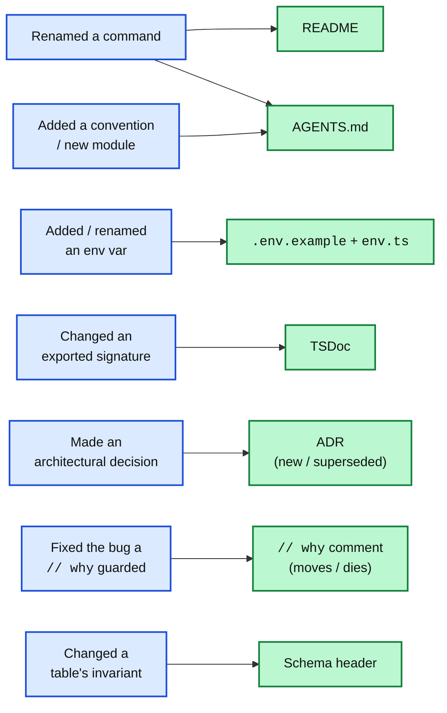

import Figure from '../../../components/figures/Figure.astro';
import TabbedContent from '../../../components/figures/tabbed-content/TabbedContent.astro';
import TabbedItem from '../../../components/figures/tabbed-content/TabbedItem.astro';
import Term from '../../../components/ui/Term.astro';
import ExternalResource from '../../../components/ui/ExternalResource.astro';
import Matching from '../../../components/exercises/matching/Matching.astro';
import Pair from '../../../components/exercises/matching/Pair.astro';
import CodeReview from '../../../components/exercises/code-review/CodeReview.astro';
import ReviewFile from '../../../components/exercises/code-review/ReviewFile.astro';
import ReviewIssue from '../../../components/exercises/code-review/ReviewIssue.astro';
import ReviewWhy from '../../../components/exercises/code-review/ReviewWhy.astro';
import CourseProgressBar from '../../../components/ui/CourseProgressBar.astro';
import { Steps } from '@astrojs/starlight/components';
import { CardGrid } from '@astrojs/starlight/components';

<CourseProgressBar value={frontmatter['course-progress']} />

A pull request splits the test suite in two — unit tests and end-to-end tests, each with its own command — and renames the script the README tells people to run from `pnpm test` to `pnpm test:unit`. The change is correct. CI is green. The PR merges.

The README still says `pnpm test`.

Three weeks later someone new clones the repo, opens the README to get the project running, and types the command it tells them to: `pnpm test`. `command not found`. They check that they typed it right. They check their Node version. They re-read the setup steps in case they missed one. Eventually they give up and ask in the team channel, and someone who knows answers in ten seconds — *oh yeah, it's `test:unit` now*. The newcomer lost an afternoon, and they learned something they'll carry for the rest of their time on the codebase: the README can't be trusted. Next time it says something, they'll check the code first.

Nothing in that story was a coding mistake. The code change was right. The test split was right. The thing that went wrong is that a PR changed something the README *makes a claim about*, and the README shipped wrong, in the same repo, on the same day, because nobody asked the one question this lesson is about: *what did this PR claim, and which docs make a claim about that?*

This is the last lesson of the chapter, and it closes out the documentation half of the unit. [The previous chapter](/101-docs-that-live-next-to-the-truth/1-the-four-jobs-of-docs/) named the four artifacts a repo maintains from the outside — README, AGENTS.md, ADRs, source-as-reference. This chapter went inside the source file for the other two: [TSDoc on the public surface](/102-docs-that-live-in-the-code/1-tsdoc-the-public-surface/) and [`// why` comments](/102-docs-that-live-in-the-code/2-comment-the-why-not-the-what/) on the lines that need one. Every one of those is one merge away from being silently wrong. This lesson is the discipline that keeps all of them true.

Here's the payload. One rule — the doc ships in the PR that changed the thing it describes. One map — which artifact moves with which kind of change. One checklist — the five doc checks a reviewer runs on any diff. And one boundary — automation catches the drift a machine can compare, review catches the drift only a human can read. The deliverable isn't a tool. It's a reflex you run at the moment you open a PR, automatic after a quarter of practice.

## A wrong doc is worse than no doc

Before the mechanics, the *why* — because the map in the next sections is only worth memorizing once you feel the cost of getting it wrong.

Start with the obvious case: a missing doc. A function with no doc comment, a README that doesn't mention some command, a config value nobody wrote down. A missing doc has a cost, and the cost is real: the reader has to go read the code to learn what the doc would have told them. But that cost is *bounded*. It's paid once, it's paid up front, and the reader knows they're paying it — there's no doc, so they go to the source. They never get misled, because there was nothing there to mislead them.

Now the case that looks the same but isn't: a *wrong* doc. A doc that asserts something the code no longer does — this is <Term definition="When a doc and the code it describes fall out of sync; the doc still asserts something that's no longer true.">drift</Term>, and it costs the next reader far more than a missing doc ever could. Trace what the README cost the newcomer in the opening:

- They read it. (The time a missing doc would have saved them.)
- They *believed* it, and acted on it — ran the command, watched it fail.
- They spent an afternoon discovering it was lying — re-checking their own setup, suspecting themselves before suspecting the doc, because a doc is supposed to be true.
- They stopped trusting it. And not just that line — the *whole* README, and every doc next to it. A doc caught lying once poisons every doc around it, because now the reader has to verify all of them against the code, which is exactly the work the docs were supposed to save.

That last cost is the one that compounds. A missing doc is a hole; a wrong doc is a trap, and a trap that's sprung once makes the reader distrust the whole floor. The following figure puts the two side by side as a ledger of stacking costs — flip between the tabs and watch the second column run past the first.

<TabbedContent syncKey="cost-asymmetry">
  <TabbedItem label="No doc" icon="information" caption="Bounded, one-time, and honest — the reader knows to go read the code.">
    <div style="display: flex; flex-direction: column; gap: 10px; margin: 0;">
      <div style="display: flex; align-items: baseline; justify-content: space-between; gap: 12px; margin: 0;">
        <span style="font-size: 1.05rem; font-weight: 700; color: var(--sl-color-white); margin: 0;">Missing doc</span>
        <span style="font-size: 0.8rem; font-weight: 600; color: var(--sl-color-gray-3); margin: 0;">cost ledger</span>
      </div>
      <div style="display: flex; flex-direction: column; gap: 8px; margin: 0;">
        <div style="display: flex; align-items: center; gap: 10px; padding: 12px 14px; border-radius: 8px; background: color-mix(in oklab, #38bdf8 14%, transparent); border-left: 4px solid #0ea5e9; margin: 0;">
          <span style="flex: 0 0 1.6rem; font-size: 0.95rem; font-weight: 700; color: #0ea5e9; margin: 0;">1</span>
          <span style="font-size: 0.95rem; color: var(--sl-color-white); margin: 0;">Reader goes and reads the code instead.</span>
        </div>
      </div>
      <div style="display: flex; align-items: center; gap: 10px; padding: 12px 14px; border-radius: 8px; background: color-mix(in oklab, #0ea5e9 20%, transparent); border: 1px solid color-mix(in oklab, #0ea5e9 45%, transparent); margin: 6px 0 0;">
        <strong style="font-size: 0.95rem; color: var(--sl-color-white); margin: 0;">Total —</strong>
        <span style="font-size: 0.95rem; color: var(--sl-color-white); margin: 0;">one cost, paid once, up front. The reader is never misled.</span>
      </div>
    </div>
  </TabbedItem>

  <TabbedItem label="Wrong doc" icon="error" caption="Every cost of a missing doc, plus four more that compound.">
    <div style="display: flex; flex-direction: column; gap: 10px; margin: 0;">
      <div style="display: flex; align-items: baseline; justify-content: space-between; gap: 12px; margin: 0;">
        <span style="font-size: 1.05rem; font-weight: 700; color: var(--sl-color-white); margin: 0;">Wrong doc (drift)</span>
        <span style="font-size: 0.8rem; font-weight: 600; color: var(--sl-color-gray-3); margin: 0;">cost ledger</span>
      </div>
      <div style="display: flex; flex-direction: column; gap: 8px; margin: 0;">
        <div style="display: flex; align-items: center; gap: 10px; padding: 12px 14px; border-radius: 8px; background: color-mix(in oklab, #f87171 14%, transparent); border-left: 4px solid #dc2626; margin: 0;">
          <span style="flex: 0 0 1.6rem; font-size: 0.95rem; font-weight: 700; color: #dc2626; margin: 0;">1</span>
          <span style="font-size: 0.95rem; color: var(--sl-color-white); margin: 0;">Reader reads the doc.</span>
        </div>
        <div style="display: flex; align-items: center; gap: 10px; padding: 12px 14px; border-radius: 8px; background: color-mix(in oklab, #f87171 14%, transparent); border-left: 4px solid #dc2626; margin: 0;">
          <span style="flex: 0 0 1.6rem; font-size: 0.95rem; font-weight: 700; color: #dc2626; margin: 0;">2</span>
          <span style="font-size: 0.95rem; color: var(--sl-color-white); margin: 0;">Reader believes it and acts on it.</span>
        </div>
        <div style="display: flex; align-items: center; gap: 10px; padding: 12px 14px; border-radius: 8px; background: color-mix(in oklab, #f87171 14%, transparent); border-left: 4px solid #dc2626; margin: 0;">
          <span style="flex: 0 0 1.6rem; font-size: 0.95rem; font-weight: 700; color: #dc2626; margin: 0;">3</span>
          <span style="font-size: 0.95rem; color: var(--sl-color-white); margin: 0;">The code does something else — a failure, a bug, a failed clone.</span>
        </div>
        <div style="display: flex; align-items: center; gap: 10px; padding: 12px 14px; border-radius: 8px; background: color-mix(in oklab, #f87171 14%, transparent); border-left: 4px solid #dc2626; margin: 0;">
          <span style="flex: 0 0 1.6rem; font-size: 0.95rem; font-weight: 700; color: #dc2626; margin: 0;">4</span>
          <span style="font-size: 0.95rem; color: var(--sl-color-white); margin: 0;">Reader spends time discovering the doc is lying.</span>
        </div>
        <div style="display: flex; align-items: center; gap: 10px; padding: 12px 14px; border-radius: 8px; background: color-mix(in oklab, #f87171 14%, transparent); border-left: 4px solid #dc2626; margin: 0;">
          <span style="flex: 0 0 1.6rem; font-size: 0.95rem; font-weight: 700; color: #dc2626; margin: 0;">5</span>
          <span style="font-size: 0.95rem; color: var(--sl-color-white); margin: 0;">Reader stops trusting this doc — and every doc next to it.</span>
        </div>
      </div>
      <div style="display: flex; align-items: center; gap: 10px; padding: 12px 14px; border-radius: 8px; background: color-mix(in oklab, #dc2626 22%, transparent); border: 1px solid color-mix(in oklab, #dc2626 50%, transparent); margin: 6px 0 0;">
        <strong style="font-size: 0.95rem; color: var(--sl-color-white); margin: 0;">Total —</strong>
        <span style="font-size: 0.95rem; color: var(--sl-color-white); margin: 0;">worse than no doc. A missing doc is a hole; a wrong doc is a trap that poisons the docs around it.</span>
      </div>
    </div>
  </TabbedItem>
</TabbedContent>

Now the economics, stated plainly, because they're what make this a reflex instead of a nice idea. Writing the doc update *inside the PR*, while the change is fresh in your head and the diff is right in front of you, costs about fifteen minutes. Discovering a wrong doc *in production* — a teammate or a customer hitting the lie, tracing it, fixing it, and rebuilding their trust in the docs — costs days. The asymmetry is so lopsided that "I'll do it later" is never actually the cheaper option. It only *feels* cheaper, because the fifteen minutes lands on you now and the days land on someone else later. The PR is where you pay the small cost so nobody pays the large one.

## The rule: the doc ships in the PR that changed the thing

Here's the discipline, in one sentence you can repeat to yourself:

**A code change that breaks a doc claim updates that doc claim in the same PR.** Not the next PR. Not a follow-up ticket. Not "before release." The same one.

The reason isn't tidiness — it's structural, and it's the whole argument. Walk a change through the checkpoints it passes on its way to production. You write it. You open a PR. A reviewer (a human, or a reviewing agent) reads the diff *with attention* — this is the one moment where someone is deliberately looking at exactly what changed. They approve. It merges. It deploys.

Count the checkpoints where someone looks at the change closely: there's one. Code review. After that, the very next checkpoint is *production*. So a doc that the change should have updated has exactly one shot at being noticed — that single review — before it's wrong in front of real users with nobody looking. The PR is the moment of leverage, because it's the only moment when the change and the docs that describe it are in front of a person *at the same time*. Before the PR, the change is still in flight and the docs aren't wrong yet. After it merges, the docs are wrong and nobody is reviewing them.

That's also why "I'll fix the docs in a quick follow-up PR" doesn't escape the problem — it just narrows it. Picture it: the code PR merges Monday, the doc PR merges Wednesday. Between those two merges, `main` is self-contradictory — the code says one thing, the doc says another. On a team that deploys `main` continuously, that window isn't theoretical. It's a live wrong doc in production for two days, available to every reader and every clone. The same-PR rule is the only option where that window has *zero* width, because the code and its doc land in the same merge or neither does.

This is the thesis. The next two sections make it usable: a map of *what* to update, and a checklist for *catching* what got missed.

## The doc-change map: which artifact moves with which change

The reflex when you open a PR is to run one question down a short list: *for each doc surface, did this diff invalidate a claim that surface makes?* The list is the same every time, which is exactly why it becomes automatic — you're not deciding *which* surfaces to check, you're checking the same seven and asking yes-or-no on each.

And the skill isn't only knowing which to update. It's knowing which to *skip*. Most PRs touch one or two of these surfaces and none of the rest, so half the value of the map is learning the "usually doesn't move" case for each — recognizing fast that a surface is irrelevant to this change is as much the reflex as catching the one that isn't. Here are the seven, each with its trigger and its quiet case.

- **README** — moves when the local-dev sequence changes, a common-task command changes (the opening anecdote), or a major stack swap happens. Most feature PRs don't touch it. (You met the [thin README](/101-docs-that-live-next-to-the-truth/2-the-thin-readme/) last chapter — it's deliberately small, so the few claims it makes are the ones worth watching.)
- **AGENTS.md** — moves when a convention shifts: a new "don't" rule, a new module added to the repo layout, a build or test command renamed, a tool added to the stack. Feature PRs rarely move it; refactor and infrastructure PRs often do.
- **ADRs** — a *new* <Term definition="Architecture Decision Record; a short file capturing one architectural decision and its consequences.">ADR</Term> is added in the PR that ships an architectural decision; an existing ADR's status flips to "superseded" in the PR that overturns it. Both happen in the deciding PR, never in a follow-up — the decision and its record land together. (This is the [one-decision-per-file ADR](/101-docs-that-live-next-to-the-truth/4-adrs---one-decision-per-file/) from last chapter, and its three-test inclusion bar still applies — not every change is a decision worth an ADR.)
- **TSDoc** — moves when an exported function's signature, contract, side effects, or failure modes change: adding `@throws` for a new error path, updating `@param`, marking `@deprecated`, or just refreshing the summary sentence so it still describes what the function does. All in the PR that changed the code. (This is [TSDoc on the public surface](/102-docs-that-live-in-the-code/1-tsdoc-the-public-surface/) — the cut for *which* functions earn a block hasn't changed; this is about keeping the blocks you already wrote honest.)
- **Inline `// why` comments** — move when the *why* changes. The constraint got fixed upstream, so the comment is now a <Term definition="A // why comment explaining a workaround for a bug since fixed; now actively misleading.">fossil comment</Term> and the workaround it guards should go with it; or the constraint got promoted into enforcement, so the comment dies and a type, test, or transaction takes its place. The comment travels with the lines it explains, or it dies with them — never outlives the reason it existed. (This is the carry-or-promote reflex from [commenting the why](/102-docs-that-live-in-the-code/2-comment-the-why-not-the-what/).)
- **Schema header comments** — the one-paragraph header on a `pgTable` declaration moves when the table's *purpose, scope, or invariants* change. A new column usually doesn't trigger it. A new *invariant* does — a uniqueness rule, a tenancy constraint, a new lifecycle the table now enforces. (The schema-header pattern is from [last chapter](/101-docs-that-live-next-to-the-truth/2-the-thin-readme/).)
- **`.env.example`** — moves whenever `env.ts` adds, removes, or renames a key. These two files are siblings: [`env.ts`](/081-the-security-baseline/7-the-env-schema/) is the validated source of truth, and `.env.example` is the human-readable hint a new developer copies to get started. An `env.ts` change without a matching `.env.example` change is an incomplete PR.

That last pair is worth a second look, because it shows why the human checklist exists at all. `env.ts` is *enforced* — a missing required variable fails `pnpm build`, so the code can't ship with `env.ts` out of sync with reality. But `.env.example` is just a text file. Nothing validates it. Add `RESEND_API_KEY` to `env.ts` and forget the example, and the build stays green while the next developer who clones the repo has no idea the variable exists until something fails at runtime. The build catches a *missing* var; nothing catches a *stale example*. That gap — enforced on one side, hint-only on the other — is exactly the kind of drift only a person reading the diff will catch.

The whole map compresses into one picture. The following diagram puts the kinds of code change on the left and the doc artifacts each one moves on the right; the edges are the reflex itself, drawn out. The goal is that after you've seen it, opening a PR fires the right edge automatically — *renamed a command* lights up *AGENTS.md* and *README*, *changed a signature* lights up *TSDoc*, and so on.

<Figure caption="Open a PR, run down the left column, and follow the edges. Most PRs light up one or two artifacts and leave the rest dark — knowing which to skip is half the reflex.">

</Figure>

A note on the most tempting wrong edge, because it's the one that separates following the map from understanding it: a plain *new column* on a table does **not** move the schema header. Adding a nullable `feature_flag_enabled` column for a flag is just more shape; the table's purpose, scope, and invariants are unchanged, so the header that describes them is still true. The header moves only when an *invariant* changes — when the new column comes with a uniqueness rule, a tenancy constraint, or a new rule the table now enforces. The cut is purpose and invariants, never field count.

Drill the map now. Match each code change on the left to the doc artifact that has to move with it.

<Matching instructions="Match each code change to the doc artifact that must move with it in the same PR.">
  <Pair>
    <Fragment slot="left">Renamed `getInvoice` and added a new `@throws` case</Fragment>
    <Fragment slot="right">Its TSDoc block</Fragment>
  </Pair>
  <Pair>
    <Fragment slot="left">Added `RESEND_API_KEY` to `env.ts`</Fragment>
    <Fragment slot="right">`.env.example`</Fragment>
  </Pair>
  <Pair>
    <Fragment slot="left">Decided to move from polling to webhooks</Fragment>
    <Fragment slot="right">A new ADR</Fragment>
  </Pair>
  <Pair>
    <Fragment slot="left">Deleted a `setTimeout` whose race was fixed upstream</Fragment>
    <Fragment slot="right">The fossil `// why` comment beside it</Fragment>
  </Pair>
  <Pair>
    <Fragment slot="left">Renamed the lint command from `lint` to `check`</Fragment>
    <Fragment slot="right">AGENTS.md</Fragment>
  </Pair>
  <Pair>
    <Fragment slot="left">Added a `unique` constraint for a new tenant invariant</Fragment>
    <Fragment slot="right">The schema header comment</Fragment>
  </Pair>
</Matching>

## The reviewer's doc checklist

Everything so far has been from the author's seat — *I'm opening a PR, which docs did my change touch?* Now flip to the reviewer's chair. The author's reflex run from the outside becomes the reviewer's pass: a short, fixed list of doc checks to run against any diff. It's the same map you just learned, read from the other side of the PR — the author asks "which docs did I move?", the reviewer asks "did they move the docs they should have?"

This is the structural enforcement the last two lessons kept pointing forward to. TSDoc taught you to write a good doc block; comments taught you to carry a comment through a refactor or promote it. Both said the thing that *keeps* those docs accurate is review — and this is it. Here are the five checks, run in order on the diff:

<Steps>
1. **Signatures.** Did any exported function's signature, contract, or set of thrown errors change? If yes — did its TSDoc update to match? A new parameter with no `@param`, a new error path with no `@throws`, a summary sentence that now describes the old behavior: all drift.

2. **Env vars.** Did any environment variable get added or renamed? If yes — did `env.ts` *and* `.env.example` both update? The build enforces one side; you're the only thing enforcing the other.

3. **Conventions and layout.** Did any convention or repo-layout fact change — a renamed command, a new module, a new rule? If yes — did AGENTS.md update? This is the surface that rots quietest, because no single small change *feels* like it touches it.

4. **Decisions.** Did this PR make an architectural decision, or overturn one? If yes — is there a new ADR, or a status flip on the old one? A cross-cutting pattern introduced with no ADR is a decision nobody recorded.

5. **Stripped comments.** Was a `// why` comment removed in a refactor? If yes — was the constraint it protected either preserved in a moved comment, or upgraded to enforcement? If the comment is just *gone* and the constraint is gone with it, that's a bug walking back in.
</Steps>

Check five is the subtle one, and it's the reason "comments are part of the code" was a whole section of the last lesson. The first four checks ask you to spot something that's *in* the diff — a changed signature, a new env var, a new pattern. Check five asks you to spot something that's *missing* from it: a comment that used to be there and isn't anymore. Noticing an absence in a diff is the hardest thing a reviewer does, because nothing on the screen draws your eye to a line that was deleted — you have to be reading the *minus* lines as carefully as the plus ones. Remember the deleted `setTimeout` from the last lesson — the load-bearing sleep that got tidied away, with no comment to explain why it was there, and surfaced as a flaky production bug a week later? A `// why` line beside it would have turned that silent deletion into one a reviewer could question, and *this* is the checkpoint where that question gets asked. A reviewer running check five sees a comment vanish, stops, and asks what it was protecting — before the bug it was holding back can ship.

Time to sit in the reviewer's chair for real. The following is a small pull request across four files. Review it the way you'd review a teammate's: read the diff, find where a doc no longer matches the code it describes, and click the line to leave a comment naming the drift. There are four defects, one per surface from the checklist.

<CodeReview instructions="Review this PR the way you'd review a teammate's. Every defect here is a doc that no longer matches the code it describes. Click the line and name the drift. There are four.">
  <ReviewFile name="src/lib/billing/charge.ts">
    ```ts ins={10-12}
    /**
     * Charges a finalized invoice through Stripe and records the result.
     *
     * @param invoiceId - the invoice to charge
     * @throws when the invoice is not in the `finalized` state
     */
    export const chargeInvoice = async (invoiceId: string): Promise<Result<Charge>> => {
      const invoice = await getInvoice(invoiceId);
      if (invoice.status !== 'finalized') return err('not_finalized', 'Invoice must be finalized before charging.');
      if (invoice.amountCents > org.chargeLimitCents) {
        throw new ChargeLimitError(invoice.amountCents);
      }
      return ok(await stripe.charge(invoice));
    };
    ```
  </ReviewFile>

  <ReviewFile name="src/env.ts">
    ```ts ins={5}
    export const env = createEnv({
      server: {
        DATABASE_URL: z.url(),
        STRIPE_SECRET_KEY: z.string().min(1),
        RESEND_API_KEY: z.string().min(1),
      },
      // …
    });
    ```
  </ReviewFile>

  <ReviewFile name="src/lib/invoices/finalize.ts">
    ```ts del={2-5} ins={6}
    export const finalizeInvoice = async (input: FinalizeInput) => {
      // Order matters: the audit row must commit before the receipt enqueues,
      // or a crash between the two loses the audit but still sends the email.
      await writeAuditRow(input);
      await enqueueReceiptEmail(input.invoiceId);
      await persistInvoiceResult(input);
      return ok();
    };
    ```
  </ReviewFile>

  <ReviewFile name="src/lib/notifications/dispatch.ts">
    ```ts ins={4-6}
    export const dispatch = async (event: NotifiableEvent) => {
      await sendEmail(event);
      await sendInbox(event);
      // every channel now also mirrors to the new webhook fan-out service;
      // downstream teams subscribe instead of us pushing per-integration
      await sendWebhookFanout(event);
    };
    ```
  </ReviewFile>

  <ReviewIssue
    file="src/lib/billing/charge.ts"
    line={11}
    kernel="TSDoc `@throws` no longer matches the function's error paths — a new throw was added but the doc block wasn't updated"
  >
    The PR adds a `ChargeLimitError` throw, but the block above still lists only the `not_finalized` case. A caller reading the hover won't know to handle the limit error. The doc moves in the same PR as the code — add the `@throws` line for `ChargeLimitError`.
  </ReviewIssue>

  <ReviewIssue
    file="src/env.ts"
    line={5}
    kernel="`env.ts` gained a key but `.env.example` wasn't updated to match — the two files must ship together"
  >
    The build will pass because `env.ts` validates what's set, but the next developer cloning the repo copies `.env.example` and never learns `RESEND_API_KEY` exists. The sibling file has to ship in this same PR — and notice that `.env.example` isn't even in this diff. That absence is the tell.
  </ReviewIssue>

  <ReviewIssue
    file="src/lib/invoices/finalize.ts"
    line={6}
    kernel="the refactor dropped a load-bearing ordering comment without preserving the constraint or upgrading it to enforcement"
  >
    The deleted comment was guarding a real ordering invariant — the audit row has to commit before the receipt email enqueues. The extraction took the warning with it, and nothing now stops a future edit from flipping the order inside the helper. Either carry the comment into `persistInvoiceResult`, or make the order structural (one transaction). This is check 5 — the absence is the defect.
  </ReviewIssue>

  <ReviewIssue
    file="src/lib/notifications/dispatch.ts"
    line={6}
    kernel="this PR introduces a cross-cutting architectural pattern but adds no ADR recording the decision"
  >
    Moving from per-integration pushes to a webhook fan-out is an architectural decision — it changes how every downstream integration is built. There's no ADR in this PR capturing why, the alternatives, or the consequences. The decision and its record ship together; add the ADR here. The inline comment is good, but a one-line `// why` isn't the place for a decision this size — that's the comment-vs-ADR scope cut from the last lesson.
  </ReviewIssue>

  <ReviewWhy>
    Every defect here is a doc that fell out of sync with the code in the same diff — drift, not bad writing. Plant 1 is check 1 (a signature's error set changed, the TSDoc didn't). Plant 2 is check 2 (an env var moved, its sibling file didn't). Plant 3 is check 5, the hard one (a load-bearing comment was stripped and the constraint went with it — you had to notice the *absence*). Plant 4 is check 4 (a real architectural decision shipped with no ADR). If you caught all four, you ran the reviewer's pass exactly as it's meant to run — and notice that catching the doc was, every time, cheaper than the bug or the lost afternoon it prevents.
  </ReviewWhy>
</CodeReview>

That fourth plant — a decision shipped with no ADR — raises a question the checklist doesn't answer: what does a reviewer *do* when a PR is incomplete like this? The mechanism is a *block* — the reviewer declines to approve until the missing doc ships, because a PR that changes a contract without updating its doc isn't done. *How* to block well — the language of it, when to block versus suggest, how to phrase it so it lands as help and not an obstacle — is the whole subject of the next chapter. Here, just hold the shape: an incomplete PR gets blocked, and the doc is part of what makes it complete.

## Where automation stops and review begins

There's an obvious objection forming by now: if doc drift is this mechanical, why is a *human* the load-bearing check? Why not just add a CI rule and be done?

Because some drift a machine can compare and some it can't, and the line between them is the most important thing in this section. Get it wrong in the cheap direction — "tooling will catch it" — and you stop reading diffs, and the half of drift that no tool can see ships unguarded.

Here's the split, with concrete cases on each side.

**Mechanical drift — automatable.** This is drift a machine can detect by *comparing two things for a structural match*:

- The cleanest example: a `.env.example`-vs-`env.ts` key-parity check. The two files must declare the same set of keys. That's a set comparison — a script computes both key sets and fails if they differ. Pure mechanics, zero judgment.
- A TSDoc linter (such as `eslint-plugin-tsdoc`) flagging a `@param` that names an argument the function no longer has, or a malformed tag. The tool isn't reading meaning — it's matching tag names against the signature.
- A test that imports a Server Action and exercises its success and failure paths. When the contract changes in a way the test pins, the test goes red. The behavior change announces itself.

Each of those works because there's a structural fact to compare: key set against key set, tag name against parameter name, asserted behavior against actual behavior. No interpretation required.

**Semantic drift — review-only.** This is drift where being right requires *reading intent against behavior* — and no linter can do that:

- Does the TSDoc *summary sentence* still describe what the function does? The tags can all be present and well-formed while the sentence quietly describes last quarter's behavior. A machine sees a valid summary; only a reader sees that it's lying.
- Does the README's "getting started" prose still match the actual steps? The commands might all exist (so a parity check passes) while the *order* or the *explanation* is now wrong.
- Is a `// why` comment still *true*, or is it a fossil for a bug that's since been fixed? The comment is syntactically fine; it's just describing a world that no longer exists.
- Did this PR's new behavior warrant an ADR that nobody wrote? No tool can decide a change was architecturally significant.

None of those have a structural fact to compare. They require someone who knows what the code is *supposed* to do, reading the doc against that. That someone is the reviewer.

So the threshold, as the one line to carry out of this section: **lint catches the drift a machine can compare; the reviewer catches the drift only a human can read.** The env-parity check is the cleanest anchor for the left side — it's the one drift class that's *purely* mechanical, a set equality, nothing else — which is exactly why it's the easiest to automate and the least interesting to a reviewer. The further you get from "two sets must be equal," the more the check belongs to a person.

:::note
There are products that automate doc-drift detection — they watch the diff and flag docs that look stale. They're useful, and the boundary above is exactly the one they live on: they automate the mechanical class and *surface candidates* for the semantic class, but the semantic call stays human. The point isn't which tool — it's that no tool moves the line. Don't reach for one expecting it to replace the reviewer's pass; reach for it to take the mechanical drudgery off the reviewer's plate so they can spend attention on the semantic checks only they can do.
:::

## Move the reflex into the workflow

A reflex this lesson describes is worth nothing if it evaporates the first busy week. Two pieces of lightweight scaffolding keep it alive — not as the teaching, just as the rails that hold the discipline in place when nobody has time to be disciplined.

### The PR template

A pull-request template is a markdown file at a known path that GitHub uses to pre-fill the description box every time someone opens a PR. Put two checkboxes in it and the author has to look at the doc surfaces at the exact moment of leverage — PR-open time — before they request review.

```md title=".github/pull_request_template.md"
## Docs

- [ ] I updated the docs affected by this change (TSDoc, `// why`, README, AGENTS.md, ADR).
- [ ] If I added or renamed a dependency or env var, `env.ts` and `.env.example` match.
```

Two lines, not an essay — a template that runs to a page of checkboxes gets approved unread, which is worse than no template, because now everyone's *trained* to tick boxes without looking. Keep it short enough that ticking it honestly is faster than ticking it dishonestly.

And name the failure mode honestly, because it's the obvious one: the author ticks the box without doing the work. The template is a *prompt*, not enforcement — it can't make anyone actually update a doc. That's fine, because it was never meant to be the enforcement. The reviewer's five-check pass from two sections ago is what catches a box that was ticked falsely. The box and the checklist are two halves of one mechanism: the box is the author-side prompt that makes them look, and the checklist is the reviewer-side verification that they actually did. Neither works alone; together they close the loop.

### The quarterly meta-doc review

There's a class of drift the per-PR reflex *can't* catch, no matter how disciplined everyone is. Some docs rot without any single PR touching them. The README's "getting started" sequence and the AGENTS.md conventions list drift *slowly* — a dozen small changes each leave them a little more out of date, and no one of those changes is wrong enough, or close enough to the doc, to trip the per-PR check. Each PR is individually clean; the doc is collectively stale. Per-PR review structurally can't see it, because there's no single PR to point at.

The counter isn't a better review — it's a *cadence*. Every quarter or so, someone follows the README from a genuinely clean clone — fresh machine state, no assumptions — and writes down every place it deviates from reality. Same for the AGENTS.md conventions: read them against what the codebase actually does now. State the cadence once, schedule it like any other recurring engineering chore, and it works.

The anti-pattern is what happens to *every* recurring chore that isn't defended: "everyone's too busy this quarter," and then the quarter after, and the meta-docs rot in exactly the slow, invisible way the cadence existed to prevent. The quarterly review has to be defended on the calendar the same way you'd defend dependency upgrades or on-call rotation — not because it's urgent any given week, but because it's the only thing that catches the rot nothing else can.

One small connection, stated once: if your team uses <Term definition="A commit-message convention (feat:, fix:…) that tools parse to auto-generate changelogs.">conventional commits</Term>, a line in the commit body can flag that the PR touched docs, and changelog tooling picks it up. Useful, not load-bearing — the discipline is the PR review, not the commit prefix. Don't mistake the prefix for the protection.

## The reflex, and the chapters it closes

Everything in this lesson — the map, the checklist, the boundary, the template, the cadence — is scaffolding around a single question. Pull it out and carry it, because after a quarter of running it on every PR you open, it fires on its own:

> Before you request review, ask: *what did this PR claim, and which docs make a claim about that?*

The list of docs is the same seven surfaces every time. The question takes seconds once it's a habit. And it's the entire payload of this lesson — the map just tells you where to look, the checklist is the same question from the reviewer's seat, and the rest keeps the habit alive when you're busy. The reflex *is* the deliverable.

This also closes the documentation half of the unit, so step back and see the shape these two chapters were building toward. Four ideas, each a lesson's worth of work, stacked into one posture:

- Docs live *next to* the truth — in the repo, beside the code, where they can't be forgotten in a wiki nobody opens.
- You *link* instead of duplicating — so a doc can't drift from the source it points at, because it doesn't store a second copy of anything.
- *Volume tracks value* — the public-surface cut for TSDoc, the why-not-what cut for comments — so the docs that exist are the ones worth reading, and the signal isn't drowned in noise.
- And the lock on all of it: *the doc ships with the change that affects it, or it's already wrong.*

The first three keep docs worth reading. This last one keeps them *true*. And it's the load-bearing one, because without it the other three decay: a doc placed next to the truth drifts away from it on the next merge, a link goes stale, a perfectly-cut TSDoc block ends up describing a function that no longer behaves that way. With this discipline, the three compound instead — every accurate doc makes the next reader trust the docs more, which makes them read them, which makes them worth maintaining.

One last property, stated plainly and then left alone: in 2026, a repo's docs are read by whoever — or whatever — edits the code next. A stale AGENTS.md or a wrong TSDoc steers the next change wrong before a human ever looks at it. That raises the stakes on accuracy, but it doesn't change the discipline one bit. It's the same discipline a careful team has always run — the doc ships in the PR, or it's already wrong. The only thing that's changed is that it's no longer optional.

The next chapter picks up where the reviewer's pass left off: not just the doc checks, but the whole craft of reviewing a pull request — what to look for beyond docs, when to suggest versus when to block, and the language that makes a review land as help instead of an obstacle. You've been doing review from one narrow seat this whole lesson. Next, you take the whole chair.

## External resources

A few resources are worth bookmarking — the philosophy this whole unit rests on, the reviewer's-pass guidance read from a different angle, and the file you'll wire up to put the reflex into a real repo.

<CardGrid>
  <ExternalResource
    title="Docs as Code"
    href="https://www.writethedocs.org/guide/docs-as-code/"
    icon="lucide:file-code"
    iconColor="#1f7a8c"
    description="Write the Docs' canonical writeup of the philosophy behind this unit — docs live in the repo, ship in the PR, and get reviewed like code."
  />
  <ExternalResource
    title="What to look for in a code review"
    href="https://google.github.io/eng-practices/review/reviewer/looking-for.html"
    icon="simple-icons:google"
    iconColor="#4285F4"
    description="Google's engineering-practices guide — the reviewer's pass widened past docs, including a dedicated documentation check."
  />
  <ExternalResource
    title="Creating a pull request template"
    href="https://docs.github.com/en/communities/using-templates-to-encourage-useful-issues-and-pull-requests/creating-a-pull-request-template-for-your-repository"
    icon="simple-icons:github"
    description="GitHub's docs on the .github/pull_request_template.md file and where it lives, for the two-checkbox version."
  />
</CardGrid>
