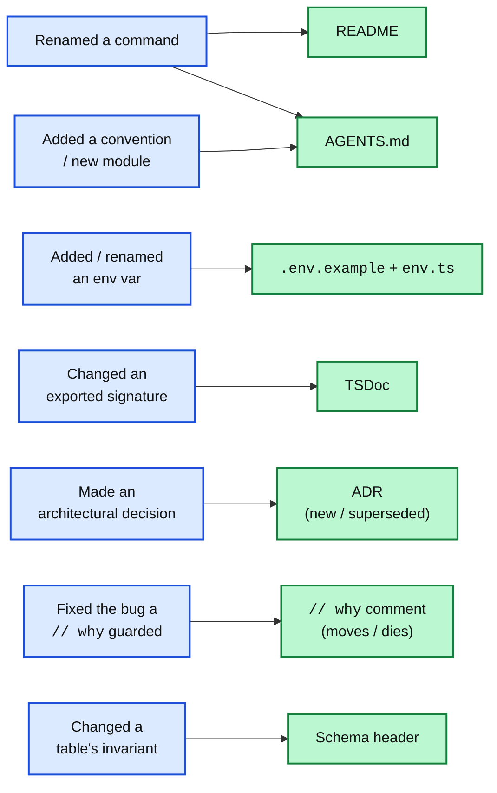

import Figure from '../../../components/figures/Figure.astro';
import TabbedContent from '../../../components/figures/tabbed-content/TabbedContent.astro';
import TabbedItem from '../../../components/figures/tabbed-content/TabbedItem.astro';
import Term from '../../../components/ui/Term.astro';
import ExternalResource from '../../../components/ui/ExternalResource.astro';
import CodeReview from '../../../components/exercises/code-review/CodeReview.astro';
import ReviewFile from '../../../components/exercises/code-review/ReviewFile.astro';
import ReviewIssue from '../../../components/exercises/code-review/ReviewIssue.astro';
import ReviewWhy from '../../../components/exercises/code-review/ReviewWhy.astro';
import CourseProgressBar from '../../../components/ui/CourseProgressBar.astro';
import { Steps } from '@astrojs/starlight/components';
import { CardGrid } from '@astrojs/starlight/components';

<CourseProgressBar value={frontmatter['course-progress']} />

A pull request splits the test suite into unit and end-to-end tests, and renames the command the README tells people to run from `pnpm test` to `pnpm test:unit`. The code is correct, CI is green, the PR merges.

The README still says `pnpm test`.

Three weeks later someone new clones the repo, follows the README, and types `pnpm test`. The shell answers `command not found`. They check their typing, their Node version, the setup steps, then ask in the team channel, where someone answers in ten seconds: it's `test:unit` now. They lost an afternoon, and they learned to check the code before the README.

No line of code was wrong. A PR changed something the README *makes a claim about*, and the stale README shipped in the same repo on the same day, because nobody asked the question this lesson is about: *what did this PR claim, and which docs make a claim about that?*

This chapter moved documentation inside the source file, with [TSDoc on the public surface](/102-documentation-in-the-code/1-tsdoc-the-public-surface/) and [`// why` comments](/102-documentation-in-the-code/2-when-inline-comments-earn-their-place/), joining the README, AGENTS.md, and ADRs from [the previous chapter](/101-documenting-a-saas-codebase/1-the-four-jobs-of-docs/). Every one is one merge away from being silently wrong, and this lesson is the discipline that keeps them true: a rule for when a doc ships, a map of which artifact moves with which change, a reviewer's checklist, and the line where automation stops and a human has to read.

## A wrong doc is worse than no doc

Start with the obvious case: a missing doc, a function with no doc comment or a command the README never mentions. It costs the reader real time, since they have to read the code to learn what the doc would have told them. But that cost is *bounded*: paid once, up front, with nothing there to mislead them.

Now the case that looks the same but isn't: a *wrong* doc, one that asserts something the code no longer does. This is *drift*: a doc and the code it describes have fallen out of sync, so the doc still claims something that's no longer true. It costs the next reader far more. Trace what the README cost the newcomer in the opening:

- They read it, the same time a missing doc would have cost them.
- They believed it and acted on it: they ran the command and watched it fail.
- They spent an afternoon discovering it was wrong, suspecting their own setup first, because a doc is supposed to be true.
- They stopped trusting it, not just that line but the *whole* README and every doc beside it, so now they verify all of them against the code, the exact work the docs were supposed to save.

That last cost is the one that compounds. A missing doc is a hole; a wrong doc is a trap, and once a reader steps in one, they distrust the whole floor.

<TabbedContent syncKey="cost-asymmetry">
  <TabbedItem label="No doc" icon="information" caption="Bounded and one-time: the reader knows to go straight to the code.">
    <div style="display: flex; flex-direction: column; gap: 10px; margin: 0;">
      <div style="display: flex; align-items: baseline; justify-content: space-between; gap: 12px; margin: 0;">
        <span style="font-size: 1.05rem; font-weight: 700; color: var(--sl-color-white); margin: 0;">Missing doc</span>
        <span style="font-size: 0.8rem; font-weight: 600; color: var(--sl-color-gray-3); margin: 0;">cost ledger</span>
      </div>
      <div style="display: flex; flex-direction: column; gap: 8px; margin: 0;">
        <div style="display: flex; align-items: center; gap: 10px; padding: 12px 14px; border-radius: 8px; background: color-mix(in oklab, #38bdf8 14%, transparent); border-left: 4px solid #0ea5e9; margin: 0;">
          <span style="flex: 0 0 1.6rem; font-size: 0.95rem; font-weight: 700; color: #0ea5e9; margin: 0;">1</span>
          <span style="font-size: 0.95rem; color: var(--sl-color-white); margin: 0;">Reader goes and reads the code instead.</span>
        </div>
      </div>
      <div style="display: flex; align-items: center; gap: 10px; padding: 12px 14px; border-radius: 8px; background: color-mix(in oklab, #0ea5e9 20%, transparent); border: 1px solid color-mix(in oklab, #0ea5e9 45%, transparent); margin: 6px 0 0;">
        <strong style="font-size: 0.95rem; color: var(--sl-color-white); margin: 0;">Total:</strong>
        <span style="font-size: 0.95rem; color: var(--sl-color-white); margin: 0;">one cost, paid once, up front. The reader is never misled.</span>
      </div>
    </div>
  </TabbedItem>

  <TabbedItem label="Wrong doc" icon="error" caption="Every cost of a missing doc, plus four that compound.">
    <div style="display: flex; flex-direction: column; gap: 10px; margin: 0;">
      <div style="display: flex; align-items: baseline; justify-content: space-between; gap: 12px; margin: 0;">
        <span style="font-size: 1.05rem; font-weight: 700; color: var(--sl-color-white); margin: 0;">Wrong doc (drift)</span>
        <span style="font-size: 0.8rem; font-weight: 600; color: var(--sl-color-gray-3); margin: 0;">cost ledger</span>
      </div>
      <div style="display: flex; flex-direction: column; gap: 8px; margin: 0;">
        <div style="display: flex; align-items: center; gap: 10px; padding: 12px 14px; border-radius: 8px; background: color-mix(in oklab, #f87171 14%, transparent); border-left: 4px solid #dc2626; margin: 0;">
          <span style="flex: 0 0 1.6rem; font-size: 0.95rem; font-weight: 700; color: #dc2626; margin: 0;">1</span>
          <span style="font-size: 0.95rem; color: var(--sl-color-white); margin: 0;">Reader reads the doc.</span>
        </div>
        <div style="display: flex; align-items: center; gap: 10px; padding: 12px 14px; border-radius: 8px; background: color-mix(in oklab, #f87171 14%, transparent); border-left: 4px solid #dc2626; margin: 0;">
          <span style="flex: 0 0 1.6rem; font-size: 0.95rem; font-weight: 700; color: #dc2626; margin: 0;">2</span>
          <span style="font-size: 0.95rem; color: var(--sl-color-white); margin: 0;">Reader believes it and acts on it.</span>
        </div>
        <div style="display: flex; align-items: center; gap: 10px; padding: 12px 14px; border-radius: 8px; background: color-mix(in oklab, #f87171 14%, transparent); border-left: 4px solid #dc2626; margin: 0;">
          <span style="flex: 0 0 1.6rem; font-size: 0.95rem; font-weight: 700; color: #dc2626; margin: 0;">3</span>
          <span style="font-size: 0.95rem; color: var(--sl-color-white); margin: 0;">The code does something else: a failure, a bug, a failed clone.</span>
        </div>
        <div style="display: flex; align-items: center; gap: 10px; padding: 12px 14px; border-radius: 8px; background: color-mix(in oklab, #f87171 14%, transparent); border-left: 4px solid #dc2626; margin: 0;">
          <span style="flex: 0 0 1.6rem; font-size: 0.95rem; font-weight: 700; color: #dc2626; margin: 0;">4</span>
          <span style="font-size: 0.95rem; color: var(--sl-color-white); margin: 0;">Reader spends time discovering the doc is lying.</span>
        </div>
        <div style="display: flex; align-items: center; gap: 10px; padding: 12px 14px; border-radius: 8px; background: color-mix(in oklab, #f87171 14%, transparent); border-left: 4px solid #dc2626; margin: 0;">
          <span style="flex: 0 0 1.6rem; font-size: 0.95rem; font-weight: 700; color: #dc2626; margin: 0;">5</span>
          <span style="font-size: 0.95rem; color: var(--sl-color-white); margin: 0;">Reader stops trusting this doc, and every doc next to it.</span>
        </div>
      </div>
      <div style="display: flex; align-items: center; gap: 10px; padding: 12px 14px; border-radius: 8px; background: color-mix(in oklab, #dc2626 22%, transparent); border: 1px solid color-mix(in oklab, #dc2626 50%, transparent); margin: 6px 0 0;">
        <strong style="font-size: 0.95rem; color: var(--sl-color-white); margin: 0;">Total:</strong>
        <span style="font-size: 0.95rem; color: var(--sl-color-white); margin: 0;">worse than no doc. A missing doc is a hole; a wrong doc is a trap that poisons the docs around it.</span>
      </div>
    </div>
  </TabbedItem>
</TabbedContent>

The asymmetry is what makes paying up front a reflex. Updating the doc inside the PR, while the change is fresh and the diff is in front of you, costs about fifteen minutes. Discovering a wrong doc in production costs days: someone hits the wrong claim, traces it, fixes it, and rebuilds their trust in the docs. "I'll do it later" only *feels* cheaper because the fifteen minutes lands on you now and the days land on someone else later.

## Docs ship in the PR that changed the code

**A code change that breaks a doc claim updates that doc claim in the same PR.** Not the next PR, not a follow-up ticket, not "before release." The same one.

The reason is structural. A change to production passes exactly one checkpoint where someone looks at it closely: code review. The next checkpoint after it is production. So a doc the change should have updated gets a single shot at being noticed, that one review, before it is wrong in front of real users with nobody looking. Review is the only moment when the change and the docs that describe it sit in front of a person together; once it merges, the docs are wrong and no one is reading them.

This is why "I'll fix the docs in a quick follow-up PR" doesn't escape the problem, it just narrows it. The code PR merges Monday, the doc PR merges Wednesday, and in between `main` contradicts itself. On a team that deploys `main` continuously, that is a wrong doc live in production for two days. The same-PR rule is the only option where that window has zero width, because the code and its doc land in one merge or neither does.

## The doc-change map: which artifact moves with which change

When you open a PR, run one question down the same seven doc surfaces: did this diff invalidate a claim that surface makes? You answer yes or no on each, every time, which is what makes it automatic. Knowing which surface to skip is as much the skill as knowing which to update; most PRs touch one or two and leave the rest, so half the map is the "usually doesn't move" case. Here are the seven, each with its trigger and its quiet case.

- **README** moves when the local-dev sequence changes, a common-task command changes, or the stack swaps. Most feature PRs don't touch the [thin README](/101-documenting-a-saas-codebase/2-the-thin-readme/); it's deliberately small, so its few claims are the ones worth watching.
- **AGENTS.md** moves when a convention shifts: a new "don't" rule, a new module in the repo layout, a renamed build or test command, a tool added to the stack. Feature PRs rarely move it; refactor and infrastructure PRs often do.
- **ADRs.** A PR that ships an architectural decision adds a new <Term definition="Architecture Decision Record; a short file capturing one architectural decision and its consequences.">ADR</Term>; a PR that overturns one flips an existing ADR's status to "superseded." Both happen in the deciding PR, never a follow-up. The [three-test bar](/101-documenting-a-saas-codebase/4-adrs---one-decision-per-file/) still applies: not every change is a decision worth an ADR.
- **TSDoc** moves when an exported function's signature, contract, side effects, or failure modes change: a new `@throws`, an updated `@param`, a `@deprecated` mark, or a refreshed summary sentence. Which functions earn [a block](/102-documentation-in-the-code/1-tsdoc-the-public-surface/) hasn't changed; this is about keeping the blocks you wrote honest.
- **Inline `// why` comments** move when the *why* changes. The constraint got fixed upstream, so the comment is now a <Term definition="A // why comment explaining a workaround for a bug since fixed; now actively misleading.">fossil comment</Term> and the workaround it guards goes with it; or the constraint got promoted into enforcement, so a type, test, or transaction replaces both. The [comment](/102-documentation-in-the-code/2-when-inline-comments-earn-their-place/) travels with the lines it explains or dies with them, never outliving its reason.
- **Schema header comments.** The one-paragraph header on a `pgTable` declaration moves when the table's *purpose, scope, or invariants* change. A new column usually doesn't trigger it; a new *invariant* does, like a uniqueness rule, a tenancy constraint, or a new lifecycle the table now enforces.
- **`.env.example`** moves whenever `env.ts` adds, removes, or renames a key. [`env.ts`](/081-the-security-baseline/7-the-env-schema/) is the validated source of truth and `.env.example` is the human-readable hint a new developer copies; an `env.ts` change without a matching `.env.example` change is an incomplete PR.

That last pair shows why the human checklist exists. `env.ts` is enforced: a missing required variable fails `pnpm build`. But `.env.example` is plain text that nothing validates. Add `RESEND_API_KEY` to `env.ts` and forget the example, and the build stays green while the next developer to clone the repo never learns the variable exists until something fails at runtime. The build catches a missing var; nothing catches a stale example, and only a person reading the diff closes that gap.

The diagram puts each kind of code change on the left and the doc surface it moves on the right, so opening a PR fires the right edge automatically.

<Figure caption="Run down the left column and follow the edges. Most PRs light up one or two surfaces and leave the rest dark.">

</Figure>

One edge separates following the map from understanding it: a plain *new column* does **not** move the schema header. A nullable `feature_flag_enabled` column is just more shape, and the table's purpose, scope, and invariants are unchanged. The header moves only when the new column carries an *invariant*, like a uniqueness rule or a tenancy constraint. The cut is purpose and invariants, never field count.

## The reviewer's doc checklist

So far you've been the author asking "which docs did my change touch?" Now flip to the reviewer's chair, where the question is "did they move the docs they should have?" Same map, read from the other side of the PR. This is the review that keeps docs accurate, the enforcement TSDoc and comments both pointed to. Run these five checks in order on the diff:

<Steps>
1. **Signatures.** Did any exported function's signature, contract, or set of thrown errors change? If so, did its TSDoc update to match? A new parameter with no `@param`, a new error path with no `@throws`, a summary sentence that now describes the old behavior: all drift.

2. **Env vars.** Did any environment variable get added or renamed? If so, did `env.ts` *and* `.env.example` both update? The build enforces one side; you're the only thing enforcing the other.

3. **Conventions and layout.** Did any convention or repo-layout fact change, such as a renamed command, a new module, or a new rule? If so, did AGENTS.md update? This is the surface that rots most quietly, because no single small change *feels* like it touches it.

4. **Decisions.** Did this PR make an architectural decision, or overturn one? If so, is there a new ADR, or a status flip on the old one? A cross-cutting pattern introduced with no ADR is a decision nobody recorded.

5. **Stripped comments.** Was a `// why` comment removed in a refactor? If so, was the constraint it protected either preserved in a moved comment or upgraded to enforcement? If the comment is just *gone* and the constraint is gone with it, that's a bug walking back in.
</Steps>

Check five is the subtle one. The first four ask you to spot something *in* the diff; check five asks you to spot something *missing* from it, a comment that used to be there and isn't anymore. That is the hardest thing a reviewer does, because nothing on the screen draws your eye to a deleted line: you have to read the *minus* lines as carefully as the plus ones. Remember the deleted `setTimeout` from the last lesson, the load-bearing sleep tidied away with no comment that surfaced as a flaky production bug. A `// why` line beside it would have turned that silent deletion into a question, and this is the checkpoint where it gets asked.

Now review a real one: four files, four defects, one per surface from the checklist. Find where a doc no longer matches the code it describes, and click the line to name the drift.

<CodeReview instructions="Find where a doc no longer matches the code it describes, then click the line and name the drift. Four defects, one per surface.">
  <ReviewFile name="src/lib/billing/charge.ts">
    ```ts ins={10-12}
    /**
     * Charges a finalized invoice through Stripe and records the result.
     *
     * @param invoiceId - the invoice to charge
     * @throws when the invoice is not in the `finalized` state
     */
    export const chargeInvoice = async (invoiceId: string): Promise<Result<Charge>> => {
      const invoice = await getInvoice(invoiceId);
      if (invoice.status !== 'finalized') return err('not_finalized', 'Invoice must be finalized before charging.');
      if (invoice.amountCents > org.chargeLimitCents) {
        throw new ChargeLimitError(invoice.amountCents);
      }
      return ok(await stripe.charge(invoice));
    };
    ```
  </ReviewFile>

  <ReviewFile name="src/env.ts">
    ```ts ins={5}
    export const env = createEnv({
      server: {
        DATABASE_URL: z.url(),
        STRIPE_SECRET_KEY: z.string().min(1),
        RESEND_API_KEY: z.string().min(1),
      },
      // …
    });
    ```
  </ReviewFile>

  <ReviewFile name="src/lib/invoices/finalize.ts">
    ```ts del={2-5} ins={6}
    export const finalizeInvoice = async (input: FinalizeInput) => {
      // Order matters: the audit row must commit before the receipt enqueues,
      // or a crash between the two loses the audit but still sends the email.
      await writeAuditRow(input);
      await enqueueReceiptEmail(input.invoiceId);
      await persistInvoiceResult(input);
      return ok();
    };
    ```
  </ReviewFile>

  <ReviewFile name="src/lib/notifications/dispatch.ts">
    ```ts ins={4-6}
    export const dispatch = async (event: NotifiableEvent) => {
      await sendEmail(event);
      await sendInbox(event);
      // every channel now also mirrors to the new webhook fan-out service;
      // downstream teams subscribe instead of us pushing per-integration
      await sendWebhookFanout(event);
    };
    ```
  </ReviewFile>

  <ReviewIssue
    file="src/lib/billing/charge.ts"
    line={11}
    kernel="TSDoc `@throws` no longer matches the function's error paths — a new throw was added but the doc block wasn't updated"
  >
    The PR adds a `ChargeLimitError` throw, but the block above still lists only the `not_finalized` case. A caller reading the hover won't know to handle the limit error. The doc moves in the same PR as the code — add the `@throws` line for `ChargeLimitError`.
  </ReviewIssue>

  <ReviewIssue
    file="src/env.ts"
    line={5}
    kernel="`env.ts` gained a key but `.env.example` wasn't updated to match — the two files must ship together"
  >
    The build will pass because `env.ts` validates what's set, but the next developer cloning the repo copies `.env.example` and never learns `RESEND_API_KEY` exists. The sibling file has to ship in this same PR — and notice that `.env.example` isn't even in this diff. That absence is the tell.
  </ReviewIssue>

  <ReviewIssue
    file="src/lib/invoices/finalize.ts"
    line={6}
    kernel="the refactor dropped a load-bearing ordering comment without preserving the constraint or upgrading it to enforcement"
  >
    The deleted comment was guarding a real ordering invariant — the audit row has to commit before the receipt email enqueues. The extraction took the warning with it, and nothing now stops a future edit from flipping the order inside the helper. Either carry the comment into `persistInvoiceResult`, or make the order structural (one transaction). This is check 5 — the absence is the defect.
  </ReviewIssue>

  <ReviewIssue
    file="src/lib/notifications/dispatch.ts"
    line={6}
    kernel="this PR introduces a cross-cutting architectural pattern but adds no ADR recording the decision"
  >
    Moving from per-integration pushes to a webhook fan-out is an architectural decision — it changes how every downstream integration is built. There's no ADR in this PR capturing why, the alternatives, or the consequences. The decision and its record ship together; add the ADR here. The inline comment is good, but a one-line `// why` isn't the place for a decision this size — that's the comment-vs-ADR scope cut from the last lesson.
  </ReviewIssue>

  <ReviewWhy>
    Every defect here is a doc that fell out of sync with the code in the same diff — drift, not bad writing. Plant 1 is check 1 (a signature's error set changed, the TSDoc didn't). Plant 2 is check 2 (an env var moved, its sibling file didn't). Plant 3 is check 5, the hard one (a load-bearing comment was stripped and the constraint went with it — you had to notice the *absence*). Plant 4 is check 4 (a real architectural decision shipped with no ADR). If you caught all four, you ran the reviewer's pass exactly as it's meant to run — and notice that catching the doc was, every time, cheaper than the bug or the lost afternoon it prevents.
  </ReviewWhy>
</CodeReview>

That fourth plant raises a question the checklist doesn't answer: what does a reviewer *do* with an incomplete PR? The mechanism is a *block*. The reviewer declines to approve until the missing doc ships, because a PR that changes a contract without updating its doc isn't done. How to block well, the language that makes it land as help, is the subject of the next chapter; for now, just hold the shape: an incomplete PR gets blocked, and the doc is part of what makes it complete.

## Where automation stops and review begins

Some drift a machine can compare, and some it can't, and getting that line wrong is expensive: assume "tooling will catch it" and you stop reading diffs, so the half of drift no tool can see ships unguarded.

**Mechanical drift is automatable.** A machine detects it by comparing two things for a structural match, with no interpretation:

- A `.env.example`-vs-`env.ts` key-parity check. The two files must declare the same keys, so a script computes both key sets and fails if they differ. Pure mechanics, zero judgment.
- A TSDoc linter (such as `eslint-plugin-tsdoc`) flagging a `@param` that names an argument the function no longer has, or a malformed tag. It matches tag names against the signature, not meaning.
- A test that imports a Server Action and exercises its success and failure paths. Change the contract in a way the test pins, and the test goes red.

**Semantic drift is review-only.** Being right requires reading intent against behavior, which no linter can do:

- Does the TSDoc summary sentence still describe what the function does? Every tag can be present and well-formed while the sentence quietly describes last quarter's behavior. A machine sees a valid summary; only a reader sees it's wrong.
- Does the README's "getting started" prose still match the actual steps? The commands might all exist, so a parity check passes, while the order or the explanation is now wrong.
- Is a `// why` comment still true, or a fossil for a bug since fixed? It's syntactically fine, just describing a world that no longer exists.
- Did this PR's behavior warrant an ADR nobody wrote? No tool can decide a change was architecturally significant.

None of these have a structural fact to compare. They need someone who knows what the code is supposed to do, reading the doc against that. That someone is the reviewer.

So here is the threshold to carry out of this section: **lint catches the drift a machine can compare; the reviewer catches the drift only a human can read.** The env-parity check anchors the mechanical side, set equality and nothing else. The further a check gets from "two sets must be equal," the more it belongs to a person.

:::note
Products that automate doc-drift detection watch the diff and flag stale-looking docs, living on exactly this boundary: they automate the mechanical class and surface candidates for the semantic class, but the semantic call stays human. No tool moves the line. Reach for one to take the mechanical drudgery off the reviewer's plate, not to replace their pass.
:::

## Move the reflex into the workflow

A reflex evaporates the first busy week unless something holds it in place. Two lightweight rails do that: a PR template and a quarterly review.

### The PR template

A pull-request template is a markdown file that GitHub uses to pre-fill the description box whenever someone opens a PR. Put two checkboxes in it and the author has to look at the doc surfaces at PR-open time, before they request review.

```md title=".github/pull_request_template.md"
## Docs

- [ ] I updated the docs affected by this change (TSDoc, `// why`, README, AGENTS.md, ADR).
- [ ] If I added or renamed a dependency or env var, `env.ts` and `.env.example` match.
```

Keep it to two lines. A template that runs to a page of checkboxes gets approved unread, which trains everyone to tick boxes without looking, worse than no template at all.

The template is a prompt, not enforcement: it can't make anyone actually update a doc, and that was never its job. The reviewer's five-check pass from two sections ago catches a box ticked falsely. The box makes the author look; the checklist verifies they did; neither works alone.

### The quarterly meta-doc review

Some docs rot without any single PR touching them. The README's "getting started" sequence and the AGENTS.md conventions drift slowly: a dozen small changes each leave them a little more out of date, but no one change is wrong enough to trip the per-PR check. Every PR is individually clean while the doc is collectively stale, and per-PR review can't see it because there's no single PR to point at.

The counter is a cadence, not a better review. Every quarter, someone follows the README from a genuinely clean clone and writes down every place it deviates from reality, then does the same for the AGENTS.md conventions against what the codebase actually does now.

Defend that cadence on the calendar, or it slips to "everyone's too busy this quarter," then the quarter after, and the meta-docs rot in exactly the slow, invisible way the cadence existed to prevent. Schedule it like dependency upgrades or on-call rotation: not urgent any given week, but the only thing that catches rot nothing else can.

One small connection: if your team uses <Term definition="A commit-message convention (feat:, fix:…) that tools parse to auto-generate changelogs.">conventional commits</Term>, a line in the commit body can flag that the PR touched docs, and changelog tooling picks it up. It's useful but not load-bearing; the protection is the PR review, not the commit prefix.

## The reflex, and the chapters it closes

The map, the checklist, the boundary, the template, the cadence: all of it is scaffolding around a single question to carry into every PR.

> Before you request review, ask: *what did this PR claim, and which docs make a claim about that?*

This also closes the documentation half of the unit. Four ideas, each a lesson's work, stack into one posture:

- Docs live *next to* the truth, in the repo beside the code, not in a wiki nobody opens.
- You *link* instead of duplicating, so a doc can't drift from a source it never copied.
- *Volume tracks value*: the public-surface cut for TSDoc and the why-not-what cut for comments leave only the docs worth reading.
- And the lock on all of it: *the doc ships with the change that affects it, or it's already wrong.*

The first three keep docs worth reading; the fourth keeps them true, and it is load-bearing, because without it the others decay: the doc next to the truth drifts on the next merge, the link goes stale, the cut TSDoc block describes a function that no longer behaves that way. With the fourth in place, the three compound instead.

This matters more in 2026, because a repo's docs are read by whoever, or whatever, edits the code next: a stale AGENTS.md or a wrong TSDoc steers the next change wrong before a human ever looks.

The next chapter picks up where the reviewer's pass left off and covers the whole craft of reviewing a pull request: what to look for beyond docs, when to suggest versus block, and the language that makes a review land as help.

## External resources

Worth bookmarking: the philosophy this unit rests on, the reviewer's pass from another angle, and the file that wires the reflex into a real repo.

<CardGrid>
  <ExternalResource
    title="Docs as Code"
    href="https://www.writethedocs.org/guide/docs-as-code/"
    icon="lucide:file-code"
    iconColor="#1f7a8c"
    description="Write the Docs' canonical writeup of the philosophy behind this unit: docs live in the repo, ship in the PR, and get reviewed like code."
  />
  <ExternalResource
    title="What to look for in a code review"
    href="https://google.github.io/eng-practices/review/reviewer/looking-for.html"
    icon="simple-icons:google"
    iconColor="#4285F4"
    description="Google's engineering-practices guide: the reviewer's pass widened past docs, including a dedicated documentation check."
  />
  <ExternalResource
    title="Creating a pull request template"
    href="https://docs.github.com/en/communities/using-templates-to-encourage-useful-issues-and-pull-requests/creating-a-pull-request-template-for-your-repository"
    icon="simple-icons:github"
    description="GitHub's docs on the .github/pull_request_template.md file and where it lives, for the two-checkbox version."
  />
</CardGrid>
