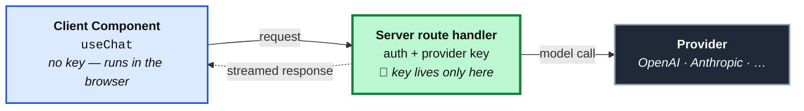

import StateMachineWalker from '../../../components/figures/state-machine-walker/StateMachineWalker.astro';
import Question from '../../../components/figures/state-machine-walker/Question.astro';
import Branch from '../../../components/figures/state-machine-walker/Branch.astro';
import Leaf from '../../../components/figures/state-machine-walker/Leaf.astro';
import Figure from '../../../components/figures/Figure.astro';
import Buckets from '../../../components/exercises/buckets/Buckets.astro';
import Bucket from '../../../components/exercises/buckets/Bucket.astro';
import Item from '../../../components/exercises/buckets/Item.astro';
import Matching from '../../../components/exercises/matching/Matching.astro';
import Pair from '../../../components/exercises/matching/Pair.astro';
import MultipleChoice from '../../../components/exercises/multiple-choice/MultipleChoice.astro';
import McqChoice from '../../../components/exercises/multiple-choice/McqChoice.astro';
import McqWhy from '../../../components/exercises/multiple-choice/McqWhy.astro';
import Term from '../../../components/ui/Term.astro';
import VideoCallout from '../../../components/embeds/VideoCallout.astro';
import ExternalResource from '../../../components/ui/ExternalResource.astro';
import CourseProgressBar from '../../../components/ui/CourseProgressBar.astro';
import { CardGrid } from '@astrojs/starlight/components';

<CourseProgressBar value={frontmatter['course-progress']} />

A stakeholder drops a line into the sprint: "Can we add AI to this?" Everyone nods. It feels like the kind of thing a 2026 product is supposed to have. The junior reflex is to open a branch and start wiring a chat box onto the dashboard.

Pause there, because that nod just skipped the only question that matters. "Add AI" is not a feature — it is a vibe. A model is the most expensive, slowest, least predictable component you can bolt onto a product, and most of the time the thing the stakeholder actually wants is already a Server Component and a SQL query that runs in two milliseconds and never hallucinates. The experienced reflex is to ask, before any code: is this surface *actually shaped* like something a probabilistic model should handle, or am I about to pay tokens and latency for a worse version of a feature I could ship deterministically today?

So let me say the thing the whole rest of these AI lessons is conditional on: **most 2026 SaaS still ships without an LLM-backed surface, and that is the correct call.** This is not a warm-up before the "real" AI lessons — it is the filter that decides whether you need them at all. You might finish this lesson, run your product through the four triggers below, find that it hits none of them, and walk away. That is a successful outcome, not a failed one. What you will leave with is a filter: four product shapes that justify reaching for a model, the look-alikes that don't, and one sentence to carry through all of it — **the model never owns data; tools own data, the model orchestrates language.** Hold onto that. It does a surprising amount of work.

## What makes a surface LLM-shaped

Before the four concrete shapes, the principle they are all instances of — because one rule with four examples is far easier to carry than four unrelated rules to memorize.

A <Term definition="Large language model. A system trained to predict likely continuations of text. It generates language; it is not a database and does not store your data.">large language model</Term> earns its place on a surface only when that surface needs one of three things that ordinary code structurally cannot produce: open-ended natural-language **input** that no form could have captured in advance, natural-language **output** that only prose can carry, or **orchestration** across steps whose shape changes depending on what the input turns out to be. If a surface needs none of those — if the work is "take an id, fetch the matching rows, render them" — then it is a query and a component, full stop. Reaching for a model there is like hiring a novelist to read you a phone number.

The reason the distinction is sharp, and not a matter of taste, is that a model is <Term definition="The same input is not guaranteed to produce the same output twice. This is the property that disqualifies a model from any task that needs exact, repeatable answers — like a lookup.">probabilistic</Term>. Ask it the same question twice and you may get two different answers. That property is exactly what makes it powerful for language you couldn't anticipate, and exactly what disqualifies it for anything that needs to be exact and repeatable. A `WHERE status = 'overdue'` clause returns the same rows every time; a model asked "which ones are overdue" might miss one. So the question underneath every trigger below is the same: *is natural language genuinely essential here, or am I dressing up a lookup?* The four triggers are just that question, made concrete enough to answer.

## The four triggers that cross the threshold

There are four shapes — and, for the purposes of this course, only four — where a model is the right tool. Each one leads with the same move: first, *why the deterministic path structurally fails*, and only then the example. If you can't articulate why a form, a query, or a fixed pipeline can't do the job, you haven't found a trigger yet. You've found a vibe.

### Open-ended Q&A grounded in app data

Picture a user staring at an invoices dashboard who wants to know: "Which clients are overdue and trending worse than last quarter?" The *answer* is entirely a function of structured data you already have. But notice what the deterministic path can't do at either end. Server-side SQL can't read the *question* — there is no form field for "and trending worse than last quarter," and you cannot pre-build a form for every question a human might phrase. And a search box, even a great one, can't *compose* the answer — it returns rows, not a sentence that says "three clients slipped, and Acme is your biggest exposure."

That two-sided gap — language coming in, prose going out — is the signature of this trigger. So what is the model's actual job? It reads the question, decides it needs real numbers, and calls a tool — say a `getInvoiceStats(...)` function you wrote — to fetch them from Postgres. Then it writes the prose around those numbers. The model never invents a balance or a due date; it can't, because it doesn't have your data. The tool owns the data; the model orchestrates the language around it. (There is that sentence again — it is going to resolve almost every hard case in this lesson.) This exact surface — invoice Q&A grounded in the org's own data through a tool — is the one the course builds end to end a few chapters from now; here we are only naming why it qualifies.

### Generation of structured artifacts from prompts

A user types "monthly retainer, 40 hours at our standard rate, net 30" and expects a properly filled-in invoice line item to appear: description, quantity, unit price, payment terms — each in its typed slot. Why can't a form do this? It can, when the input space is small. But the moment the input is genuinely free text that maps to a *typed structure* in too many ways to enumerate with dropdowns, you are no longer building a form — you are building a parser for natural language, and that is the model's job.

The model's task here is narrow and worth stating precisely: map free text onto a known schema. It does not write the row to your database — your deterministic code does that, after validating it, exactly as it would validate any untrusted input. (The AI SDK has a primitive built precisely for "free text in, typed object out"; we'll meet it in the next chapter.) The discriminating test is simple: if a dropdown and a number field would have captured the input, build the form. The model earns its place only when the input space is too varied for one.

### Classification or extraction over unstructured text

Inbound support emails that need routing by intent. Uploaded contract PDFs that need their key terms pulled into structured metadata. Free-form notes a salesperson scribbled after a call, waiting to be tagged. The common thread: the *input* is genuinely messy human text that no regex was ever going to parse reliably, and the model is the only reasonable tool for reading it.

Here is the shape to burn into memory, because it is what makes this trigger recognizable on sight: the input is messy and open-ended, but **the output is small and tidy** — an enum, a short object, a handful of tags. Then ordinary, boring, deterministic code takes that clean output and does the rest: routes the ticket, files the metadata, updates the record. The model is a translator sitting at the edge of your system, turning chaos into structure so the rest of your code never has to look at the chaos. That asymmetry — wild input, structured output — is the tell. (Keep it in mind; in the next section it draws a line that trips up almost everyone.)

### Agentic workflows the user couldn't run by hand

"Find every customer with an overdue invoice, draft a reminder for each one in a tone that matches how we've talked to them before, and queue the drafts for a human to approve." Each individual step here is deterministic — query the overdue customers, fetch prior correspondence, generate a draft, write to a queue. What is *not* fixed is the path through them: how many customers there are, what each one's history looks like, which ones need a gentle nudge versus a firmer one. The model's job is the **orchestration** — deciding what to do next based on what the previous step actually returned.

Now the qualifier that matters more than anything else in this trigger, because it is precisely where juniors over-reach: this only counts **when the steps genuinely vary by input.** If you always run step A, then step B, then step C, in that order, every time, regardless of the data — that is not an agent. That is a pipeline, and a pipeline is just a function you write. Wrapping a fixed sequence of known steps in a model is paying for a decision-maker to make a decision that was never in question. (The loop that lets a model choose its next step is the subject of a later chapter; here we only name when you'd want one.)

Step back and notice all four are the same idea wearing different clothes. Each one needs either *open-ended language* — coming in, going out, or both — or *orchestration whose shape depends on the input*. That is the one thing a form, a query, and a fixed pipeline structurally cannot give you, and it is the only thing that justifies the cost of a model. Everything else has a cheaper, faster, more reliable default — which is the entire point of the next section.

## What does not cross the bar

This section carries exactly as much weight as the last one, and you should treat it that way. The single most expensive beginner mistake with AI in 2026 is reaching for a model on a workload that a query or a form already solves. When you do, the bill is real and the result is *worse*: the user waits longer, you pay per token, and the answer is occasionally wrong where the deterministic version was always right. A look-alike that fails the filter doesn't just cost more — it regresses the product.

Here are the five most common impostors, each paired with the cheaper default you already know how to build.

**Smart search over your own data.** Someone wants "AI-powered search" across the invoices, the customers, the notes. Almost always, what they actually want is *good* search, and Postgres already ships it: full-text search and <Term definition="A Postgres extension for trigram-based fuzzy matching — it finds rows that are close to the query even with typos or partial words. The standard tool for forgiving search over your own data.">`pg_trgm`</Term> trigram similarity together cover the overwhelming majority of the workload, at zero per-query cost and zero hallucination risk. You met Postgres search earlier in the course; it is the right tool here, not a model.

**Form auto-fill from one typed field.** A user types a country code and the currency fills in; they pick a customer and the billing address populates. This is an `onChange` handler and a deterministic lookup — a map, or a single query. It is faster than any model, costs nothing per keystroke, and is incapable of guessing wrong. A model here is pure downside.

**"Make the UI feel modern."** Sometimes "add AI" decodes to "the demo would look impressive with a chat box in it." That is a pitch-deck decision, not a product decision. The user pays the latency, you pay the tokens, and the surface they actually use is worse than the buttons and filters it replaced. If you can't name which of the four triggers it hits, it hits none of them.

**Categorizing a fixed, knowable enum.** Sorting transactions into one of five accounting buckets that were defined at design time and won't change — that is a `switch` statement, a set of rules, or at most a tiny purpose-trained classifier. A general-purpose language model is wildly overpowered for choosing among five known options.

This last one sits right next to the extraction trigger from the previous section, and the line between them is the subtlest cut in this lesson — so let me draw it explicitly. Ask one question: **are the categories knowable at design time?** If you can write down the complete list of buckets today and a rule could plausibly assign them, it's deterministic — use the `switch` or the classifier. If the input is genuinely open-ended text that requires actually *understanding* language to make sense of — the messy support email, the freeform contract — then it's the extraction trigger, and the model earns its place. Same-looking task; the deciding question is whether you knew the answers in advance.

**Replacing existing search and filter with chat.** The most seductive trap. "What if instead of filters, users just *ask* the dashboard what they want?" Chat is a terrible primary affordance for scanning a list — it is slower, less precise, and it hides the structure users rely on. The move is never *replace* the filters with chat; it is *add* chat as one more surface alongside the affordances people already know how to use. Take away the filter bar and you've shipped a regression with a token bill attached.

### Sort the workload

Time to make the cut yourself. Below are real-looking feature requests. For each one, decide whether a model genuinely earns its weight or whether a deterministic default does the job better and cheaper. Drag each into its bucket, then check.

<Buckets twoCol instructions="For each request, decide whether the surface is genuinely LLM-shaped, or whether a deterministic default is the better tool.">
  <Bucket name="llm" label="LLM earns it" description="Open-ended language or input-varying orchestration" />
  <Bucket name="det" label="Deterministic default" description="A query, form, or fixed rule does it better" />

  <Item bucket="llm">Triage incoming support emails into the team that should handle each one</Item>
  <Item bucket="llm">Pull the renewal date, party names, and total value out of an uploaded vendor contract</Item>
  <Item bucket="llm">Let a finance manager type a question about this quarter's revenue and get a written answer</Item>
  <Item bucket="llm">Draft a personalized win-back message for each churned customer based on their account history</Item>
  <Item bucket="det">Suggest a city as the user types the first few letters into an address field</Item>
  <Item bucket="det">Show only invoices that are unpaid and older than 30 days</Item>
  <Item bucket="det">Sort each expense into one of the four tax categories the accountant defined</Item>
  <Item bucket="det">Find customers whose company name nearly matches what the user typed, ignoring typos</Item>
</Buckets>

The two that are worth pausing on are the contract extraction and the tax-category sort. Both are "categorize / pull structure out of a document," yet one is a model and the other is a `switch`. The contract is open-ended text you have to *read*; the tax categories were knowable at design time. That is the line.

## The four-trigger funnel

You now have the triggers and the anti-triggers as separate lists. The thing that turns them into a *skill* is the **order** you ask the questions in — because an experienced engineer reaches for the cheap, deterministic default at every branch and only lets the model survive when natural language is genuinely unavoidable. Walk the funnel below. At each question, pick the honest answer for a feature you're considering; the leaf you land on is the verdict.

<StateMachineWalker kind="decision" title="Run a feature through the filter">
  <Question id="user-facing" prompt="Is this a user-facing surface, or backend logic?">
    <Branch label="A user-facing surface" to="language" />
    <Branch label="Backend logic / data processing" to="leaf-backend" />
  </Question>

  <Question id="language" prompt="Does it need open-ended natural language — input you couldn't capture in a form, or output only prose can carry?">
    <Branch label="Yes — open-ended language is essential" to="varies" rationale="Could be Q&A, generation, or extraction." />
    <Branch label="No — the input and output are structured" to="typed-data" />
  </Question>

  <Question id="typed-data" prompt="Is the result purely a function of typed data the user could otherwise query or filter directly?">
    <Branch label="Yes — it's really a lookup or a filter" to="leaf-search" />
    <Branch label="No, but it still doesn't need language" to="leaf-form" rationale="Structured input mapped to a structured result — a form does it." />
  </Question>

  <Question id="varies" prompt="Is this one response, or a multi-step flow whose path changes with the input?">
    <Branch label="A single open-ended response over my data" to="leaf-qa" />
    <Branch label="Free text that becomes a typed artifact" to="leaf-generate" />
    <Branch label="Messy text in, small structured output" to="leaf-classify" />
    <Branch label="Multi-step, and the steps genuinely vary by input" to="leaf-agentic" />
    <Branch label="Multi-step, but a fixed known sequence every time" to="leaf-pipeline" rationale="Same steps every time is a pipeline, not an agent." />
  </Question>

  <Leaf id="leaf-qa" verdict="Trigger 1 — Open-ended Q&A grounded in app data">
    The model reads the question, calls a tool for the real numbers, and writes the prose around them — a chat surface backed by tool calling.
    The tool owns the data; the model orchestrates the language.
  </Leaf>

  <Leaf id="leaf-generate" verdict="Trigger 2 — Structured generation from a prompt">
    Map free text onto a typed schema, then validate and write it with ordinary deterministic code.
    Earns its weight only when a form couldn't have captured the input.
  </Leaf>

  <Leaf id="leaf-classify" verdict="Trigger 3 — Classification / extraction over unstructured text">
    Wild input, tidy structured output. Downstream code consumes the clean result and does the rest.
    The model is a translator sitting at the edge of the system.
  </Leaf>

  <Leaf id="leaf-agentic" verdict="Trigger 4 — Agentic workflow">
    The model decides each next step from what the last step actually returned. The orchestration *is* the model's job —
    but only because the path through the steps genuinely varies by input.
  </Leaf>

  <Leaf id="leaf-backend" verdict="Deterministic code — no surface, no model">
    Backend data processing is a function you write. There is no language and no user, so there is no trigger to hit.
  </Leaf>

  <Leaf id="leaf-search" verdict="Postgres full-text / `pg_trgm` search">
    A lookup or filter over your own data: zero per-query cost, never hallucinates.
    Add chat *alongside* it if you must — never instead of it.
  </Leaf>

  <Leaf id="leaf-form" verdict="A structured form">
    Structured input, structured result, no language in between. A form and a query are faster, cheaper, and always exact.
  </Leaf>

  <Leaf id="leaf-pipeline" verdict="A fixed pipeline — just code">
    The same known steps every time is a function, not an agent.
    A model here pays a decision-maker to make a decision that was never in question.
  </Leaf>
</StateMachineWalker>

Notice the shape of the walk: every branch has an exit to a cheaper default, and the four model verdicts sit at the *end* of the longest paths. That is not an accident of layout — it is the experienced engineer's posture made into a procedure. The model is where you arrive when nothing cheaper will carry the language, never where you start.

## Why the AI SDK is the canonical Next.js integration

Suppose a feature genuinely lands one of the four triggers. Now — and only now — does the question become *what do you reach for*. For a Next.js team in 2026, the answer is the <Term definition="Vercel's open-source toolkit for building AI features in JavaScript. Vendor-neutral: it gives you one set of functions and hooks that work the same across model providers.">Vercel AI SDK</Term>, and it's worth understanding the three reasons it's the default rather than treating it as a given.

**It owns the React 19 streaming model.** When a model generates a long answer, you don't want the user staring at a spinner until the last word arrives — you want the text to appear as it's produced. The SDK <Term definition="The server sends the response piece by piece as the model generates it, instead of waiting for the whole thing. It's what makes a chat answer appear word by word instead of all at once.">streams</Term> those pieces and partial objects in a way that composes with Suspense and Server Components by design, rather than something you bolt on afterward. (How that streaming actually works on the page is the next chapter.)

**Provider abstraction is first-class.** The model behind a feature sits behind a single identifier. Swapping from one <Term definition="The company whose API serves the model — OpenAI, Anthropic, Google. Distinct from the SDK, which is vendor-neutral and sits in front of any provider.">provider</Term> to another is, in the best case, a one-line change — not a rewrite of every call site. This is the durability argument, and it matters more than it sounds: the provider landscape is not settling down. A major model from a different company lands almost every month, and the SDK is the layer that keeps your integration from rotting every time it does. (The mechanics of that swap are a later lesson in this chapter.)

**The surface is tight.** There are five primitives an experienced engineer actually reaches for — `streamText`, `generateText`, `generateObject`, `streamObject`, and the `useChat` / `useCompletion` hooks. That's the whole working vocabulary. No sprawl, no forty-concept framework to learn before you can ship one feature. You're seeing the names now only so the shape of what's coming is familiar; none of them are taught here.

For completeness — because you will see these elsewhere and should know why the course doesn't pick them — two alternatives exist. **Calling a provider's SDK directly** (OpenAI's or Anthropic's own client) works, but it welds every call site to that one vendor and you lose the unified streaming shape; the only real reason to reach for it is a brand-new provider feature the AI SDK hasn't surfaced yet, which is rare. **Hosting LangChain on the server** brings a much heavier programming model — chains, agents, retrievers — and a streaming primitive that fights the App Router rather than flowing with it; it earns its place for research-style multi-agent orchestration off the user-request path, not for the user-facing surfaces this course is about. For a Next.js SaaS, the AI SDK is the pick.

## The version that matters — v5, not v4

A short but high-value warning, because it will save you from confidently shipping broken code. The moment you start building, you will search for help — and a large share of the tutorials, blog posts, and answers you find, *including anything a model generates from older training data*, will hand you **AI SDK v4** shapes. The SDK had a significant redesign in v5 (stable since mid-2025), and the old shapes aren't just stylistically dated — they're wrong by construction against the current SDK. You don't need to know the v5 APIs yet to protect yourself; you just need to recognize the v4 fingerprints on sight.

Here are the tells. Match each outdated v4 shape to what replaced it in v5 — not to memorize the APIs (that's the next chapter), but so a v4-flavored tutorial sets off the alarm immediately.

<Matching instructions="Each left item is an outdated v4 shape you'll meet in old tutorials. Match it to the v5 replacement that signals current code.">
  <Pair>
    <Fragment slot="left">A flat `.content` string on each message</Fragment>
    <Fragment slot="right">A `parts` array on each `UIMessage`</Fragment>
  </Pair>
  <Pair>
    <Fragment slot="left">`append` and `reload` to send and retry</Fragment>
    <Fragment slot="right">`sendMessage` and `regenerate`</Fragment>
  </Pair>
  <Pair>
    <Fragment slot="left">The hook owns the input state for you</Fragment>
    <Fragment slot="right">Input state managed manually with `useState`</Fragment>
  </Pair>
  <Pair>
    <Fragment slot="left">`maxSteps` on the client to bound an agent loop</Fragment>
    <Fragment slot="right">`stopWhen` with `stepCountIs(n)`</Fragment>
  </Pair>
</Matching>

The rule is blunt: any tutorial, or any prompt you hand a model, that emits these v4 shapes is wrong by construction for this stack. The actual mechanics of `parts`, `sendMessage`, and `stopWhen` land in the next two chapters; right now this is purely a calibration tool for your search results.

<VideoCallout videoId="ihHLs6v7Lko" videoTitle="AI SDK v5: A Crash Course — Matt Pocock at React Universe Conf 2025">
  Matt Pocock's 22-minute React Universe Conf talk frames the v5 model conceptually — why the unified API exists, and how a one-line provider swap kills vendor lock-in.
</VideoCallout>

## The architectural shape — server calls, client streams

There is one architectural rule to hold in your head before you write a single line of AI code, and the good news is you already know it. Every LLM call runs on the **server**. The Client Component subscribes to the resulting stream through the SDK's hooks. The provider key never, under any circumstances, reaches the browser.

If that sounds familiar, it should — it is the exact same server-seam rule you already learned for `authedAction` and `authedRoute` earlier in the course: secrets and privileged work live behind a server boundary, and the client only ever talks to that boundary, never to the resource directly. An LLM call is just one more privileged operation behind that seam. This is not a new rule; it's the rule you know, applied to a new kind of work.

What makes the AI SDK genuinely pleasant here is that it **enforces this by shape**. The React hooks are built to talk to a server endpoint, not to a provider directly — there is nowhere to put a key on the client even if you wanted to. The secure architecture is the path of least resistance, not extra discipline you have to remember to apply. The diagram below is the whole trust boundary: the key lives on exactly one box.

<Figure caption="Every model call goes through the server seam; the provider key lives only there, never in the browser.">

</Figure>

Two things worth naming as forward pointers, since they live *inside* that middle box: the cost guards that keep a public surface from burning your budget are the next lesson, and the provider configuration that makes the model a one-line swap is the lesson after. Both sit inside the server seam you just drew.

## Landing this surface is an architectural decision

One more habit before anyone touches a keyboard. Earlier in the course you learned the three-test rule for when a decision deserves a written record — an <Term definition="Architecture Decision Record. A short document capturing one significant decision: the context, the choice, the alternatives, and the consequences.">ADR</Term>: it touches multiple parts of the system, reasonable alternatives exist, and reversing it costs more than a single PR.

An LLM-backed surface passes all three without breaking a sweat. It touches multiple files — a route handler, a schema, a client component, environment config, very likely billing. Reasonable alternatives genuinely exist — ship no model at all, pick a different provider, lean on a hosted service. And reversal is expensive: by the time the surface is live it has dragged in a rate limiter, a per-user quota, audit-log events, and possibly Stripe metering, none of which unwind in one commit. So when this shape lands in a real codebase, **write the ADR.** Capture which trigger justified it, which alternatives you weighed, and what reversing it would cost the team that inherits it.

To be clear about scope: the worked surface this course builds later doesn't ship a fresh ADR as a deliverable — but the habit attaches to the *decision*, not to this course's project. When this lands in *your* codebase, that's the moment to write one.

## Pushing back, and the failure modes

The thread running through this entire lesson is a posture, not a checklist — so let me close on how an experienced engineer actually holds the line when the pressure to "add AI" arrives, because it always does.

When a stakeholder asks "can we add AI?", remember that they've handed you a *how*, not a *what*. The LLM is a means; the question you owe them back is what user problem it's meant to solve, and then whether that problem hits one of the four triggers. If it doesn't, the professional answer is "here's the cheaper deterministic surface that solves it better" — not a chat box built to satisfy the literal request.

:::caution
Building chat as a *replacement* for filters and search is a double regression: the UX gets worse *and* you've added a per-token cost to a thing that used to be free and instant. Chat is additive. If you're removing an affordance users already know how to use, stop.
:::

Two more that trip up teams under deadline pressure. The first: "we'll worry about cost later." That's wrong the instant the surface is public — every authenticated user can now spend your money in tokens at the speed of their keyboard, and abuse is not a someday problem but a day-one one (the next lesson is entirely about bounding it). The second: picking a provider's SDK directly because some model team's launch blog used it in their example. That welds your call site to one vendor on the strength of a marketing post — the AI SDK exists precisely to keep that decision soft.

:::tip
The model is never the source of truth. Tools own data; the model orchestrates language. If an answer's correctness depends on a real number — a balance, a date, a count — that number comes from a tool you wrote, never from the model's memory. Carry this one sentence out of the lesson; it pre-decides more design questions than any other.
:::

### Is the trigger real?

A final self-check. Each question below is a feature request dressed up the way they actually arrive — some hit a trigger, some are impostors wearing a trigger's clothes, and one hits nothing at all and should ship no model. Reason it through; the deciding question is always *which* of the four shapes, if any, this really is.

<MultipleChoice>
  A teammate pitches it as the headline AI feature: a single box where a user types anything — a half-remembered company name, a typo'd contact, a partial domain — and the matching customer surfaces instantly. The ticket title is literally "AI customer search." Before you size it, what shape is this actually?

  <McqChoice correct>A forgiving lookup over rows you already own — `pg_trgm` similarity ranks the closest matches and ships today with no per-query bill.</McqChoice>
  <McqChoice>Trigger 1: the user is typing free text, so the model has to read the query and answer it.</McqChoice>
  <McqChoice>Trigger 3: the model extracts the intended customer name out of the messy input.</McqChoice>
  <McqChoice>An agentic flow: the model decides whether to search by name, email, or domain each time.</McqChoice>

  <McqWhy>Deciding question: does this surface need to *understand* language, or just *match strings forgivingly*? Nothing here is open-ended — there is one structured answer (the customer row) and the only hard part is tolerating typos. That is a ranked lookup, and prefixing the ticket with "AI" doesn't change its shape. A model would be slower, cost tokens per keystroke, and occasionally rank a wrong row confidently.</McqWhy>
</MultipleChoice>

<MultipleChoice>
  Support is drowning in long inbound emails. The ask: as each one arrives, automatically produce a two-line gist plus a short list of suggested next actions, so an agent grasps the ticket without reading the whole thread. Which of the four triggers, if any, does this land?

  <McqChoice correct>Trigger 3 — the input is unbounded human prose and the output is a small, tidy structure the downstream UI consumes.</McqChoice>
  <McqChoice>No trigger — every email routes to one of a fixed set of teams, so a rules table covers it.</McqChoice>
  <McqChoice>Trigger 4 — reading then summarizing then listing actions is three steps, so the model must orchestrate them.</McqChoice>
  <McqChoice>No trigger — a summary is just the first few sentences truncated, which is plain string work.</McqChoice>

  <McqWhy>Deciding question: is the *input* genuinely open-ended text that has to be understood? An arbitrary email is exactly that, and the result — a gist and a few action items — is small and structured. That wild-in, tidy-out asymmetry is the extraction signature. The action items aren't a list you could enumerate at design time, so the rules-table answer misreads it; and the three "steps" never branch on the data, so it's no agent.</McqWhy>
</MultipleChoice>

<MultipleChoice>
  Sales leadership wants the dashboard to "feel like AI." Concretely: take the exact revenue and overdue-invoice figures the page already renders and, on load, restate each KPI as a friendly sentence — "Revenue is up 4% this month" instead of a bare number. No new question is being asked; the inputs are the same metrics as today. Which trigger justifies a model here?

  <McqChoice correct>None — keep it a query and a component. Pretty-printing numbers nobody asked a question about is the "make it modern" impulse, not a trigger; the right move is to ship no model.</McqChoice>
  <McqChoice>Trigger 1 — it emits prose about your app's data, which is grounded Q&A.</McqChoice>
  <McqChoice>Trigger 2 — it generates the sentence artifacts from the underlying figures.</McqChoice>
  <McqChoice>Trigger 3 — it reads the KPIs and classifies each into a sentence form.</McqChoice>

  <McqWhy>Deciding question: is natural language genuinely *essential* to this surface? There's no open-ended question coming in and no unstructured input to read — just fixed metrics the user never asked about, dressed up for vibe. Q&A needs a question; extraction needs messy input; neither exists here. You can template "up 4%" deterministically for free, exactly, every time. Landing on "ship nothing" is the most common correct answer, not a failure.</McqWhy>
</MultipleChoice>

If those felt like judgment calls rather than recall, that's the point — the filter is only useful when it transfers to inputs you've never seen phrased exactly this way.

## External resources

<CardGrid>
  <ExternalResource
    title="AI SDK — Foundations: Overview"
    href="https://ai-sdk.dev/docs/foundations/overview"
    icon="lucide:book-open"
    iconColor="#000000"
    description="The SDK's own beginner-friendly primer on LLMs, providers, and tools — the conceptual ground under every trigger in this lesson."
  />
  <ExternalResource
    title="AI SDK 5 — the announcement"
    href="https://vercel.com/blog/ai-sdk-5"
    icon="simple-icons:vercel"
    iconColor="#000000"
    description="Vercel's official v5 post (July 2025): UIMessage parts, the new provider architecture, and stopWhen — the v5 shapes you just calibrated against v4."
  />
</CardGrid>
