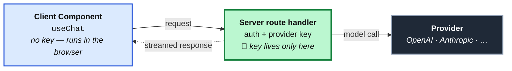

import StateMachineWalker from '../../../components/figures/state-machine-walker/StateMachineWalker.astro';
import Question from '../../../components/figures/state-machine-walker/Question.astro';
import Branch from '../../../components/figures/state-machine-walker/Branch.astro';
import Leaf from '../../../components/figures/state-machine-walker/Leaf.astro';
import Figure from '../../../components/figures/Figure.astro';
import Buckets from '../../../components/exercises/buckets/Buckets.astro';
import Bucket from '../../../components/exercises/buckets/Bucket.astro';
import Item from '../../../components/exercises/buckets/Item.astro';
import Matching from '../../../components/exercises/matching/Matching.astro';
import Pair from '../../../components/exercises/matching/Pair.astro';
import MultipleChoice from '../../../components/exercises/multiple-choice/MultipleChoice.astro';
import McqChoice from '../../../components/exercises/multiple-choice/McqChoice.astro';
import McqWhy from '../../../components/exercises/multiple-choice/McqWhy.astro';
import Term from '../../../components/ui/Term.astro';
import VideoCallout from '../../../components/embeds/VideoCallout.astro';
import ExternalResource from '../../../components/ui/ExternalResource.astro';
import CourseProgressBar from '../../../components/ui/CourseProgressBar.astro';
import { CardGrid } from '@astrojs/starlight/components';

<CourseProgressBar value={frontmatter['course-progress']} />

A stakeholder drops a line into the sprint: "Can we add AI to this?"
The junior reflex is to open a branch and wire a chat box onto the dashboard.

That skips the only question that matters.
"Add AI" is not a feature, it is a mood.
A model is the most expensive, slowest, least predictable component you can bolt onto a product, and most of the time the stakeholder wants something a Server Component and a SQL query already return in two milliseconds without ever hallucinating.
So before writing any code, ask whether this surface is really shaped for a probabilistic model, or whether you are paying tokens and latency for a worse version of a feature you could ship deterministically today.

Most 2026 SaaS still ships without an LLM-backed surface, and that is the correct call.
Run your product through the four triggers below, find it hits none, and that is the expected outcome, not a failure.
What you leave with is four product shapes that justify reaching for a model, the look-alikes that don't, and one sentence to carry through all of it: **the model never owns data; tools own data, the model orchestrates language.**

## What makes a surface LLM-shaped

A <Term definition="Large language model. A system trained to predict likely continuations of text. It generates language; it is not a database and does not store your data.">large language model</Term> earns its place on a surface only when that surface needs one of three things ordinary code cannot produce: open-ended natural-language **input** no form could have captured in advance, natural-language **output** that only prose can carry, or **orchestration** across steps whose shape depends on what the input turns out to be.
A surface that needs none of those is a query and a component, nothing more.

The line is structural because a model is <Term definition="The same input is not guaranteed to produce the same output twice. This is the property that disqualifies a model from any task that needs exact, repeatable answers — like a lookup.">probabilistic</Term>: a `WHERE status = 'overdue'` clause returns the same rows every time, while a model asked "which ones are overdue" might miss one.
That unpredictability powers language you couldn't anticipate but disqualifies anything that must be exact.
So the question under every trigger below is the same: is natural language essential here, or are you dressing up a lookup?

## The four triggers that cross the threshold

Four shapes, and for this course only four, call for a model.
Each leads with why the deterministic path fails, then the example.
If you can't say why a form, a query, or a fixed pipeline can't do the job, you haven't found a trigger.

### Open-ended Q&A grounded in app data

A user on an invoices dashboard wants to know which clients are overdue and trending worse than last quarter.
The answer is entirely a function of structured data you already have, yet the deterministic path fails at both ends.
Server-side SQL can't read the question: there is no form field for "and trending worse than last quarter," and you can't pre-build a form for every question a human might phrase.
A search box can't compose the answer either; it returns rows, not a sentence that says "three clients slipped, and Acme is your biggest exposure."

That two-sided gap, language in and prose out, is the signature of this trigger.
The model reads the question, decides it needs real numbers, and calls a tool you wrote, say `getInvoiceStats(...)`, to fetch them from Postgres, then writes the prose around those numbers.
It never invents a balance or a due date because it doesn't have your data: the tool owns the data, and the model orchestrates the language.
The course builds this surface later.

### Generation of structured artifacts from prompts

A user types "monthly retainer, 40 hours at our standard rate, net 30" and expects a filled-in invoice line item, with description, quantity, unit price, and payment terms each in its typed slot.
A form handles this when the input space is small.
But once free text maps to a typed structure in too many ways to enumerate with dropdowns, you are no longer building a form; you are building a parser for natural language, and that is the model's job.

The model's task is narrow: map free text onto a known schema.
It does not write the row to your database; your deterministic code does that, after validating it like any untrusted input.
The deciding test is simple: if a dropdown and a number field would have captured the input, build the form.
The model earns its place only when the input space is too varied for one.

### Classification or extraction over unstructured text

Consider inbound support emails to route by intent, contract PDFs whose key terms must become structured metadata, or a salesperson's free-form call notes that need tagging.
The common thread is messy human text that no regex was going to parse reliably, so the model is the only reasonable tool for reading it.

What makes this trigger recognizable: the input is messy and open-ended, but **the output is small and tidy**, an enum, a short object, or a handful of tags.
Deterministic code takes that clean output and does the rest: routes the ticket, files the metadata, updates the record.
The model is a translator at the edge of your system, turning chaos into structure so the rest of your code never has to look at the chaos.

### Agentic workflows the user couldn't run by hand

Consider the request: "Find every customer with an overdue invoice, draft a reminder for each in a tone that matches how we've talked to them before, and queue the drafts for a human to approve."
Each step is deterministic: query the overdue customers, fetch prior correspondence, generate a draft, write to a queue.
What is not fixed is the path through them: how many customers there are, what each one's history looks like, and which need a gentle nudge versus a firmer one.
The model's job is the **orchestration**, deciding what to do next based on what the previous step returned.

Here is the qualifier juniors over-reach on: this counts only **when the steps genuinely vary by input.**
If you always run A, then B, then C regardless of the data, that is not an agent; it is a pipeline, and a pipeline is just a function you write.
Wrapping a fixed sequence in a model pays a decision-maker to make a decision that was never in question.

All four reduce to one need a form, a query, and a fixed pipeline cannot meet: open-ended language coming in or going out, or orchestration whose shape depends on the input.
Everything else has a cheaper, faster, more reliable default.

## Workloads that don't need a model

The most expensive beginner mistake is reaching for a model on a workload a query or a form already solves: slower, more expensive, and occasionally wrong where the deterministic version is always right.
Here are the five most common impostors, each paired with the cheaper default you already know how to build.

**Smart search over your own data.**
"AI-powered search" across the invoices, customers, and notes almost always means the user wants *good* search, and Postgres already ships it.
Full-text search and <Term definition="A Postgres extension for trigram-based fuzzy matching — it finds rows that are close to the query even with typos or partial words. The standard tool for forgiving search over your own data.">`pg_trgm`</Term> trigram similarity cover the overwhelming majority of the workload, at zero per-query cost and zero hallucination risk.

**Form auto-fill from one typed field.**
A country code fills in the currency; a chosen customer populates the billing address.
This is an `onChange` handler and a deterministic lookup, a map or a single query: faster than any model, free per keystroke, and incapable of guessing wrong.

**"Make the UI feel modern."**
Here "add AI" means "the demo would look impressive with a chat box in it" — a pitch-deck decision, not a product one.
The user pays the latency, you pay the tokens, and the surface is worse than the buttons and filters it replaced.

**Categorizing a fixed, knowable enum.**
Sorting transactions into one of five accounting buckets defined at design time is a `switch` statement, a set of rules, or at most a tiny purpose-trained classifier; a general-purpose model is wildly overpowered for choosing among five known options.
This one sits right next to the extraction trigger, so ask one question: **are the categories knowable at design time?**
If you can write the complete list of buckets today and a rule could plausibly assign them, use the `switch` or the classifier.
If the input is open-ended text you have to actually *understand*, like a messy support email or a freeform contract, it's the extraction trigger and the model earns its place.

**Replacing existing search and filter with chat.**
"What if, instead of filters, users just *ask* the dashboard what they want?"
Chat is a poor primary affordance for scanning a list: slower, less precise, and it hides the structure users rely on.
Add chat alongside the affordances people already know; never *replace* them.
Take away the filter bar and you've shipped a regression with a token bill attached.

### Sort the workload

Now make the cut yourself.
For each request below, decide whether a model genuinely earns its weight or whether a deterministic default does the job better and cheaper.
Drag each into its bucket, then check.

<Buckets twoCol instructions="For each request, decide whether the surface is genuinely LLM-shaped, or whether a deterministic default is the better tool.">
  <Bucket name="llm" label="LLM earns it" description="Open-ended language or input-varying orchestration" />
  <Bucket name="det" label="Deterministic default" description="A query, form, or fixed rule does it better" />

  <Item bucket="llm">Triage incoming support emails into the team that should handle each one</Item>
  <Item bucket="llm">Pull the renewal date, party names, and total value out of an uploaded vendor contract</Item>
  <Item bucket="llm">Let a finance manager type a question about this quarter's revenue and get a written answer</Item>
  <Item bucket="llm">Draft a personalized win-back message for each churned customer based on their account history</Item>
  <Item bucket="det">Suggest a city as the user types the first few letters into an address field</Item>
  <Item bucket="det">Show only invoices that are unpaid and older than 30 days</Item>
  <Item bucket="det">Sort each expense into one of the four tax categories the accountant defined</Item>
  <Item bucket="det">Find customers whose company name nearly matches what the user typed, ignoring typos</Item>
</Buckets>

The two worth pausing on are the contract extraction and the tax-category sort: both look like "pull structure out of a document," yet the contract is open-ended text you have to *read*, while the tax categories were knowable at design time.

## The four-trigger funnel

The triggers and anti-triggers are two separate lists; asking the questions in a fixed order turns them into one procedure.
Walk the funnel below, picking the true answer for a feature you're weighing, and the leaf you land on is the verdict.

<StateMachineWalker kind="decision" title="Run a feature through the filter">
  <Question id="user-facing" prompt="Is this a user-facing surface, or backend logic?">
    <Branch label="A user-facing surface" to="language" />
    <Branch label="Backend logic / data processing" to="leaf-backend" />
  </Question>

  <Question id="language" prompt="Does it need open-ended natural language — input you couldn't capture in a form, or output only prose can carry?">
    <Branch label="Yes — open-ended language is essential" to="varies" rationale="Could be Q&A, generation, or extraction." />
    <Branch label="No — the input and output are structured" to="typed-data" />
  </Question>

  <Question id="typed-data" prompt="Is the result purely a function of typed data the user could otherwise query or filter directly?">
    <Branch label="Yes — it's really a lookup or a filter" to="leaf-search" />
    <Branch label="No, but it still doesn't need language" to="leaf-form" rationale="Structured input mapped to a structured result — a form does it." />
  </Question>

  <Question id="varies" prompt="Is this one response, or a multi-step flow whose path changes with the input?">
    <Branch label="A single open-ended response over my data" to="leaf-qa" />
    <Branch label="Free text that becomes a typed artifact" to="leaf-generate" />
    <Branch label="Messy text in, small structured output" to="leaf-classify" />
    <Branch label="Multi-step, and the steps genuinely vary by input" to="leaf-agentic" />
    <Branch label="Multi-step, but a fixed known sequence every time" to="leaf-pipeline" rationale="Same steps every time is a pipeline, not an agent." />
  </Question>

  <Leaf id="leaf-qa" verdict="Trigger 1 — Open-ended Q&A grounded in app data">
    The model reads the question, calls a tool for the real numbers, and writes the prose around them: a chat surface backed by tool calling.
    The tool owns the data; the model orchestrates the language.
  </Leaf>

  <Leaf id="leaf-generate" verdict="Trigger 2 — Structured generation from a prompt">
    Map free text onto a typed schema, then validate and write it with ordinary deterministic code.
    It earns its weight only when a form couldn't have captured the input.
  </Leaf>

  <Leaf id="leaf-classify" verdict="Trigger 3 — Classification / extraction over unstructured text">
    Wild input, tidy structured output. Downstream code consumes the clean result and does the rest.
    The model is a translator sitting at the edge of the system.
  </Leaf>

  <Leaf id="leaf-agentic" verdict="Trigger 4 — Agentic workflow">
    The model decides each next step from what the last step actually returned. The orchestration *is* the model's job,
    but only because the path through the steps genuinely varies by input.
  </Leaf>

  <Leaf id="leaf-backend" verdict="Deterministic code — no surface, no model">
    Backend data processing is a function you write. There is no language and no user, so there is no trigger to hit.
  </Leaf>

  <Leaf id="leaf-search" verdict="Postgres full-text / `pg_trgm` search">
    A lookup or filter over your own data: zero per-query cost, never hallucinates.
    Add chat *alongside* it if you must, never instead of it.
  </Leaf>

  <Leaf id="leaf-form" verdict="A structured form">
    Structured input, structured result, no language in between. A form and a query are faster, cheaper, and always exact.
  </Leaf>

  <Leaf id="leaf-pipeline" verdict="A fixed pipeline — just code">
    The same known steps every time is a function, not an agent.
    A model here pays a decision-maker to make a decision that was never in question.
  </Leaf>
</StateMachineWalker>

The shape of the walk carries the rule: every branch has an exit to a cheaper default, and the four model verdicts sit at the *end* of the longest paths.
The model is where you arrive when nothing cheaper will carry the language, never where you start.

## Why the Vercel AI SDK is the Next.js default

Once a feature lands one of the four triggers, the question is what you reach for.
For a Next.js team in 2026, the answer is the <Term definition="Vercel's open-source toolkit for building AI features in JavaScript. Vendor-neutral: it gives you one set of functions and hooks that work the same across model providers.">Vercel AI SDK</Term>, for three reasons.

**It owns the React 19 streaming model.**
When a model generates a long answer, you want the text to appear as it's produced, not a spinner until the last word arrives.
The SDK <Term definition="The server sends the response piece by piece as the model generates it, instead of waiting for the whole thing. It's what makes a chat answer appear word by word instead of all at once.">streams</Term> those pieces and partial objects to compose with Suspense and Server Components by design, not as something you bolt on afterward.

**Provider abstraction is first-class.**
The model behind a feature sits behind a single identifier, so swapping from one <Term definition="The company whose API serves the model — OpenAI, Anthropic, Google. Distinct from the SDK, which is vendor-neutral and sits in front of any provider.">provider</Term> to another is a one-line change rather than a rewrite of every call site.
That matters when a stronger model ships from a different company, which happens often.

**The surface is tight.**
You work with five primitives: `streamText`, `generateText`, `generateObject`, `streamObject`, and the `useChat` / `useCompletion` hooks.
That's the whole vocabulary, with no forty-concept framework to learn before you ship one feature.

Two alternatives exist, and since you will see them elsewhere it's worth knowing why the course doesn't pick them.
**Calling a provider's SDK directly**, OpenAI's or Anthropic's own client, welds every call site to that one vendor and loses the unified streaming shape; reach for it only for a brand-new provider feature the AI SDK hasn't surfaced yet.
**Hosting LangChain on the server** brings a heavier model of chains, agents, and retrievers, plus a streaming primitive that fights the App Router; it earns its place for research-style multi-agent orchestration off the request path, not the user-facing surfaces this course is about.
For a Next.js web app, the AI SDK is the pick.

## Spot outdated AI SDK v4 code

Once you start building, you will search for help, and much of what you find, including code a model generates from older training data, will hand you **AI SDK v4** shapes.
The SDK was redesigned in v5, stable since mid-2025, so v4 shapes aren't just dated, they're wrong against the current SDK.
You don't need the v5 APIs yet, only the ability to spot a v4 fingerprint on sight.

<Matching instructions="Each left item is an outdated v4 shape you'll meet in old tutorials. Match it to the v5 replacement that signals current code.">
  <Pair>
    <Fragment slot="left">A flat `.content` string on each message</Fragment>
    <Fragment slot="right">A `parts` array on each `UIMessage`</Fragment>
  </Pair>
  <Pair>
    <Fragment slot="left">`append` and `reload` to send and retry</Fragment>
    <Fragment slot="right">`sendMessage` and `regenerate`</Fragment>
  </Pair>
  <Pair>
    <Fragment slot="left">The hook owns the input state for you</Fragment>
    <Fragment slot="right">Input state managed manually with `useState`</Fragment>
  </Pair>
  <Pair>
    <Fragment slot="left">`maxSteps` on the client to bound an agent loop</Fragment>
    <Fragment slot="right">`stopWhen` with `stepCountIs(n)`</Fragment>
  </Pair>
</Matching>

Don't memorize the v5 replacements now, that comes in the next two chapters; for now they only need to set off the alarm when a search result looks wrong.

<VideoCallout videoId="ihHLs6v7Lko" videoTitle="AI SDK v5: A Crash Course — Matt Pocock at React Universe Conf 2025">
  Matt Pocock's 22-minute React Universe Conf talk frames the v5 model conceptually, useful background before you write any v5 code.
</VideoCallout>

## The architectural shape: server calls, client streams

Every LLM call runs on the **server**, the Client Component subscribes to the resulting stream through the SDK's hooks, and the provider key never reaches the browser.
This is the same server-seam rule you learned for `authedAction` and `authedRoute`: privileged work lives behind a server boundary, and the client only ever talks to that boundary.
The AI SDK **enforces this by shape**, because its React hooks talk to a server endpoint rather than a provider, so there is nowhere to put a key on the client.

<Figure caption="Every model call goes through the server seam; the provider key lives only there, never in the browser.">

</Figure>

Cost guards and provider configuration both live inside that middle box.

## Write an ADR when this surface lands

An LLM-backed surface passes the three-test rule for when a decision deserves an <Term definition="Architecture Decision Record. A short document capturing one significant decision: the context, the choice, the alternatives, and the consequences.">ADR</Term>.
It touches multiple parts of the system: a route handler, a schema, a client component, environment config, and likely billing.
Real alternatives exist: ship no model, pick a different provider, or lean on a hosted service.
And reversal is expensive, because a live surface has already dragged in a rate limiter, a per-user quota, audit-log events, and possibly Stripe metering, none of which unwind in one commit.
So when this shape lands in a real codebase, **write the ADR**: capture which trigger justified it, which alternatives you weighed, and what reversing it would cost.

The worked surface this course builds later ships no ADR, because the habit attaches to the decision, not to this project.

## Pushing back, and the failure modes

"Can we add AI?" is a *how*, not a *what*.
Ask back what user problem it solves and whether that problem hits one of the four triggers.
If it doesn't, the professional answer is the cheaper deterministic surface, not a chat box that satisfies the literal request.

:::caution
Chat is additive, never a replacement.
Swap it in for filters and search and you make a known affordance worse while attaching a per-token cost to something that used to be free and instant.
If you're removing an affordance users already know, stop.
:::

Two traps catch teams under deadline pressure.
The first is "we'll worry about cost later": the moment the surface is public, every authenticated user can spend your money in tokens as fast as they type, so abuse is a day-one problem the next lesson is entirely about bounding.
The second is reaching for a provider's SDK because a launch blog used it; that welds your call site to one vendor, which is exactly what the AI SDK exists to keep reversible.

:::tip
The model is never the source of truth: tools own data, the model orchestrates language.
If an answer's correctness depends on a real number, a balance, a date, or a count, that number comes from a tool you wrote, never from the model's memory.
:::

### Is the trigger real?

Each request below arrives the way they actually do: some hit a trigger, some are impostors in a trigger's clothes, and one hits nothing and should ship no model.
The deciding question is always *which* of the four shapes, if any, this really is.

<MultipleChoice>
  A teammate pitches it as the headline AI feature: a single box where a user types anything — a half-remembered company name, a typo'd contact, a partial domain — and the matching customer surfaces instantly. The ticket title is literally "AI customer search." Before you size it, what shape is this actually?

  <McqChoice correct>A forgiving lookup over rows you already own — `pg_trgm` similarity ranks the closest matches and ships today with no per-query bill.</McqChoice>
  <McqChoice>Trigger 1: the user is typing free text, so the model has to read the query and answer it.</McqChoice>
  <McqChoice>Trigger 3: the model extracts the intended customer name out of the messy input.</McqChoice>
  <McqChoice>An agentic flow: the model decides whether to search by name, email, or domain each time.</McqChoice>

  <McqWhy>Deciding question: does this surface need to *understand* language, or just *match strings forgivingly*? Nothing here is open-ended — there is one structured answer (the customer row) and the only hard part is tolerating typos. That is a ranked lookup, and prefixing the ticket with "AI" doesn't change its shape. A model would be slower, cost tokens per keystroke, and occasionally rank a wrong row confidently.</McqWhy>
</MultipleChoice>

<MultipleChoice>
  Support is drowning in long inbound emails. The ask: as each one arrives, automatically produce a two-line gist plus a short list of suggested next actions, so an agent grasps the ticket without reading the whole thread. Which of the four triggers, if any, does this land?

  <McqChoice correct>Trigger 3 — the input is unbounded human prose and the output is a small, tidy structure the downstream UI consumes.</McqChoice>
  <McqChoice>No trigger — every email routes to one of a fixed set of teams, so a rules table covers it.</McqChoice>
  <McqChoice>Trigger 4 — reading then summarizing then listing actions is three steps, so the model must orchestrate them.</McqChoice>
  <McqChoice>No trigger — a summary is just the first few sentences truncated, which is plain string work.</McqChoice>

  <McqWhy>Deciding question: is the *input* genuinely open-ended text that has to be understood? An arbitrary email is exactly that, and the result — a gist and a few action items — is small and structured. That wild-in, tidy-out asymmetry is the extraction signature. The action items aren't a list you could enumerate at design time, so the rules-table answer misreads it; and the three "steps" never branch on the data, so it's no agent.</McqWhy>
</MultipleChoice>

<MultipleChoice>
  Sales leadership wants the dashboard to "feel like AI." Concretely: take the exact revenue and overdue-invoice figures the page already renders and, on load, restate each KPI as a friendly sentence — "Revenue is up 4% this month" instead of a bare number. No new question is being asked; the inputs are the same metrics as today. Which trigger justifies a model here?

  <McqChoice correct>None — keep it a query and a component. Pretty-printing numbers nobody asked a question about is the "make it modern" impulse, not a trigger; the right move is to ship no model.</McqChoice>
  <McqChoice>Trigger 1 — it emits prose about your app's data, which is grounded Q&A.</McqChoice>
  <McqChoice>Trigger 2 — it generates the sentence artifacts from the underlying figures.</McqChoice>
  <McqChoice>Trigger 3 — it reads the KPIs and classifies each into a sentence form.</McqChoice>

  <McqWhy>Deciding question: is natural language genuinely *essential* to this surface? There's no open-ended question coming in and no unstructured input to read — just fixed metrics the user never asked about, dressed up for vibe. Q&A needs a question; extraction needs messy input; neither exists here. You can template "up 4%" deterministically for free, exactly, every time. Landing on "ship nothing" is the most common correct answer, not a failure.</McqWhy>
</MultipleChoice>

If those felt like judgment calls rather than recall, that's the point: the filter only earns its keep on inputs you've never seen phrased this way.

## External resources

<CardGrid>
  <ExternalResource
    title="AI SDK — Foundations: Overview"
    href="https://ai-sdk.dev/docs/foundations/overview"
    icon="lucide:book-open"
    iconColor="#000000"
    description="The SDK's own beginner-friendly primer on LLMs, providers, and tools — the conceptual ground under every trigger in this lesson."
  />
  <ExternalResource
    title="AI SDK 5 — the announcement"
    href="https://vercel.com/blog/ai-sdk-5"
    icon="simple-icons:vercel"
    iconColor="#000000"
    description="Vercel's official v5 post (July 2025): UIMessage parts, the new provider architecture, and stopWhen — the v5 shapes you just calibrated against v4."
  />
</CardGrid>
