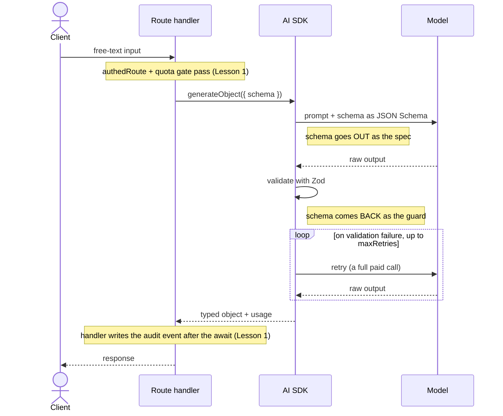

import AnnotatedCode from '../../../components/code/annotated-code/AnnotatedCode.astro';
import AnnotatedStep from '../../../components/code/annotated-code/AnnotatedStep.astro';
import CodeVariants from '../../../components/code/code-variants/CodeVariants.astro';
import CodeVariant from '../../../components/code/code-variants/CodeVariant.astro';
import Figure from '../../../components/figures/Figure.astro';
import StateMachineWalker from '../../../components/figures/state-machine-walker/StateMachineWalker.astro';
import Question from '../../../components/figures/state-machine-walker/Question.astro';
import Branch from '../../../components/figures/state-machine-walker/Branch.astro';
import Leaf from '../../../components/figures/state-machine-walker/Leaf.astro';
import Buckets from '../../../components/exercises/buckets/Buckets.astro';
import Bucket from '../../../components/exercises/buckets/Bucket.astro';
import Item from '../../../components/exercises/buckets/Item.astro';
import Sequence from '../../../components/exercises/sequence/Sequence.astro';
import Step from '../../../components/exercises/sequence/Step.astro';
import ZodCoding from '../../../components/live-coding/ZodCoding/ZodCoding.astro';
import Term from '../../../components/ui/Term.astro';
import ExternalResource from '../../../components/ui/ExternalResource.astro';
import VideoCallout from '../../../components/embeds/VideoCallout.astro';
import CourseProgressBar from '../../../components/ui/CourseProgressBar.astro';
import { CardGrid } from '@astrojs/starlight/components';

<CourseProgressBar value={frontmatter['course-progress']} />

A customer pastes a paragraph into your invoice app:

> "2x logo design at $400, 1x brand guidelines at $1200, due net 30."

You don't want the model to *talk back* about this. You want a row:

```ts
{
  items: [
    { description: 'logo design', quantity: 2, unitAmount: 400 },
    { description: 'brand guidelines', quantity: 1, unitAmount: 1200 },
  ],
  dueDate: '2026-07-15',
}
```

The next line of code hands that object to Drizzle for insertion, so prose won't do.
You need a typed value whose keys and types match a shape your database already understands.

With only `streamText` from the last lesson, the temptation is to prompt the model to "respond in JSON," then `JSON.parse` the reply and hope.
There's a better way, for reasons the next section covers.

`generateObject` and `streamObject` are the AI SDK's structured-output calls: you hand them a Zod schema, and the SDK turns it into the model's instructions, validates the reply, and hands back a typed object.
`result.object.unitAmount` is a `number`, with no cast and no parsing.
Because the contract lives in the schema rather than in prose tuned for one model, the same schema works against any model behind the handle you set up earlier.

## Why a schema beats prompt-engineered JSON

Prompting a model to "respond in JSON" and parsing the string works in your first demo and fails in production, because nothing enforces that the reply is well-formed and correctly keyed.
Three things go wrong, all invisible at first:

- **The model renames or invents keys.** You asked for `unitAmount`; it returns `unit_price` on one call and `amount` on another. Your `result.unitAmount` is silently `undefined`.
- **It wraps prose around the JSON.** "Here's the data you asked for:" followed by a ` ```json ` fence. `JSON.parse` throws on the first non-`{` character, and now you're writing a regex to fish the object out of a string.
- **It drifts on the next model update.** The format you tuned against one model shifts when the provider ships another. Nothing in your code changed; the output did.

`generateObject` removes all three by construction: it constrains the output to your schema, validates the reply with Zod, retries on a miss, and hands back a typed object.
And because a Zod schema is provider-independent, the same schema produces the same shape on OpenAI, Anthropic, or Google, where a prompt-engineered format is tied to the one model it was tuned for.
Whenever the workload allows structured output, reach for it.

The two call sites side by side:

<CodeVariants>
  <CodeVariant label="Prompt-engineered JSON">
    <div data-mark-color="red">

    ```ts del={9}
    const result = await generateText({
      model: fastModel,
      system: 'Extract the line item. Respond with ONLY valid JSON, no prose.',
      prompt,
      maxOutputTokens: 500,
    });

    try {
      const item = JSON.parse(result.text);
    } catch {
      // and now what? the model wrapped it in a code fence again
    }
    ```

    </div>
    **Fragile.** Nothing catches a renamed key, a code fence, or a format that drifts on the next model.
  </CodeVariant>

  <CodeVariant label="generateObject">
    <div data-mark-color="green">

    ```ts {8}
    const { object } = await generateObject({
      model: fastModel,
      schema: invoiceLineItemSchema,
      prompt,
      maxOutputTokens: 500,
    });

    const total = object.quantity * object.unitAmount;
    ```

    </div>
    **The schema is the contract.** The output is constrained to it, validated against it, retried on a miss, and handed back typed. `object.unitAmount` is a `number`, no parse step in between.
  </CodeVariant>
</CodeVariants>

## Calling `generateObject` with a Zod schema

We'll use one shape for the whole lesson, an invoice line item, so you track a single contract throughout.
Keep it bare for now; descriptions come next.

```ts
import { z } from 'zod';

const invoiceLineItemSchema = z.object({
  description: z.string(),
  quantity: z.number(),
  unitAmount: z.number(),
});
```

Nothing here is AI-specific; what matters is what `generateObject` does with it.

<AnnotatedCode lang="ts" code={`
const { object, usage, finishReason } = await generateObject({
  model: fastModel,
  schema: invoiceLineItemSchema,
  prompt,
  maxOutputTokens: 500,
});

const lineTotal = object.quantity * object.unitAmount;
`}>
  <AnnotatedStep meta={`"fastModel"`} color="blue">
    The model handle, imported from `lib/llm/models.ts`, never an inline `openai('gpt-X')`. `fastModel` fits extraction: it's cheap, and the work is mechanical enough not to need the expensive model.
  </AnnotatedStep>

  <AnnotatedStep meta={`"schema"`} color="green">
    The Zod object is the contract. The SDK serializes it and sends it to the model as the spec for what to produce. This one field is why we reach for `generateObject` instead of `streamText`.
  </AnnotatedStep>

  <AnnotatedStep meta={`"maxOutputTokens"`} color="orange">
    Still required. Structured output gets no exemption from the cost cap; every call in this course carries one.
  </AnnotatedStep>

  <AnnotatedStep meta={`"object" {8}`} color="violet">
    `object` is typed by the schema, so `object.unitAmount` is a `number`, not `any`. No cast, no `JSON.parse`, no post-validation: you go straight from model to typed value.
  </AnnotatedStep>
</AnnotatedCode>

There's no parse step of your own because the SDK already validated the output against your schema before handing you `object`.
That serialization travels over the wire as <Term definition="A standard, language-neutral format for describing the shape of JSON data. The AI SDK converts the Zod schema to JSON Schema and sends it to the model as the output spec.">JSON Schema</Term>, the format every provider's structured-output mode speaks: your Zod schema is the source, and you never write the JSON Schema by hand.

<VideoCallout videoId="mojZpktAiYQ" videoTitle="A Complete Guide To Vercel's AI SDK">
  Matt Pocock's 38-minute tour of the AI SDK. The structured-outputs, streaming-structured-outputs, and classifier chapters (from ~13:49) walk this lesson on screen.
</VideoCallout>

## Describe every non-obvious field

Put a `.describe()` on every field that isn't self-explanatory.
This one method call is what turns a flaky extraction into a reliable one.

When the SDK serializes your schema to JSON Schema, each field's `.describe()` string rides along as that field's documentation, and the model reads it the way you'd read a spec before filling out a form.
A bare field is a name and a type, so the model guesses; a described field is an instruction.

Watch what that does to a date.
`dueDate: z.iso.datetime()` alone lets the model invent a format, so it returns `"30 days"` on one call, `"net 30"` on another, `"2026-07-15"` on a third.
Add `.describe('ISO 8601 datetime, the date the invoice must be paid by')` and it extracts cleanly every time.
Use `z.iso.datetime()`, not `z.string()`: the format builder carries its own JSON Schema shape, so the model knows the field is a datetime, not free text.

It's the same Zod you've always written, now with a reader.
Units are where a description earns its keep most, so compare the before and after of the *same* schema.

<CodeVariants>
  <CodeVariant label="Bare schema">
    ```ts
    const invoiceLineItemSchema = z.object({
      description: z.string(),
      quantity: z.number(),
      unitAmount: z.number(),
    });
    ```
    **A teaching foil, not a shape you'd ship.** The fields are typed correctly but undocumented, so the model guesses. `unitAmount` could come back as dollars, cents, or the line total, and you won't know which until a wrong invoice ships.
  </CodeVariant>

  <CodeVariant label="Described schema">
    <div data-mark-color="green">

    ```ts /\.describe/
    const invoiceLineItemSchema = z.object({
      description: z
        .string()
        .describe('what the line item is, e.g. "logo design"'),
      quantity: z.number().int().describe('how many units, a whole number'),
      unitAmount: z
        .number()
        .describe('unit price in whole dollars, not cents, before tax'),
    });
    ```

    </div>
    **Now the schema reads like a spec,** and the model fills it the same way every time. The units decision is written down once, where the model can see it.
  </CodeVariant>
</CodeVariants>

One nuance: descriptions are part of the prompt, so they cost input tokens on every call.
Be generous on genuinely ambiguous fields and terse on obvious ones; a field named `description` doesn't need a paragraph explaining that it's a description.

Now write one yourself.
The exercise below gives you a half-finished line-item schema; tighten it so every fixture lands the right way.
The fixtures pin the *shape* of the contract, the part you can prove in the browser.

<ZodCoding
  schemaName="invoiceLineItemSchema"
  instructions="Here's a half-described invoice line-item schema. Tighten it so every fixture passes. The field types are the structural floor — get those right, and watch the `^?` query firm up the inferred `LineItem` as you go. Descriptions don't change what `safeParse` accepts, so they aren't graded here, but write them anyway: in a real call they're what the model reads."
  starter={`import { z } from 'zod';

export const invoiceLineItemSchema = z.object({
  description: z.string(),
  quantity: z.string(),
  unitAmount: z.number(),
});

type LineItem = z.infer<typeof invoiceLineItemSchema>;
//   ^?
`}
  fixtures={[
    { name: 'well-formed line item', input: { description: 'logo design', quantity: 2, unitAmount: 400 }, expect: 'pass' },
    { name: 'quantity sent as a string', input: { description: 'logo design', quantity: '2', unitAmount: 400 }, expect: 'fail' },
    { name: 'missing description', input: { quantity: 2, unitAmount: 400 }, expect: 'fail' },
    { name: 'free line item (zero amount)', input: { description: 'goodwill credit', quantity: 1, unitAmount: 0 }, expect: 'pass' },
  ]}
/>

The grader checks only the schema's shape, its types and required fields, because that's all `safeParse` runs in the browser, but the testable skill is the one that counts: designing a schema that survives contact with a model.

## What the model can render: schema-shape constraints

Most Zod schemas survive the trip through JSON Schema, but a few break the export or quietly degrade the model's accuracy.

**The top level must be an object.** Most providers reject a bare array or primitive at the top of a structured-output call, so your root is always `z.object(...)`. A mode for returning a bare list, covered later, is the exception.

**These are safe inside the object:** strings, numbers, booleans, `z.enum([...])`, nested objects, and arrays of objects. All serialize and extract cleanly, which covers most real schemas.

**Unions cost accuracy, so prefer a discriminator.** A plain `z.union([...])` makes the model guess *which* branch to match; `z.discriminatedUnion('kind', [...])` gives it an explicit `kind` label to pick instead. Reserve bare `z.union` for genuinely shapeless alternatives.

**Three things break or degrade structured output.** `z.any()` and `z.unknown()` have nothing to serialize, so the model gets zero guidance. `z.transform()` is code, which JSON Schema can't represent, so the SDK can't send it. A recursive schema, one that references itself, blows up the export. If a field needs one of these, structured output is the wrong tool for it.

Sort each fragment into the bucket it belongs in.

<Buckets twoCol instructions="Each fragment is a piece of a schema you'd send to a model. Sort each into whether it serializes to JSON Schema cleanly, or breaks / degrades the structured-output call.">
  <Bucket name="safe" label="Model-safe" description="Serializes and extracts cleanly" />
  <Bucket name="breaks" label="Breaks or degrades" description="Won't serialize, or the model can't comply" />

  <Item bucket="safe">`z.object({ ... })` at the root</Item>
  <Item bucket="safe">`z.enum(['draft', 'sent', 'paid'])`</Item>
  <Item bucket="safe">`z.array(invoiceLineItemSchema)` inside an object</Item>
  <Item bucket="safe">`z.discriminatedUnion('kind', [...])`</Item>
  <Item bucket="breaks">`z.any()`</Item>
  <Item bucket="breaks">a recursive `z.lazy(() => nodeSchema)` tree</Item>
  <Item bucket="breaks">`z.string().transform((s) => s.trim())`</Item>
  <Item bucket="breaks">a bare `z.array(...)` at the top level</Item>
</Buckets>

## Hard constraints in the schema, soft in the prompt

Which constraints belong in the schema and which belong in the prompt is the costliest call to get wrong in structured output, because the two kinds fail very differently.

A Zod `.refine()` runs at *validation time*, on the object the model already returned.
If it fails, the SDK doesn't patch the object; it **retries the model**, and every retry is a full, paid call.
So a constraint the model can't reliably satisfy isn't a guardrail, it's a recurring bill.

- **Hard structural constraints go in the schema:** types, enums, required fields. These describe shape, which structured-output mode enforces natively, so every output clears the schema or the call fails.
- **Soft constraints go in the prompt:** formatting conventions, house style, "invoice numbers follow `INV-XXXX`." These shape the common case without making a single miss expensive.

A model-generated invoice number is the classic case.

<CodeVariants>
  <CodeVariant label="Over-strict (retry thrash)">
    <div data-mark-color="red">

    ```ts {2}
    const invoiceSchema = z.object({
      invoiceNumber: z.string().refine((s) => s.startsWith('INV-')),
      // ...
    });
    ```

    </div>
    **Burns a retry on every miss.** When the model returns `INV/0001` or `2026-INV-1`, the refine rejects it, and the SDK pays for a fresh call to try again.
  </CodeVariant>

  <CodeVariant label="Floor in schema, hint in prompt">
    <div data-mark-color="green">

    ```ts {2,6}
    const invoiceSchema = z.object({
      invoiceNumber: z.string(),
      // ...
    });

    const prompt = `${input}\n\nInvoice numbers use the format INV-0001.`;
    ```

    </div>
    **Reliable and cheap.** The field is a plain string the model can always produce; the format lives in the prompt as a suggestion, so a near-miss still passes and costs nothing extra.
  </CodeVariant>
</CodeVariants>

This doesn't mean never refine.
Cross-field invariants the model controls are a legitimate use: `endDate` on or after `startDate`, or a total equalling the sum of its lines.
The line to hold is between a constraint the model can always meet and a format you're only *hoping* it hits.

## Picking the output shape: object, enum, array, and streaming

So far every call has been `generateObject` returning one record.
That's the default, but it's one of four shapes; pick by the workload, not by whichever you used last.

**One structured record → `generateObject` with a `z.object`.** The default you know: parse one thing into one shape.

**One value from a known set → `output: 'enum'`.** When the answer is a single label, like a sentiment or a priority bucket, a schema is overkill. You pass an `enum` array and get back one string from it: same retry behavior, less overhead, cheaper call.

**A list of records → `output: 'array'`.** When the workload is "extract *all* the line items," name it directly with `output: 'array'` and a per-item `schema`; the mode wraps the top level for you and types `object` as `LineItem[]`.

**A large output read field-by-field → `streamObject`.** Same schemas, but it streams *partial* objects as the fields populate. For a big schema the user reads top-to-bottom, this turns a four-second spinner into four seconds of progressive fill. The route returns `result.toTextStreamResponse()`; the client renders the growing object with the `useObject` hook, which is the next lesson.

<StateMachineWalker title="Which output shape?">
  <Question id="shape" prompt="What shape is the answer?">
    <Branch label="One label from a fixed set" to="leaf-enum" rationale="A sentiment, an intent, a priority — not a record." />
    <Branch label="One structured record" to="size-record" rationale="A line item, a parsed form — one typed object." />
    <Branch label="A list of records" to="size-list" rationale="Extract all the line items, not just one." />
  </Question>

  <Question
    id="size-record"
    prompt="How is the record read?"
    description="One typed object — but how big is it, and does the user read it as it arrives?"
  >
    <Branch label="Small, read whole" to="leaf-object" />
    <Branch label="Large, read field-by-field" to="leaf-stream" rationale="A multi-section summary the user scans top to bottom." />
  </Question>

  <Question
    id="size-list"
    prompt="How is the list read?"
    description="A list of records — same question as for a record."
  >
    <Branch label="Short list, read whole" to="leaf-array" />
    <Branch label="Long list, read as it fills" to="leaf-stream" rationale="A long extraction the user watches populate." />
  </Question>

  <Leaf id="leaf-enum" verdict="output: 'enum'">
    Classification into a known set: sentiment, intent, priority. The cheapest return, one string from your list, no schema overhead.
  </Leaf>

  <Leaf id="leaf-object" verdict="generateObject + z.object">
    One typed record, read whole. The default. `result.object` is your schema, fully populated.
  </Leaf>

  <Leaf id="leaf-array" verdict="output: 'array'">
    Extract a list. Names the workload, and wraps the top level so you don't have to. `result.object` is `T[]`.
  </Leaf>

  <Leaf id="leaf-stream" verdict="streamObject">
    A large output the user reads sequentially. Streams partial objects so the UI fills in progressively instead of waiting. The client renders it with `useObject`, the next lesson.
  </Leaf>
</StateMachineWalker>

The four call sites in one place; only the shape changes, the `model` and `maxOutputTokens` discipline holds throughout.

```ts
// One record
const { object } = await generateObject({
  model: fastModel,
  schema: invoiceLineItemSchema,
  prompt,
  maxOutputTokens: 500,
});

// One label
const { object: priority } = await generateObject({
  model: fastModel,
  output: 'enum',
  enum: ['low', 'medium', 'high'],
  prompt,
  maxOutputTokens: 20,
});

// A list
const { object: items } = await generateObject({
  model: fastModel,
  output: 'array',
  schema: invoiceLineItemSchema,
  prompt,
  maxOutputTokens: 800,
});

// A large output, streamed
const result = streamObject({
  model: chatModel,
  schema: invoiceSummarySchema,
  prompt,
  maxOutputTokens: 1500,
});
```

## The same handler, with `generateObject` swapped in

Structured output lives behind the *exact same* route handler you built in the last lesson: you swap one call, not the handler shape.
`generateObject` sits inside the same `authedRoute('member', schema, fn)` wrapper, behind the same rate-limit and quota gates, as `streamText`.
The one shift is where the audit write lands, explained at the call below.

<AnnotatedCode lang="ts" maxLines={18} code={`
export const POST = authedRoute(
  'member',
  extractLineItemSchema,
  async ({ body, orgId }, request) => {
    const { object, usage, finishReason } = await generateObject({
      model: fastModel,
      schema: invoiceLineItemSchema,
      prompt: body.text,
      maxOutputTokens: 500,
      maxRetries: 1,
      abortSignal: request.signal,
    });

    await recordLlmUsage({ orgId, usage, event: 'llm.call.completed' });

    if (finishReason !== 'stop' || !object) {
      return problem(422, 'Could not extract a line item from that text.');
    }

    const line = await insertInvoiceLine(orgId, object);
    return Response.json({ line });
  },
);
`}>
  <AnnotatedStep meta={`"authedRoute"`} color="blue">
    The same wrapper from the last lesson: auth, role check, body validation, rate-limit, and quota, all lifted out of the handler body. The quota layer is the `withLlmQuota(...)` composition wrapped around `authedRoute` from the cost chapter. Structured output reuses the same seam.
  </AnnotatedStep>

  <AnnotatedStep meta={`"generateObject"`} color="violet">
    The one line that differs from the `streamText` handler.
  </AnnotatedStep>

  <AnnotatedStep meta="{14}" color="green">
    `generateObject` is awaited, so `usage` comes back on the resolved result with no `onFinish`. The token accounting and the `llm.call.completed` write run right here, inline after the `await`. (`streamObject` keeps an `onFinish`, since it returns before the call completes, so its write has no later line to run on.)
  </AnnotatedStep>

  <AnnotatedStep meta={`"maxRetries: 1"`} color="orange">
    The retry knob. When the model returns output that fails Zod parsing, the SDK retries; the default is two. Each retry is a full paid call, so this is a cost lever, not a reliability dial: a well-described schema rarely misses, so `1` caps the spend. Raise it only when the workload benefits.
  </AnnotatedStep>

  <AnnotatedStep meta="{16-18}" color="red">
    The defensive guard. Even with retries, the model can return an empty `object` or hit a non-`stop` finish reason. Check before the Drizzle insert and return a clean 422, so `object.description` never blows up on `null`.
  </AnnotatedStep>
</AnnotatedCode>

## The structured-output lifecycle, end to end

The schema travels **out** to the model as the JSON Schema spec and comes **back** through the SDK as the Zod validator, with the paid retry loop in between.

<Figure caption="Each retry in the loop is a full model call, so an over-strict schema spends your budget there.">

</Figure>

<Sequence instructions="Put the steps of a `generateObject` call in order, from the user's text to the response.">
  <Step>User input reaches the route handler</Step>
  <Step>`authedRoute` and the quota gate pass</Step>
  <Step>`generateObject` serializes the schema to JSON Schema and sends it with the prompt</Step>
  <Step>The model returns structured output</Step>
  <Step>The SDK validates the output against the Zod schema</Step>
  <Step>On a validation miss, the SDK retries the model</Step>
  <Step>The typed object returns and the handler writes the audit event after the await</Step>
  <Step>The handler responds to the client</Step>
</Sequence>

## One seam, every structured call

The same seam covers every structured call the invoice app needs, from extracting line items to classifying a payment email to drafting a description, each provider-swappable because the Zod schema is the contract.
The discipline carries past one-shot calls too: the *tools* the ask-your-invoices chat calls later will validate their inputs and outputs with Zod the same way.

## External resources

<CardGrid>
  <ExternalResource
    title="AI SDK — generateObject"
    href="https://ai-sdk.dev/v5/docs/reference/ai-sdk-core/generate-object"
    icon="simple-icons:vercel"
    iconColor="#000000"
    description="The full reference: output modes, maxRetries, and the result shape."
  />
  <ExternalResource
    title="AI SDK — Generating Structured Data"
    href="https://ai-sdk.dev/v5/docs/ai-sdk-core/generating-structured-data"
    icon="simple-icons:vercel"
    iconColor="#000000"
    description="The conceptual guide behind the reference — object, array, and enum modes, plus schema descriptions, end to end."
  />
  <ExternalResource
    title="Zod — Basic usage"
    href="https://zod.dev/basics"
    icon="simple-icons:zod"
    iconColor="#3E67B1"
    description="Defining schemas, parse vs safeParse, and z.infer — the same Zod you point at the model here."
  />
</CardGrid>
