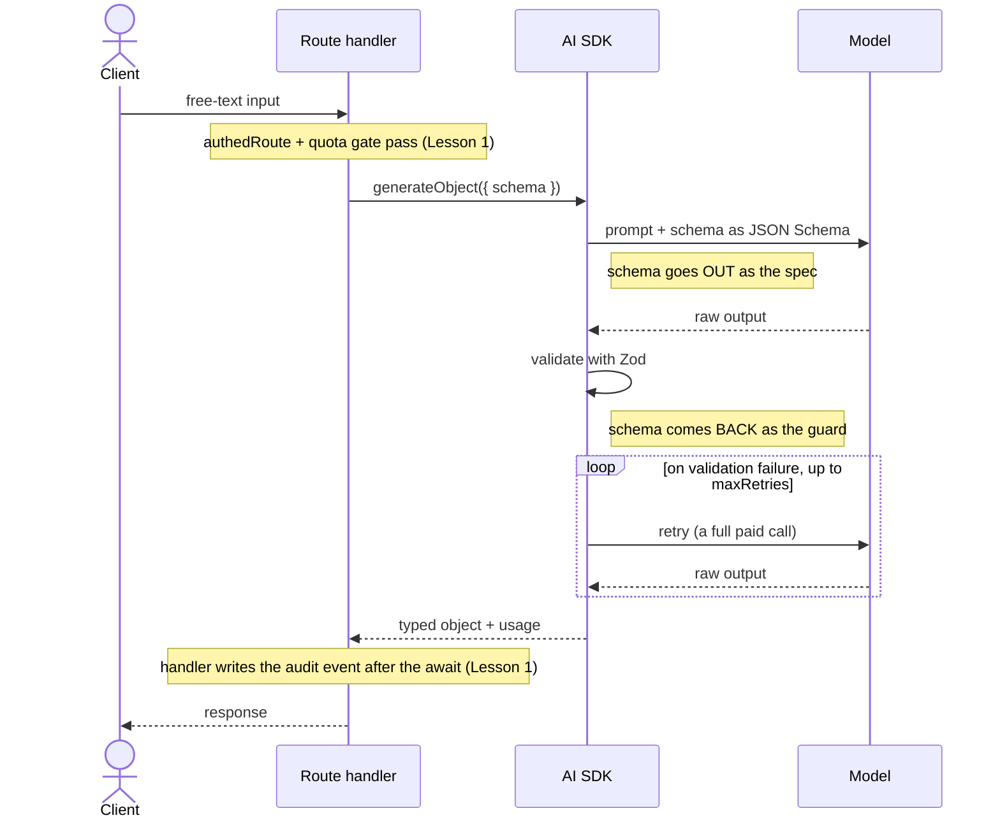

import AnnotatedCode from '../../../components/code/annotated-code/AnnotatedCode.astro';
import AnnotatedStep from '../../../components/code/annotated-code/AnnotatedStep.astro';
import CodeVariants from '../../../components/code/code-variants/CodeVariants.astro';
import CodeVariant from '../../../components/code/code-variants/CodeVariant.astro';
import Figure from '../../../components/figures/Figure.astro';
import StateMachineWalker from '../../../components/figures/state-machine-walker/StateMachineWalker.astro';
import Question from '../../../components/figures/state-machine-walker/Question.astro';
import Branch from '../../../components/figures/state-machine-walker/Branch.astro';
import Leaf from '../../../components/figures/state-machine-walker/Leaf.astro';
import Buckets from '../../../components/exercises/buckets/Buckets.astro';
import Bucket from '../../../components/exercises/buckets/Bucket.astro';
import Item from '../../../components/exercises/buckets/Item.astro';
import Sequence from '../../../components/exercises/sequence/Sequence.astro';
import Step from '../../../components/exercises/sequence/Step.astro';
import ZodCoding from '../../../components/live-coding/ZodCoding/ZodCoding.astro';
import Term from '../../../components/ui/Term.astro';
import ExternalResource from '../../../components/ui/ExternalResource.astro';
import VideoCallout from '../../../components/embeds/VideoCallout.astro';
import CourseProgressBar from '../../../components/ui/CourseProgressBar.astro';
import { CardGrid } from '@astrojs/starlight/components';

<CourseProgressBar value={frontmatter['course-progress']} />

A customer pastes a paragraph into your invoice app:

> "2x logo design at $400, 1x brand guidelines at $1200, due net 30."

You don't want a model to *talk back* about this. You want a row:

```ts
{
  items: [
    { description: 'logo design', quantity: 2, unitAmount: 400 },
    { description: 'brand guidelines', quantity: 1, unitAmount: 1200 },
  ],
  dueDate: '2026-07-15',
}
```

The next line of your code inserts that object with Drizzle. Prose won't do — you need a typed value, with the keys you expect, in the types you expect, ready to hand to the next function. The whole job here is to map free text onto a shape your database already understands.

The temptation, if you'd only met `streamText` from the last lesson, is to reach for it: write a system prompt that begs the model to "respond in JSON," then `JSON.parse` the reply and hope. That works in the demo and breaks in production, and we'll spend the first minute of this lesson on *why* it's a bug class rather than a shortcut.

The right tool exists, and it's the focus of this lesson: `generateObject` and `streamObject`. You hand them a Zod schema; the SDK turns that schema into the model's instructions, validates the reply against it, retries when the model misses, and hands you back a typed object — `result.object.unitAmount` is a `number` at the call site, no cast, no parsing. And because the contract lives in the schema rather than in prose you've hand-tuned for one model, this is the *swap-friendly* call shape: the same schema works against Claude, GPT, or Gemini behind the model handle you set up earlier.

You've already met both halves of this. The previous lesson gave you the route-handler seam — `authedRoute`, the rate-limit and quota gates, `onFinish` for the usage and audit writes, `maxOutputTokens` on every call, and the model handle imported from `lib/llm/models.ts`. And Zod 4 you've known since you first started validating forms. This lesson is that *same* seam with one call swapped, and your Zod schemas pointed at a new reader: the model.

## Why a schema beats prompt-engineered JSON

Before any syntax, the decision. An experienced engineer on the 2026 stack does not ask a model to "respond in JSON" and parse the string, and it's worth being precise about why, because the failure is invisible in testing.

When you prompt for JSON and `JSON.parse` the reply, you're trusting the model to produce well-formed, correctly-keyed JSON *every single time*, with no enforcement. Three things go wrong, and all three pass your first demo:

- **The model renames or invents keys.** You asked for `unitAmount`; it returns `unit_price` on one call and `amount` on another. Your `result.unitAmount` is silently `undefined`.
- **It wraps prose around the JSON.** "Here's the data you asked for:" followed by a ` ```json ` fence. `JSON.parse` throws on the first non-`{` character, and now you're writing a regex to fish the object out of a string.
- **It drifts on the next model update.** The format you tuned against this quarter's model shifts when the provider ships a new one. Nothing in your code changed; the output did.

`generateObject` removes all three by construction. In one sentence each, it: **constrains** the model's output to your schema, **validates** the reply with Zod, **retries** the model when the output doesn't fit, **returns a typed object**, and **absorbs provider differences** — the same schema produces the same shape whether the call lands on OpenAI, Anthropic, or Google.

That last point is the one the whole lesson hangs on. Free-form `streamText` couples your contract to prompt-engineering, and prompt-engineering is tuned to a specific model — change the model and you re-tune. `generateObject` moves the contract *into the schema*, and a Zod schema is provider-independent. So a surface built on structured output swaps providers cleanly, which is exactly the abstraction discipline you set up when you put every model behind `lib/llm/models.ts`. The rule is short: **whenever the workload allows structured output, reach for it.**

The contrast is the teaching here, so look at the two call sites side by side.

<CodeVariants>
  <CodeVariant label="Prompt-engineered JSON">
    <div data-mark-color="red">

    ```ts del={9}
    const result = await generateText({
      model: fastModel,
      system: 'Extract the line item. Respond with ONLY valid JSON, no prose.',
      prompt,
      maxOutputTokens: 500,
    });

    try {
      const item = JSON.parse(result.text);
    } catch {
      // and now what? the model wrapped it in a code fence again
    }
    ```

    </div>
    **Fragile.** The model can rename keys, wrap prose around the JSON, or drift on the next model update — and nothing here catches it. `JSON.parse` throws on the first non-`{` character, leaving you to write a regex to fish the object out of a string.
  </CodeVariant>

  <CodeVariant label="generateObject">
    <div data-mark-color="green">

    ```ts {8}
    const { object } = await generateObject({
      model: fastModel,
      schema: invoiceLineItemSchema,
      prompt,
      maxOutputTokens: 500,
    });

    const total = object.quantity * object.unitAmount;
    ```

    </div>
    **The schema is the contract.** The output is constrained to it, validated against it, retried on a miss, and handed back to you typed. `object.unitAmount` is a `number` here, no parse step in between.
  </CodeVariant>
</CodeVariants>

## The minimal call: schema in, typed object out

Here's the spine the rest of the lesson decorates. It's three lines of decision wrapped around one Zod object.

Start with the schema. We'll use one shape for the entire lesson — an invoice line item — so you track a single contract instead of re-reading a new one in every section. Keep it bare for now; descriptions come next, deliberately staged so you see the plain shape first.

```ts
import { z } from 'zod';

const invoiceLineItemSchema = z.object({
  description: z.string(),
  quantity: z.number(),
  unitAmount: z.number(),
});
```

That's a normal Zod schema — nothing AI-specific about it. The interesting part is what `generateObject` *does* with it.

<AnnotatedCode lang="ts" code={`
const { object, usage, finishReason } = await generateObject({
  model: fastModel,
  schema: invoiceLineItemSchema,
  prompt,
  maxOutputTokens: 500,
});

const lineTotal = object.quantity * object.unitAmount;
`}>
  <AnnotatedStep meta={`"fastModel"`} color="blue">
    The model handle, imported from `lib/llm/models.ts` — never an inline `openai('gpt-X')`, same rule as the last lesson. `fastModel` is the right pick for extraction: it's cheap, and the work is mechanical enough not to need the expensive model.
  </AnnotatedStep>

  <AnnotatedStep meta={`"schema"`} color="green">
    The Zod object is the contract. The SDK serializes it and sends it to the model as the spec for what to produce. This one field is the whole reason we're not in `streamText`.
  </AnnotatedStep>

  <AnnotatedStep meta={`"maxOutputTokens"`} color="orange">
    Still non-optional. Structured output is not exempt from the cost cap — every call in this course carries one.
  </AnnotatedStep>

  <AnnotatedStep meta={`"object" {8}`} color="violet">
    The return is destructured to `{ object, usage, finishReason }`. `object` is typed *by the schema* — `object.unitAmount` is a `number`, not `any`. That's the TypeScript win: no cast, no `JSON.parse`, no post-validation. You go straight from model to typed value.
  </AnnotatedStep>
</AnnotatedCode>

Two things to notice about what is *not* there. There's no `JSON.parse`. There's no `safeParse` after the call. The SDK already validated the model's output against your schema before it handed you `object` — adding your own parse step would be re-checking work that's already done, and re-checking it would teach exactly the redundancy this lesson argues against.

What makes "serialize the schema and send it" possible is <Term definition="A standard, language-neutral format for describing the shape of JSON data. The AI SDK converts the Zod schema to JSON Schema and sends it to the model as the output spec.">JSON Schema</Term> — the universal way to describe a JSON shape that every provider's structured-output mode speaks. Your Zod schema is the source; JSON Schema is the wire format the model receives. You never write it by hand, but knowing it's the intermediary explains the next section.

<VideoCallout videoId="mojZpktAiYQ" videoTitle="A Complete Guide To Vercel's AI SDK">
  Matt Pocock's 38-minute tour of the AI SDK — the structured-outputs, streaming-structured-outputs, and classifier chapters (from ~13:49) walk this whole lesson on screen.
</VideoCallout>

## Descriptions are the model's documentation

The single highest-leverage habit in schema design for AI is also the one beginners skip: a `.describe()` on every field that isn't self-explanatory. This is where a flaky extraction becomes a reliable one, and it costs you one method call.

Here's the mechanism. When the SDK serializes your schema to JSON Schema, each field's `.describe()` string rides along as that field's documentation — the model reads it the way you'd read a spec before filling out a form. A bare field is a field name and a type and nothing else, so the model guesses. A described field is an instruction.

Watch what that does to a date. `dueDate: z.iso.datetime()` with no description leaves the model to invent a format, and it will hand you `"30 days"` on one call, `"net 30"` on another, `"2026-07-15"` on a third. Add the documentation — `z.iso.datetime().describe('ISO 8601 datetime, the date the invoice must be paid by')` — and it extracts cleanly and consistently. (Note `z.iso.datetime()`, not `z.string()`: the top-level format builder is the convention for dates, and it carries its own JSON Schema shape so the model knows it's a datetime, not free text.)

So the reflex is: every non-obvious field gets a `.describe`, and the schema should read like a spec for a human contractor. It's the same Zod you've always written; the only new thing is the reader. The clearest place this bites is units — look at the before and after of the *same* schema.

<CodeVariants>
  <CodeVariant label="Bare schema">
    ```ts
    const invoiceLineItemSchema = z.object({
      description: z.string(),
      quantity: z.number(),
      unitAmount: z.number(),
    });
    ```
    **A teaching foil, not a shape you'd ship.** The fields are typed correctly but undocumented, so the model has to guess — `unitAmount` could come back as dollars, cents, or the line total, and you won't know which until a wrong invoice ships.
  </CodeVariant>

  <CodeVariant label="Described schema">
    <div data-mark-color="green">

    ```ts /\.describe/
    const invoiceLineItemSchema = z.object({
      description: z
        .string()
        .describe('what the line item is, e.g. "logo design"'),
      quantity: z.number().int().describe('how many units, a whole number'),
      unitAmount: z
        .number()
        .describe('unit price in whole dollars, not cents, before tax'),
    });
    ```

    </div>
    **Now the schema reads like a spec,** and the model fills it the same way every time. The units decision is written down once, where the model can see it.
  </CodeVariant>
</CodeVariants>

One nuance, because it foreshadows a cost watch-out later: descriptions are part of the prompt, so they cost input tokens on every call. Be generous on the fields that are genuinely ambiguous; be terse on the obvious ones. A field named `description` doesn't need a paragraph explaining that it's a description. Write specs, not essays.

Now write one yourself. The exercise below gives you a half-finished line-item schema. Tighten it so every fixture lands the right way — the fixtures pin the *shape* of the contract, which is the part you can prove in the browser.

<ZodCoding
  schemaName="invoiceLineItemSchema"
  instructions="Here's a half-described invoice line-item schema. Tighten it so every fixture passes. The field types are the structural floor — get those right, and watch the `^?` query firm up the inferred `LineItem` as you go. Descriptions don't change what `safeParse` accepts, so they aren't graded here, but write them anyway: in a real call they're what the model reads."
  starter={`import { z } from 'zod';

export const invoiceLineItemSchema = z.object({
  description: z.string(),
  quantity: z.string(),
  unitAmount: z.number(),
});

type LineItem = z.infer<typeof invoiceLineItemSchema>;
//   ^?
`}
  fixtures={[
    { name: 'well-formed line item', input: { description: 'logo design', quantity: 2, unitAmount: 400 }, expect: 'pass' },
    { name: 'quantity sent as a string', input: { description: 'logo design', quantity: '2', unitAmount: 400 }, expect: 'fail' },
    { name: 'missing description', input: { quantity: 2, unitAmount: 400 }, expect: 'fail' },
    { name: 'free line item (zero amount)', input: { description: 'goodwill credit', quantity: 1, unitAmount: 0 }, expect: 'pass' },
  ]}
/>

The drill grades the schema's *shape* — types and required fields — because that's what `safeParse` checks and what runs in the browser. The description discipline rides in the prose and in the call, not in the grader. That split is honest about what's testable here, and it still puts the real skill under your hands: designing a schema that survives contact with a model.

## What the model can render: schema-shape constraints

Not every Zod schema survives the trip through JSON Schema. A handful serialize cleanly and extract reliably; a few break the export or quietly degrade the model's accuracy. This is a short reference section — learn the rule, then sort the cases.

**The top level must be an object.** Your root is always `z.object(...)`. Most providers reject a bare array or a bare primitive at the top of a structured-output call. (You'll see in a moment how to "return a list" without violating this — there's a mode for it.)

**These are safe inside the object:** strings, numbers, booleans, `z.enum([...])`, nested objects, and arrays of objects. All of them serialize and extract cleanly. This covers the overwhelming majority of real schemas.

**Unions cost accuracy, so prefer a discriminator.** A plain `z.union([...])` asks the model to infer *which* branch its output should match — a shape it has to guess at. A `z.discriminatedUnion('kind', [...])` gives it an explicit `kind` label to pick instead. Reserve bare `z.union` for genuinely shapeless alternatives; reach for the discriminated form whenever the variants are tagged. The framing: give the model a label to choose, not a shape to infer.

**Three things break or degrade structured output**, and they're worth memorizing as a set: `z.any()` and `z.unknown()` (there's nothing to serialize, so the model gets zero guidance about what goes there); `z.transform()` (a transform is code, and JSON Schema can't represent code, so the SDK can't send it); and **recursive schemas** (a schema that references itself blows up the JSON Schema export). If a field needs one of these, the structured-output call is the wrong tool for that field.

Sort the cases below into the two buckets. Each chip is a small schema fragment — decide whether it survives serialization or breaks it.

<Buckets twoCol instructions="Each fragment is a piece of a schema you'd send to a model. Sort each into whether it serializes to JSON Schema cleanly, or breaks / degrades the structured-output call.">
  <Bucket name="safe" label="Model-safe" description="Serializes and extracts cleanly" />
  <Bucket name="breaks" label="Breaks or degrades" description="Won't serialize, or the model can't comply" />

  <Item bucket="safe">`z.object({ ... })` at the root</Item>
  <Item bucket="safe">`z.enum(['draft', 'sent', 'paid'])`</Item>
  <Item bucket="safe">`z.array(invoiceLineItemSchema)` inside an object</Item>
  <Item bucket="safe">`z.discriminatedUnion('kind', [...])`</Item>
  <Item bucket="breaks">`z.any()`</Item>
  <Item bucket="breaks">a recursive `z.lazy(() => nodeSchema)` tree</Item>
  <Item bucket="breaks">`z.string().transform((s) => s.trim())`</Item>
  <Item bucket="breaks">a bare `z.array(...)` at the top level</Item>
</Buckets>

## The schema is the floor, the prompt is the suggestion

This section is one decision, and getting it wrong is the most expensive beginner mistake in structured output. The decision: which constraints belong in the schema, and which belong in the prompt.

Here's the mechanism that forces the call. A Zod `.refine()` runs at *validation time*, on the object the model already returned. If the refinement fails, the SDK doesn't patch the object — it **retries the model**, and every retry is a full, paid call. So a constraint the model can't reliably satisfy isn't a guardrail. It's a cost amplifier that thrashes the retry loop and burns your budget, one failed call at a time.

That gives you a clean cut, and it's the section's title made concrete:

- **Hard structural constraints go in the schema** — types, enums, required fields. These are things the model can *always* satisfy, because they're about shape, and shape is what structured-output mode enforces natively. The schema is the floor: every output clears it or the call fails.
- **Soft constraints go in the prompt** — formatting conventions, house style, "invoice numbers follow `INV-XXXX`." These shape the common case without making a single miss expensive. The prompt is the suggestion.

The classic anti-example is a model-generated invoice number. Look at the wrong way and the right way side by side.

<CodeVariants>
  <CodeVariant label="Over-strict (retry thrash)">
    <div data-mark-color="red">

    ```ts {2}
    const invoiceSchema = z.object({
      invoiceNumber: z.string().refine((s) => s.startsWith('INV-')),
      // ...
    });
    ```

    </div>
    **Burns a retry on every miss.** The model occasionally returns `INV/0001` or `2026-INV-1`, the refine rejects it, and the SDK pays for a fresh call to try again.
  </CodeVariant>

  <CodeVariant label="Floor in schema, hint in prompt">
    <div data-mark-color="green">

    ```ts {2,6}
    const invoiceSchema = z.object({
      invoiceNumber: z.string(),
      // ...
    });

    const prompt = `${input}\n\nInvoice numbers use the format INV-0001.`;
    ```

    </div>
    **Reliable and cheap.** The field is a plain string the model can always produce; the format lives in the prompt as a suggestion, so a near-miss still passes and costs nothing extra.
  </CodeVariant>
</CodeVariants>

This doesn't mean *never refine*. There's a legitimate use: cross-field invariants the model controls and can satisfy — `endDate` must be on or after `startDate`, a total must equal the sum of its lines. There, `.refine` is a real guard against a genuinely-wrong object, not a thrash. The line to hold is the difference between a constraint the model can always meet and a format you're *hoping* it hits.

## Picking the output shape: object, enum, array, and streaming

So far every call has been `generateObject` returning one record. That's the default, but it's one of four shapes, and the experienced move is to pick among them by naming the workload — not by reaching for the one you used last time. Each maps to a sentence you can say out loud about the task.

**One structured record → `generateObject` with a `z.object`.** The default you already know. Extract a line item, fill a form, parse one thing into one shape.

**One value from a known set → `output: 'enum'`.** When the answer isn't a record at all but a single label — a sentiment, an intent, a priority bucket — the schema is overkill. `generateObject({ model: fastModel, output: 'enum', enum: ['low', 'medium', 'high'], prompt, maxOutputTokens: 20 })` returns a single string from the set you gave it. Same retry behavior, less overhead, cheaper call. Reach for it when the result is a label, not a record.

**A list of records → `output: 'array'`.** When the workload is "extract *all* the line items," you want an array. You *could* wrap it — `z.object({ items: z.array(invoiceLineItemSchema) })` works and clears the top-level-object rule — but `output: 'array'` is the idiom that names the workload directly: `generateObject({ model: fastModel, output: 'array', schema: invoiceLineItemSchema, prompt, maxOutputTokens: 800 })` hands you `object` typed as `LineItem[]`. This is also the answer to "but the top level must be an object" — the mode handles the wrapping for you.

**A large output read field-by-field → `streamObject`.** Same schemas, but instead of waiting for the whole object, it streams *partial* objects as the fields populate. When the schema is big — a multi-section summary, a long list of extracted lines — and the user reads the result top-to-bottom as it arrives, this turns a four-second spinner into four seconds of progressive fill. The route handler returns `result.toTextStreamResponse()`, and on the client the `useObject` hook renders the partial object as it grows. You'll build that client side in the next lesson; here, just know `streamObject` is the server primitive that feeds it.

The lesson isn't the four call signatures — it's the *order you ask the questions in*. Walk it.

<StateMachineWalker title="Which output shape?">
  <Question id="shape" prompt="What shape is the answer?">
    <Branch label="One label from a fixed set" to="leaf-enum" rationale="A sentiment, an intent, a priority — not a record." />
    <Branch label="One structured record" to="size-record" rationale="A line item, a parsed form — one typed object." />
    <Branch label="A list of records" to="size-list" rationale="Extract all the line items, not just one." />
  </Question>

  <Question
    id="size-record"
    prompt="How is the record read?"
    description="One typed object — but how big is it, and does the user read it as it arrives?"
  >
    <Branch label="Small, read whole" to="leaf-object" />
    <Branch label="Large, read field-by-field" to="leaf-stream" rationale="A multi-section summary the user scans top to bottom." />
  </Question>

  <Question
    id="size-list"
    prompt="How is the list read?"
    description="A list of records — same question as for a record."
  >
    <Branch label="Short list, read whole" to="leaf-array" />
    <Branch label="Long list, read as it fills" to="leaf-stream" rationale="A long extraction the user watches populate." />
  </Question>

  <Leaf id="leaf-enum" verdict="output: 'enum'">
    Classification into a known set — sentiment, intent, priority. The cheapest, simplest return: one string from your list, no schema overhead.
  </Leaf>

  <Leaf id="leaf-object" verdict="generateObject + z.object">
    One typed record, read whole. The default. `result.object` is your schema, fully populated.
  </Leaf>

  <Leaf id="leaf-array" verdict="output: 'array'">
    Extract a list. Names the workload, and handles the top-level wrapping so you don't have to. `result.object` is `T[]`.
  </Leaf>

  <Leaf id="leaf-stream" verdict="streamObject">
    A large output the user reads sequentially. Streams partial objects so the UI fills in progressively instead of waiting. The client renders it with `useObject` — that's the next lesson.
  </Leaf>
</StateMachineWalker>

For reference after the walk, here are the four call sites in one place. Same `model` and `maxOutputTokens` discipline throughout; only the shape changes.

```ts
// One record
const { object } = await generateObject({
  model: fastModel,
  schema: invoiceLineItemSchema,
  prompt,
  maxOutputTokens: 500,
});

// One label
const { object: priority } = await generateObject({
  model: fastModel,
  output: 'enum',
  enum: ['low', 'medium', 'high'],
  prompt,
  maxOutputTokens: 20,
});

// A list
const { object: items } = await generateObject({
  model: fastModel,
  output: 'array',
  schema: invoiceLineItemSchema,
  prompt,
  maxOutputTokens: 800,
});

// A large output, streamed
const result = streamObject({
  model: chatModel,
  schema: invoiceSummarySchema,
  prompt,
  maxOutputTokens: 1500,
});
```

## The same seam, the retry knob, and the audit write

Here's the part that should feel anticlimactic, and that's the point: structured output lives behind the *exact same* route handler you built in the last lesson. You don't learn a second handler shape. You swap one call.

`generateObject` sits inside the same `authedRoute('member', schema, fn)` wrapper, behind the same rate-limit and quota gates, as `streamText`. One thing does shift, and it's worth being precise about: `generateObject` is the awaited, non-streaming primitive, so it has no `onFinish` — it resolves with `{ object, usage, finishReason }` directly, and your token accounting and the `llm.call.completed` audit write run *inline after the `await`*, reading `usage` off that result. `streamObject` is the one that keeps an `onFinish`: it returns before the call completes, the handler returns `result.toTextStreamResponse()` immediately, and `onFinish` owns the post-call write because there's no later line to run it on. Same destination — the audit event lands either way — just two different slots. The whole stack is otherwise unchanged; one call differs.

<AnnotatedCode lang="ts" maxLines={18} code={`
export const POST = authedRoute(
  'member',
  extractLineItemSchema,
  async ({ body, orgId }, request) => {
    const { object, usage, finishReason } = await generateObject({
      model: fastModel,
      schema: invoiceLineItemSchema,
      prompt: body.text,
      maxOutputTokens: 500,
      maxRetries: 1,
      abortSignal: request.signal,
    });

    await recordLlmUsage({ orgId, usage, event: 'llm.call.completed' });

    if (finishReason !== 'stop' || !object) {
      return problem(422, 'Could not extract a line item from that text.');
    }

    const line = await insertInvoiceLine(orgId, object);
    return Response.json({ line });
  },
);
`}>
  <AnnotatedStep meta={`"authedRoute"`} color="blue">
    The same wrapper from the last lesson — auth, role check, body validation, rate-limit, and quota (the quota layer is the `withLlmQuota(...)` composition wrapped around `authedRoute` from the cost chapter), all lifted out of the handler body. Structured output doesn't get a different seam.
  </AnnotatedStep>

  <AnnotatedStep meta={`"generateObject"`} color="violet">
    This is the one line that differs from the `streamText` handler. Everything around it is unchanged.
  </AnnotatedStep>

  <AnnotatedStep meta="{14}" color="green">
    `generateObject` is awaited, so `usage` comes back on the resolved result — no `onFinish`. The token accounting and the `llm.call.completed` audit write run right here, inline after the `await`. (`streamObject` is the one that keeps an `onFinish`, because it returns before the call completes.)
  </AnnotatedStep>

  <AnnotatedStep meta={`"maxRetries: 1"`} color="orange">
    The retry knob. When the model returns output that fails Zod parsing, the SDK retries — the documented default is two. Each retry is a full paid call, so it's a cost lever, not a reliability dial: a well-described schema with a sane floor rarely misses, so `1` is often right and caps the spend. Raise it only when the workload genuinely benefits.
  </AnnotatedStep>

  <AnnotatedStep meta="{16-18}" color="red">
    The defensive guard. Even with retries, the model can genuinely fail to comply and hand back an empty `object`, or the call can hit a non-`stop` finish reason. Check before the Drizzle insert and return a clean failure — never let `object.description` blow up on `null`.
  </AnnotatedStep>
</AnnotatedCode>

The two new things in that handler are both one line. `maxRetries: 1` is the cost knob — covered in the step above, and the reason the floor-vs-suggestion section mattered: a schema the model can reliably satisfy almost never spends a retry. And the `finishReason !== 'stop' || !object` guard is the "not everything always succeeds" reflex. Most of the time `object` arrives fully populated, but the rare genuine failure — the model truly can't comply, or generation errors out — should surface as a clean 422, not a crash on `object.description`. One check before the insert buys you that.

## The structured-output lifecycle, end to end

One picture consolidates the whole lesson. The thing to *see* is the schema's dual role: it travels **out** to the model as documentation, and comes **back** as the validator — and the retry loop you were warned about is right there in the middle, where the cost lives.

<Figure caption="The schema makes two trips: out to the model as the JSON Schema spec, and back through the SDK as the Zod validator. The retry loop is where over-strict schemas spend your budget.">

</Figure>

Trace that same flow yourself, in order — it's the cleanest recall check of everything above.

<Sequence instructions="Put the steps of a `generateObject` call in the order they happen, from the user's text to the response.">
  <Step>User input reaches the route handler</Step>
  <Step>`authedRoute` and the quota gate pass</Step>
  <Step>`generateObject` serializes the schema to JSON Schema and sends it with the prompt</Step>
  <Step>The model returns structured output</Step>
  <Step>The SDK validates the output against the Zod schema</Step>
  <Step>On a validation miss, the SDK retries the model</Step>
  <Step>The typed object returns and the handler writes the audit event after the await</Step>
  <Step>The handler responds to the client</Step>
</Sequence>

## Where it earns its weight

You can now write the structured-output calls the invoice app actually needs: extract line items from a pasted description with `generateObject`, classify an inbound payment email into a status bucket with `output: 'enum'`, draft an invoice description from a brief. Each is the same seam from the last lesson with a Zod schema as the contract — and because that contract is provider-independent, each one swaps providers without a re-tune.

The reflex to carry forward: even when the surface looks conversational — the ask-your-invoices chat you'll build later — the *tools* that conversation calls use this exact Zod discipline for their inputs and outputs. Structured output isn't a niche; it's the spine under a lot of what an AI feature does. The one-line takeaway: it's the swap-friendly call shape, so prefer it whenever the workload is extraction, classification, or form-fill.

## External resources

<CardGrid>
  <ExternalResource
    title="AI SDK — generateObject"
    href="https://ai-sdk.dev/v5/docs/reference/ai-sdk-core/generate-object"
    icon="simple-icons:vercel"
    iconColor="#000000"
    description="The full reference: output modes, maxRetries, and the result shape."
  />
  <ExternalResource
    title="AI SDK — Generating Structured Data"
    href="https://ai-sdk.dev/v5/docs/ai-sdk-core/generating-structured-data"
    icon="simple-icons:vercel"
    iconColor="#000000"
    description="The conceptual guide behind the reference — object, array, and enum modes, plus schema descriptions, end to end."
  />
  <ExternalResource
    title="Zod — Basic usage"
    href="https://zod.dev/basics"
    icon="simple-icons:zod"
    iconColor="#3E67B1"
    description="Defining schemas, parse vs safeParse, and z.infer — the same Zod you point at the model here."
  />
</CardGrid>
