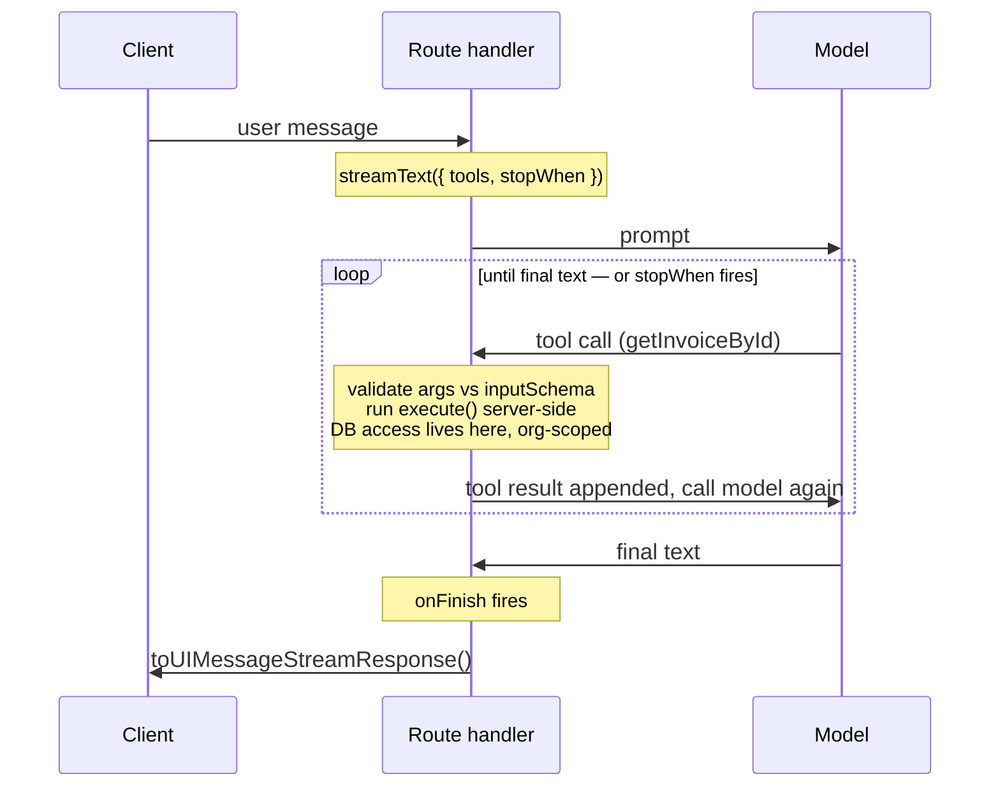

import AnnotatedCode from '../../../components/code/annotated-code/AnnotatedCode.astro';
import AnnotatedStep from '../../../components/code/annotated-code/AnnotatedStep.astro';
import CodeVariants from '../../../components/code/code-variants/CodeVariants.astro';
import CodeVariant from '../../../components/code/code-variants/CodeVariant.astro';
import Sequence from '../../../components/exercises/sequence/Sequence.astro';
import Step from '../../../components/exercises/sequence/Step.astro';
import MultipleChoice from '../../../components/exercises/multiple-choice/MultipleChoice.astro';
import McqChoice from '../../../components/exercises/multiple-choice/McqChoice.astro';
import McqWhy from '../../../components/exercises/multiple-choice/McqWhy.astro';
import Figure from '../../../components/figures/Figure.astro';
import Term from '../../../components/ui/Term.astro';
import ExternalResource from '../../../components/ui/ExternalResource.astro';
import VideoCallout from '../../../components/embeds/VideoCallout.astro';
import CourseProgressBar from '../../../components/ui/CourseProgressBar.astro';
import { CardGrid } from '@astrojs/starlight/components';

<CourseProgressBar value={frontmatter['course-progress']} />

The chat surface you built in the last chapter can talk about invoices. It cannot look one up. Ask it "what's the total on invoice INV-0042?" and it will answer confidently and wrongly — because the only things the model has ever seen are its training data and the words in this conversation. Your database isn't in either. The model can transform text; it cannot reach into your app.

Tools are how it reaches. A tool is the bridge from a model that produces language to an app that owns data, and by the end of this lesson you'll be able to define one, explain exactly where its code runs and why that single fact decides whether it's safe, and cap a multi-step loop so a single chat turn can't quietly burn your budget. This is also where a loose end gets tied off: the previous chapter named a `finishReason` value, `'tool-calls'`, and deferred it "to the next chapter." This is that chapter, and that value is about to mean something.

## A tool is a function the model can ask you to run

Strip away the loop and the lifecycle and everything else for a moment, because the unit you have to hold first is small: a tool is three fields. You hand them to the SDK's `tool` helper, and together they describe one function the model is allowed to ask you to run.

<AnnotatedCode lang="ts" code={`
const getInvoiceById = tool({
  description: 'Look up a single invoice by its ID for the current organization.',
  inputSchema: z.object({
    invoiceId: z.uuid().describe('The UUID of the invoice to look up.'),
  }),
  execute: async ({ invoiceId }) => {
    // server-side query — covered next section
  },
});
`}>
  <AnnotatedStep meta="{2}" color="blue">
    The most under-rated field in the whole SDK. The model reads this string to decide *when* to reach for this tool. "Gets data" tells it nothing; it will pick the wrong tool or none at all. Write the description the way you'd brief a junior contractor: one line, exact about what the tool does and when it applies. This is a prompt, not a comment — it ships to the model on every request.
  </AnnotatedStep>

  <AnnotatedStep meta="{3-5}" color="blue">
    A Zod schema, but pointed at a tool instead of a form. The SDK serializes it to JSON Schema and sends it to the model as the tool's call signature, so the model knows what arguments to produce. When the model emits a call, the SDK validates those arguments against this schema *before* `execute` ever runs. Note `z.uuid()` is the top-level builder, and `.describe()` on the field is read by the model too — the same three-jobs-in-one Zod contract you used for structured output, now describing a function the model can call.
  </AnnotatedStep>

  <AnnotatedStep meta="{6-8}" color="blue">
    The async function that does the real work and returns the result. For now just hold it as "the body." *Where* this body runs is the whole next section, and it's the part the syntax hides.
  </AnnotatedStep>
</AnnotatedCode>

The schema deserves one callout before you move on, because it's the single most likely thing to trip you on your first compile.

:::note
The SDK renamed these fields in version 5. The input schema field used to be `parameters`; it is now `inputSchema`. There is also a new optional `outputSchema` for typing what the tool returns end-to-end (you'll put it to work in the next lesson). Every tutorial written before the v5 release still uses `parameters`, so when you copy one and the types refuse to line up, this rename is almost always why.
:::

That serialized format the SDK sends to the model — <Term content="A language-neutral schema format the SDK serializes your Zod schema into so it can describe the tool's call signature to the model.">JSON Schema</Term> — is the same translation layer that carried your structured-output schemas. You write Zod; the model sees JSON Schema; you never write JSON Schema by hand.

<VideoCallout videoId="h8gMhXYAv1k" videoTitle="What is Tool Calling? Connecting LLMs to Your Data">
  IBM's Roy Derks draws the whole loop in five minutes — name, description, and parameters in, the model recommending a call, your code running it, the result fed back. The framework-agnostic version of what you just defined.
</VideoCallout>

## Where `execute` runs — the trust boundary

Here is the idea the rest of this lesson orbits, and it's worth slowing down for, because the syntax gives you no hint that it's true. Look at that `execute` function again. Nothing about it says *where* it runs. So decide what you'd expect: the model proposed the call, so does the model run the function?

It does not. `execute` runs **server-side, inside the very same Next.js route handler that called `streamText`** — never on the model's side, never in the browser. The model's entire contribution is a request: "please run `getInvoiceById` with this `invoiceId`." Your code runs it.

Once you see that, the security consequences fall out, and they're the reason this matters more than any knob in the lesson:

- `execute` closes over the handler's scope. The `session`, the `orgId`, the audit logger, the `db` client — all of it is in reach inside the function, exactly as it would be in any other handler. So when the model says "look up invoice X," it is *your tool's code* that checks the requested row against `session.orgId`. The model never makes that check. The model can't make that check; it's just text on the other side of a wire.
- The model never receives a database connection, an API key, or a row outside its own organization. The tool runs the query, takes only the fields the model needs, and hands that slice back. Everything else stays server-side.
- Which means tools inherit your entire authorization stack for free — *but only if you put the scope filter inside `execute`.* Leave it out and you've built the oldest multi-tenant bug there is, except now anything the model decides to call can trigger it.

That last point is not abstract. Look at the same tool written two ways.

<CodeVariants>
  <CodeVariant label="Leaks across tenants">
    <div data-mark-color="red">

    ```ts {3}
    execute: async ({ invoiceId }) => {
      return db.query.invoices.findFirst({
        where: eq(invoices.id, invoiceId),
      });
    },
    ```

    </div>
    **The model can now read any organization's invoice — the worst multi-tenant bug there is, reachable by a sentence.** The query trusts the `invoiceId` the model passed and nothing else; a valid ID from a different organization comes straight back.
  </CodeVariant>

  <CodeVariant label="Org-scoped">
    <div data-mark-color="green">

    ```ts {3}
    execute: async ({ invoiceId }) => {
      return db.query.invoices.findFirst({
        where: and(eq(invoices.id, invoiceId), eq(invoices.orgId, session.orgId)),
      });
    },
    ```

    </div>
    **The scope filter lives inside `execute`, closing over the handler's `session`.** The model still only controls `invoiceId`; the `orgId` comes from the authenticated session, never from anything the model emits. This is non-negotiable on every tool that touches a tenant-owned table.
  </CodeVariant>
</CodeVariants>

State it as the rule it is: **an unauthenticated or unscoped tool is a bug class, not a shortcut.** It's the same tenancy discipline you already enforce on every route and action, applied to a new caller — one that decides what to call on its own.

One note on how this looks in the real codebase versus here. In the app, the scope filter isn't hand-written inside each tool; the tool calls a tenant-scoped query helper from `db/queries/` that already closes over the organization, the same `tenantDb(orgId)` factory every other read goes through. The inline `eq(invoices.orgId, session.orgId)` in these snippets is flattened on purpose so the boundary is visible in one place — in production the structure enforces it for you. The lesson teaches the principle; the file layout is where it gets locked down.

<MultipleChoice>
  The model emits a call to `getInvoiceById` with an `invoiceId`. What is the *only* place that can keep the returned row inside the caller's own organization?

  <McqChoice correct>The tool's own `execute` body, which runs in the route handler and can read `session.orgId`</McqChoice>
  <McqChoice>The model's decision about which `invoiceId` to ask for</McqChoice>
  <McqChoice>The SDK's validation of the arguments against `inputSchema`</McqChoice>
  <McqChoice>`convertToModelMessages`, as it prepares the message history</McqChoice>

  <McqWhy>`execute` runs server-side, inside the same handler that called `streamText`, so it closes over the authenticated `session` and `orgId`. The model only *proposes* the call — your tool's code is what filters the query by `session.orgId`, and it's the only thing in this list that can. The correct answer: the org-scope check lives inside `execute`. The model is just text on the other side of a wire and never sees the session; `inputSchema` validation only checks the *shape* of the arguments, not who's allowed to see the row; and `convertToModelMessages` only translates message formats. Leave the scope filter out of `execute` and you've built the classic cross-tenant leak — now reachable by a sentence.</McqWhy>
</MultipleChoice>

## Wiring one tool into `streamText`

You already know the chat handler from the previous chapter. Adding a tool to it is a one-line change: a `tools` option on the `streamText` call you already have.

<div data-mark-color="blue">

```ts {4}
const result = streamText({
  model: smartModel,
  messages: convertToModelMessages(messages),
  tools: { getInvoiceById },
});
```

</div>

Everything else is the handler you wrote before: `messages` still converted with `convertToModelMessages`, the return still `result.toUIMessageStreamResponse()`. The model handle is `smartModel`, imported from your models module — tool use is reasoning work, deciding *whether* to call and *with what arguments*, so it wants the stronger model, not the cheap one.

The `tools` object maps a name to a definition. The key — `getInvoiceById` here — is the name the model sees and the name you'll match on later. Hold that key in mind: when the model invokes this tool, the assistant message grows a part typed `tool-getInvoiceById`, and that part moves through four states over its short life:

- `input-streaming` — the model's argument tokens are still arriving.
- `input-available` — the arguments are parsed and validated; `execute` is running.
- `output-available` — `execute` returned; the result is on the part.
- `output-error` — `execute` threw, or the SDK couldn't validate the arguments.

These live in the same parts array you learned to walk and render in the previous chapter. Right now you only need to know the states *exist* and what each means, because the loop and the error handling ahead both refer to them. Turning these four states into actual on-screen components — a skeleton while the tool runs, the real card when it returns — is the next lesson's entire job.

## Why one step isn't enough — the agentic loop

Now the part that makes tools actually answer questions, and the cleanest way to see why it's needed is to watch the naive version fail.

Suppose the SDK ran the model exactly once. The user asks for the total on INV-0042. The model decides it needs the invoice and emits a `getInvoiceById` call. The SDK runs `execute`, gets the row back — and stops. The turn is over. The model emitted a tool call and never got to *see the result*, so it never answered the question. You've fetched the data and thrown it away.

The fix is to loop. After the tool runs, you feed its result back to the model and ask again — now the model has the data and can write the answer. Concretely, one chat turn runs like this:

1. The prompt goes to the model.
2. The model emits a tool call, or final text.
3. If it's a tool call: the SDK validates the arguments against `inputSchema` and runs `execute` server-side.
4. The SDK appends the result as a tool-result message.
5. The SDK calls the model *again*, now with that result in context.
6. Repeat until the model returns text with no tool call — or a stop condition fires.

That phrase, *or a stop condition fires*, is the senior knob, and it's where version 5 changed the shape of the problem. In version 4 the loop lived on the client, controlled by `maxSteps` on the `useChat` hook. In version 5 the loop is a **server-side** concern, controlled by `stopWhen` on the `streamText` call. This is the single biggest version-4-to-5 shift for anyone building agents, and it's the right move: the cap belongs with the code that spends the money, not with the browser.

<div data-mark-color="orange">

```ts "stopWhen: stepCountIs(5)"
streamText({ model: smartModel, messages, tools, stopWhen: stepCountIs(5) });
```

</div>

Two facts about `stopWhen` you have to internalize, because both are easy to get wrong and both cost real money:

**Omitting `stopWhen` is not the simpler example — it's a cost bug.** Leave it off and the SDK doesn't run one step; it defaults to `stepCountIs(20)`. That's a twenty-step ceiling, and a workload that should have stopped at two will happily run until something else makes it stop. This is the exact cost-cap discipline you already practice with `maxOutputTokens`, generalized from tokens-per-call to steps-per-turn. The engineer who never ships a call without `maxOutputTokens` never ships a multi-step call without an explicit `stopWhen`.

One precision point so you read the cap correctly: `stopWhen` is only evaluated when the last step produced tool results. A step where the model just returns plain text always completes on its own, cap or no cap. So `stopWhen` governs *tool-using* loops specifically — it caps how many times the model is allowed to call a tool and come back, not how long an ordinary text reply can run.

Picking the number is a judgment call, and the senior cut is narrow:

| `stopWhen` | Reach for it when… |
| --- | --- |
| `stepCountIs(2)` | One tool call plus a summary turn — the common "look it up and tell me" shape. |
| `stepCountIs(5)` | Most multi-tool workloads. The sensible default. |
| `stepCountIs(10)` | Only when the workload is genuinely multi-tool and chained. |

The whole loop fits in one picture, and it's worth studying because two things prose leaves abstract — the iteration, and the fact that `execute` lives server-side — become concrete the moment you see them on a timeline.

<Figure>
  <Fragment slot="caption">
    The agentic loop. `execute` runs inside the route handler, never on the model's side, and `stopWhen` caps how many times the loop comes back around.
  </Fragment>

</Figure>

Before moving on, rebuild the loop from memory — reconstructing the order yourself sticks far better than reading it again.

<Sequence instructions="Order the steps of a single chat turn that uses a tool, from the user's message to the final reply.">
  <Step>The user's message reaches the route handler</Step>
  <Step>The model emits a `tool-getInvoiceById` call</Step>
  <Step>The SDK validates the call's arguments against `inputSchema`</Step>
  <Step>`execute` runs server-side and queries the organization's invoice</Step>
  <Step>The tool result is appended and the model is called again</Step>
  <Step>The model returns final text and `onFinish` fires</Step>
</Sequence>

## Stop conditions beyond a step cap

`stepCountIs(n)` is the workhorse, and most of the time it's all you reach for. Two other shapes exist for the cases it doesn't cover.

The first is `hasToolCall`. You define a tiny `finish` tool that does nothing except exist, and you tell the loop to stop the moment the model calls it. This is the explicit-completion pattern: useful when the workload has a clear terminal state the model can recognize and announce, rather than a step count you're guessing at. The second is a custom predicate — a function over the steps so far that returns whether to stop. This is where you cap by *budget* instead of step count: a five-step loop that has already burned 50,000 tokens is a runaway, and a predicate that watches cumulative usage is one place to catch it.

```ts
stopWhen: stepCountIs(5);
stopWhen: hasToolCall('finish');
stopWhen: ({ steps }) => totalTokens(steps) > 50_000;
```

`stopWhen` also accepts an *array* of conditions and stops when any one of them fires, so `stopWhen: [stepCountIs(5), hasToolCall('finish')]` reads exactly how it looks — stop at five steps *or* when the model says it's done, whichever comes first. Keep `stepCountIs` as your reflex; reach for the others when the workload genuinely calls for them.

## Auditing and metering every step — `onStepFinish`

You already wired an `onFinish` callback in the previous chapter to write the usage ledger after a turn completes. The loop adds a second slot next to it, and the distinction between them is the whole point: `onFinish` fires **once, at the end**, with the aggregate for the entire turn. `onStepFinish` fires **after each step in the loop**, with that step's own `usage`, `toolCalls`, `toolResults`, and `finishReason`. They don't replace each other — they compose.

<AnnotatedCode lang="ts" code={`
streamText({
  model: smartModel,
  messages,
  tools,
  maxOutputTokens: 1024,
  stopWhen: stepCountIs(5),
  onStepFinish: ({ usage, toolCalls, toolResults, finishReason }) => {
    // per-step audit + rolling quota increment
  },
  onFinish: ({ totalUsage }) => {
    // aggregate ledger write
  },
});
`}>
  <AnnotatedStep meta="{7-9}" color="orange">
    Runs inside the loop, once per step. This is where a per-step audit event lands — a `llm.step.completed` carrying the tool name and the *shape* of its arguments, never the raw values if they could be personal data (the same hash-and-metadata discipline you apply to prompts). It's also where you increment the user's rolling token counter mid-loop, so a runaway is caught *while it's running* rather than after it has finished spending.
  </AnnotatedStep>

  <AnnotatedStep meta="{10-12}" color="green">
    Runs once, at the end. This is the aggregate ledger write from the previous chapter. The argument is `totalUsage` — the cross-step total — not the last step's `usage`. Get those two backwards and you'll bill every multi-step turn for a single step. Per-step `usage` in `onStepFinish`; aggregate `totalUsage` in `onFinish`.
  </AnnotatedStep>
</AnnotatedCode>

The reason per-step accounting exists at all is in that orange step: <Term content="Counting resource use — here, tokens — per unit of work so you can enforce a quota or bill against it.">metering</Term> that only happens in `onFinish` bills the user *after* the damage is done. A loop that's about to run away has already run away by the time the aggregate arrives. Counting per step is how you stop it mid-flight.

## Returning errors instead of throwing

Tools fail. The row isn't there, the permission check refuses, an upstream service times out. How you handle that failure *inside* `execute` is a small decision with an outsized effect on the user, and the rule is the one you already follow everywhere else in the codebase: return the expected, throw the unexpected.

Walk the cause and effect. A thrown error inside `execute` breaks the stream — the protocol carrying the turn errors out, the user watches the conversation die, and they get nothing useful. A *returned* error result is just another tool result: it flows back to the model, the model reads it, and the model can recover in plain language — "I couldn't find an invoice with that ID, can you double-check it?" One of these is a 500; the other is a graceful answer.

<CodeVariants>
  <CodeVariant label="Throws — kills the stream">
    <div data-mark-color="red">

    ```ts {3}
    execute: async ({ invoiceId }) => {
      const invoice = await getInvoice(invoiceId, session.orgId);
      if (!invoice) throw new Error('not found');
      return invoice;
    },
    ```

    </div>
    **A thrown error breaks the stream protocol — the whole turn errors and the user is left staring at a dead conversation.** The model never sees the failure, so it can't recover from it.
  </CodeVariant>

  <CodeVariant label="Returns — the model recovers">
    <div data-mark-color="green">

    ```ts {4, 7}
    execute: async ({ invoiceId }) => {
      try {
        const invoice = await getInvoice(invoiceId, session.orgId);
        if (!invoice) return { error: 'invoice_not_found' as const };
        return { invoice };
      } catch {
        return { error: 'lookup_failed' as const };
      }
    },
    ```

    </div>
    **A returned error flows back as a tool result the model can read and react to.** The missing row and the failed query both come back as typed error shapes; the model apologizes or asks the user to retry. Only genuine programmer errors should bubble past `execute` to the framework boundary.
  </CodeVariant>
</CodeVariants>

The `as const` on each error string locks the shape at the type level, and the `outputSchema` field mentioned earlier is where you'd formalize that into a typed union the client can rely on — the next lesson puts it to work. This is also the moment to connect back to the four part states: `output-error` is precisely what the client sees when you *do* throw, or when the SDK can't validate the arguments. Returning a typed error keeps the part in `output-available` with a result the model understood, which is almost always what you want. And the same discipline you use elsewhere holds here — even the friendly recovery sentence should never leak a raw database error string back to the user.

## Don't dump rows back — project the result

There's one more decision hiding in `execute`'s return value, and it's both a correctness and a cost decision. The model sees tool results as JSON injected into the next step's context. So picture a tool that returns a 200-row query result. That entire blob rides into the next step's prompt — and the step after that, and every step until the turn ends, because once it's in context it stays there. You've turned one fat result into a tax paid on every remaining loop step.

The reflex is to **project, not dump.** Return the minimal shape the model needs to answer the question — a total, a top-N list, a derived summary — never the raw rows. This is the cost discipline you've been building, applied to tool design: input tokens are paid per step, so a fat tool result gets multiplied by however many steps are left in the loop.

<CodeVariants>
  <CodeVariant label="Dumps the whole row">
    <div data-mark-color="red">

    ```ts {3}
    execute: async ({ invoiceId }) => {
      const invoice = await getInvoice(invoiceId, session.orgId);
      return invoice;
    },
    ```

    </div>
    **Every field rides into the next step's prompt, on every remaining step.** The full Drizzle row carries dozens of columns the model will never use — internal flags, timestamps, foreign keys — and you pay input tokens for all of them, repeatedly.
  </CodeVariant>

  <CodeVariant label="Projects what the model needs">
    <div data-mark-color="green">

    ```ts {5}
    execute: async ({ invoiceId }) => {
      const invoice = await getInvoice(invoiceId, session.orgId);
      if (!invoice) return { error: 'invoice_not_found' as const };
      const { id, customerName, total, dueDate, status } = invoice;
      return { id, customerName, total, dueDate, status };
    },
    ```

    </div>
    **Only the five fields the model needs to answer.** The result is small, cheap on every step, and the `outputSchema` can lock exactly this shape so a stray column can never leak back in.
  </CodeVariant>
</CodeVariants>

The discipline is locked at the type level with <Term content="Selecting and reshaping only the fields a consumer needs, instead of handing over the whole record.">projection</Term> via `outputSchema`: define the shape you intend the model to see, and the tool can't accidentally hand back the whole row. In the next lesson this same projected shape becomes the props contract for the React component that renders it — so designing it well here pays off twice.

## Forcing or forbidding tool use — `toolChoice`

By default the model decides whether to call a tool, and that's the right default for almost everything. The `toolChoice` option lets you override that decision on the rare occasions you need to.

<div data-mark-color="blue">

```ts "toolChoice: 'auto'"
streamText({ model: smartModel, messages, tools, toolChoice: 'auto' });
```

</div>

It takes four values. `'auto'` — the default — lets the model decide, and it's the reach for roughly ninety-five percent of surfaces. `'required'` forces a tool call on the first step, the right choice for a surface that *must* ground its answer in data, where a free-text reply would be a regression. `'none'` disables tools entirely, useful for a follow-up turn whose only job is to summarize what's already been gathered. And `{ type: 'tool', toolName: 'getInvoiceById' }` pins one specific tool. The guidance is one sentence: reach past `'auto'` only when the workload demands it.

## Adapting the call mid-loop — `prepareStep`

The last knob is one to know exists and almost never use, so let's lead with the trigger and keep it short. `prepareStep` is a function that runs *before* each step and can change the call's settings between steps. Its legitimate uses are narrow and specific:

- **Plan with the smart model, execute with the fast one.** The first step does the reasoning on `smartModel`; once the plan is set, follow-up steps swap to a cheaper model. A cost optimization for a proven workload, not a starting point.
- **Drop tools after they've been used.** After the database has been queried, remove the query tools so the model can't sit in a loop re-querying the same thing.

<div data-mark-color="blue">

```ts {6-7}
streamText({
  model: smartModel,
  messages,
  tools,
  stopWhen: stepCountIs(5),
  prepareStep: ({ stepNumber }) =>
    stepNumber === 0 ? {} : { model: fastModel },
});
```

</div>

Reach for `prepareStep` only when a single static call shape genuinely doesn't fit — and notice that the plain multi-step handler you've been building all lesson has *no* `prepareStep` at all. It's a power tool for a specific cut, not a line you add to every handler by reflex.

## The shape that composes everything

You've met every seam in isolation. Here they are assembled into the one handler they all live in — the same `app/api/chat/route.ts` you've been growing since the previous chapter, now with tools wired through it.

<AnnotatedCode lang="ts" code={`
export const POST = authedRoute('member', chatRequestSchema, async ({ messages }) => {
  const result = streamText({
    model: smartModel,
    messages: convertToModelMessages(messages),
    tools: { getInvoiceById },
    maxOutputTokens: 1024,
    stopWhen: stepCountIs(5),
    onStepFinish: ({ usage, toolCalls }) => {
      // per-step audit + rolling quota
    },
    onFinish: ({ totalUsage }) => {
      // aggregate ledger write
    },
  });
  return result.toUIMessageStreamResponse();
});
`}>
  <AnnotatedStep meta="{1}" color="blue">
    The wrapper does the same job it does on every route — authentication, the caller's role, org scope, and body validation, all lifted out of the handler body. In production the per-user quota wraps around this too; it's abbreviated here for focus. The `session` and `orgId` this establishes are what every tool's `execute` closes over.
  </AnnotatedStep>

  <AnnotatedStep meta="{5}" color="green">
    The doorway. Each tool's `execute` runs inside this handler, with the session and org scope from the wrapper already in reach — which is why the scope filter belongs inside the tool and nowhere else.
  </AnnotatedStep>

  <AnnotatedStep meta="{6-7}" color="orange">
    The two cost caps, side by side: `maxOutputTokens` bounds how much any single response can produce, `stopWhen` bounds how many times the loop comes around. Neither is optional on a real handler.
  </AnnotatedStep>

  <AnnotatedStep meta="{8-13}" color="violet">
    The two metering slots. Per-step accounting in the loop, aggregate ledger write at the end — audit and quota covered at both granularities.
  </AnnotatedStep>

  <AnnotatedStep meta="{15}" color="blue">
    The same parts protocol the client already speaks. Adding tools didn't change the return; tool calls simply arrive as new `tool-<name>` parts in the stream the client was already reading.
  </AnnotatedStep>
</AnnotatedCode>

That's the whole shape. Read it once more with the lesson's spine in mind: every tool in this app lives inside the same wrapper every route does, so the model's reach into your data is bounded by exactly the authorization you already enforce. Drop the scope filter and you reopen the multi-tenant leak — *an unauthenticated tool is a bug class.* That's the one reflex to carry out of here.

One last watch-out before you go, because it's the sharpest edge in the chapter: when a tool *does* something destructive — sends an invoice, deletes a row, charges a card — the model must not be allowed to fire it on its own mid-loop. The pattern is to require a human to confirm in the UI before the next step runs, splitting the propose and the commit into two tools. You'll build that pattern in full in the next lesson; for now, just flag it in your head: destructive tools need a human in the loop.

The model orchestrates language; the tool owns the data. The next lesson takes the *output* of a tool call — that projected slice you were careful to keep small — and renders it as a real React component instead of a blob of JSON in a chat bubble.

## Check yourself

The single most expensive mistake in this lesson is the one that doesn't error. Make sure it's not still hiding.

<MultipleChoice>
  You ship a multi-step chat handler with `tools` but no `stopWhen`. A user asks a question that sends the model into a long tool-calling loop. What happens?

  <McqChoice>The SDK throws at the call site, because `stopWhen` is required the moment you pass `tools`.</McqChoice>
  <McqChoice>The model runs a single step, emits its tool call, and the turn ends before it ever answers.</McqChoice>
  <McqChoice correct>The loop keeps going up to a built-in ceiling of 20 steps, spending far more than the workload ever needed.</McqChoice>
  <McqChoice>The loop has no ceiling at all and keeps calling tools until the request finally times out.</McqChoice>

  <McqWhy>The correct answer: it runs up to 20 steps. Omitting `stopWhen` doesn't disable the loop or error — the SDK silently falls back to `stepCountIs(20)`, so a two-step workload can quietly burn up to twenty. That silent default is exactly why the missing cap is a cost bug, not a simpler example. It doesn't throw (`stopWhen` is optional), it doesn't stop after one step (that's `stepCountIs(1)`, the can't-see-the-result failure), and it isn't unbounded (the 20-step ceiling bounds it — just far higher than most turns deserve).</McqWhy>
</MultipleChoice>

## Go deeper

<CardGrid>

<ExternalResource
  title="Tool Calling"
  href="https://ai-sdk.dev/docs/ai-sdk-core/tools-and-tool-calling"
  icon="simple-icons:vercel"
  iconColor="#000000"
  description="The AI SDK Core reference for the exact tool API surface — inputSchema, execute, toolChoice, and the call lifecycle."
/>

<ExternalResource
  title="Agents: Loop Control"
  href="https://ai-sdk.dev/docs/agents/loop-control"
  icon="simple-icons:vercel"
  iconColor="#000000"
  description="The canonical reference for stopWhen, the built-in stop conditions, and prepareStep."
/>

<ExternalResource
  title="AI SDK Foundations: Tools"
  href="https://ai-sdk.dev/docs/foundations/tools"
  icon="simple-icons:vercel"
  iconColor="#000000"
  description="The conceptual primer behind the API: what a tool is, its three parts, and how custom, provider-defined, and provider-executed tools differ."
/>

<ExternalResource
  title="How tool use works"
  href="https://platform.claude.com/docs/en/agents-and-tools/tool-use/how-tool-use-works"
  icon="simple-icons:anthropic"
  iconColor="#D97757"
  description="Anthropic's model-side view of the same loop — the model proposes, your code executes, the result flows back. The trust boundary, stated by the model vendor."
/>

</CardGrid>
