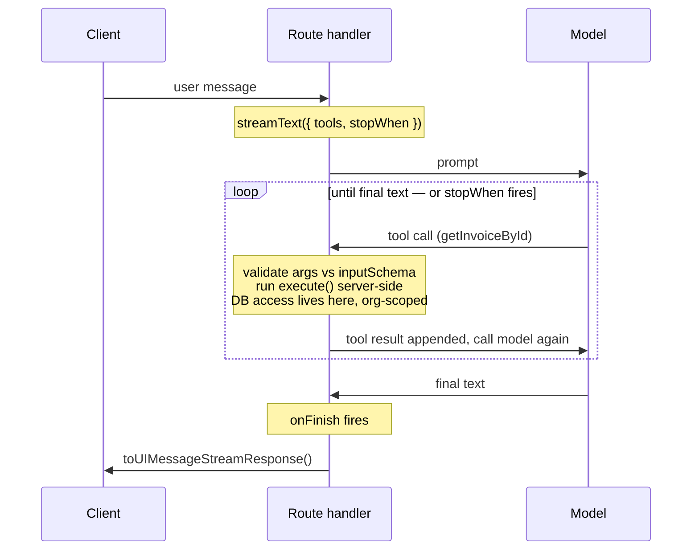

import AnnotatedCode from '../../../components/code/annotated-code/AnnotatedCode.astro';
import AnnotatedStep from '../../../components/code/annotated-code/AnnotatedStep.astro';
import CodeVariants from '../../../components/code/code-variants/CodeVariants.astro';
import CodeVariant from '../../../components/code/code-variants/CodeVariant.astro';
import Sequence from '../../../components/exercises/sequence/Sequence.astro';
import Step from '../../../components/exercises/sequence/Step.astro';
import MultipleChoice from '../../../components/exercises/multiple-choice/MultipleChoice.astro';
import McqChoice from '../../../components/exercises/multiple-choice/McqChoice.astro';
import McqWhy from '../../../components/exercises/multiple-choice/McqWhy.astro';
import Figure from '../../../components/figures/Figure.astro';
import Term from '../../../components/ui/Term.astro';
import ExternalResource from '../../../components/ui/ExternalResource.astro';
import VideoCallout from '../../../components/embeds/VideoCallout.astro';
import CourseProgressBar from '../../../components/ui/CourseProgressBar.astro';
import { CardGrid } from '@astrojs/starlight/components';

<CourseProgressBar value={frontmatter['course-progress']} />

The chat surface you built in the last chapter can talk about invoices, but it cannot look one up.
Ask it "what's the total on invoice INV-0042?" and it answers confidently and wrong: the model has only ever seen its training data and this conversation, and your database is in neither.
It can transform text; it cannot reach into your app.

A tool is how it reaches in: the bridge from a model that produces language to an app that owns data.
This lesson defines one, pins down where its code runs and why that decides whether it's safe, and caps the multi-step loop so one chat turn can't quietly burn your budget.

## A tool is a function the model can ask you to run

A tool is three fields you hand to the SDK's `tool` helper.

<AnnotatedCode lang="ts" code={`
const getInvoiceById = tool({
  description: 'Look up a single invoice by its ID for the current organization.',
  inputSchema: z.object({
    invoiceId: z.uuid().describe('The UUID of the invoice to look up.'),
  }),
  execute: async ({ invoiceId }) => {
    // server-side query — covered next section
  },
});
`}>
  <AnnotatedStep meta="{2}" color="blue">
    The model reads this string to decide *when* to reach for the tool.
    A vague "gets data" tells it nothing, so it picks the wrong tool or none at all.
    Write it the way you'd brief a junior contractor: one line, exact about what the tool does and when it applies.
    It's a prompt, not a comment, and it ships to the model on every request.
  </AnnotatedStep>

  <AnnotatedStep meta="{3-5}" color="blue">
    A Zod schema, but pointed at a tool instead of a form.
    The SDK sends it to the model as the tool's call signature, so the model knows what arguments to produce, and validates those arguments *before* `execute` runs.
    The model also reads each field's `.describe()` text.
    It's the same three-jobs-in-one Zod contract you used for structured output, now describing a function the model can call.
  </AnnotatedStep>

  <AnnotatedStep meta="{6-8}" color="blue">
    The async function that does the real work and returns the result.
    *Where* this body runs is the next section's subject, and the part the syntax hides.
  </AnnotatedStep>
</AnnotatedCode>

:::note
The SDK renamed the input schema field in version 5: `parameters` became `inputSchema`.
Tutorials written before v5 still use `parameters`, so when you copy one and the types refuse to line up, this rename is almost always why.
:::

The format the SDK actually sends is <Term definition="A language-neutral schema format the SDK serializes your Zod schema into to describe the tool's call signature to the model.">JSON Schema</Term>: you write Zod, the model sees JSON Schema, and you never write it by hand.

<VideoCallout videoId="h8gMhXYAv1k" videoTitle="What is Tool Calling? Connecting LLMs to Your Data">
  IBM's Roy Derks draws the whole loop in five minutes: name, description, and parameters go in, the model recommends a call, your code runs it, and the result feeds back.
  It's the framework-agnostic version of what you just defined.
</VideoCallout>

## Where `execute` runs: the trust boundary

The model proposed the call, so does the model run the function?

It does not. `execute` runs **server-side, inside the same Next.js route handler that called `streamText`**, never in the browser. The model's whole contribution is a request: "please run `getInvoiceById` with this `invoiceId`." Your code runs it.

The security consequences follow from that one fact:

- `execute` closes over the handler's scope, so the `session`, the `orgId`, the audit logger, and the `db` client are all in reach. When the model says "look up invoice X," *your* code checks the row against `session.orgId`. The model can't: it's text on the other side of a wire.
- The model never receives a database connection, an API key, or a row outside its own organization. The tool runs the query and returns only the fields the model needs.
- Tools inherit your entire authorization stack for free, *but only if the scope filter lives inside `execute`.* Leave it out and anything the model calls can leak across tenants.

Compare the same tool written two ways.

<CodeVariants>
  <CodeVariant label="Leaks across tenants">
    <div data-mark-color="red">

    ```ts {3}
    execute: async ({ invoiceId }) => {
      return db.query.invoices.findFirst({
        where: eq(invoices.id, invoiceId),
      });
    },
    ```

    </div>
    **The query trusts the model's `invoiceId` and nothing else, so a valid ID from another organization comes straight back.** One sentence is all it takes to read any tenant's invoice.
  </CodeVariant>

  <CodeVariant label="Org-scoped">
    <div data-mark-color="green">

    ```ts {3}
    execute: async ({ invoiceId }) => {
      return db.query.invoices.findFirst({
        where: and(eq(invoices.id, invoiceId), eq(invoices.orgId, session.orgId)),
      });
    },
    ```

    </div>
    **The scope filter lives inside `execute`, closing over the handler's `session`.** The model still controls only `invoiceId`; the `orgId` comes from the authenticated session, never from the model. Apply this to every tool that touches a tenant-owned table.
  </CodeVariant>
</CodeVariants>

So state the rule: **an unscoped tool is a bug class, not a shortcut.** It's the same tenancy discipline you enforce on every route and action, now applied to a caller that decides what to call on its own.

In the real codebase you don't hand-write the filter in each tool. The tool calls the same `tenantDb(orgId)` factory every other read goes through, which already closes over the organization. These snippets inline `eq(invoices.orgId, session.orgId)` only to show the boundary in one place.

<MultipleChoice>
  The model emits a call to `getInvoiceById` with an `invoiceId`. What is the *only* place that can keep the returned row inside the caller's own organization?

  <McqChoice correct>The tool's own `execute` body, which runs in the route handler and can read `session.orgId`</McqChoice>
  <McqChoice>The model's decision about which `invoiceId` to ask for</McqChoice>
  <McqChoice>The SDK's validation of the arguments against `inputSchema`</McqChoice>
  <McqChoice>`convertToModelMessages`, as it prepares the message history</McqChoice>

  <McqWhy>`execute` runs server-side in the same handler that called `streamText`, so it closes over the authenticated `session` and is the only thing here that can filter by `session.orgId`. The model just *proposes* the call and never sees the session. `inputSchema` validation checks the *shape* of the arguments, not who may see the row; `convertToModelMessages` only translates message formats. Leave the scope filter out of `execute` and you've built the classic cross-tenant leak, now reachable by a sentence.</McqWhy>
</MultipleChoice>

## Adding a tool to `streamText`

Adding a tool is a one-line change: a `tools` option on the `streamText` call from the previous chapter.

<div data-mark-color="blue">

```ts {4}
const result = streamText({
  model: smartModel,
  messages: convertToModelMessages(messages),
  tools: { getInvoiceById },
});
```

</div>

The rest of the handler is unchanged, including the model: deciding whether to call a tool, and with what arguments, is reasoning work, so it stays on `smartModel`, not the cheap one.

The `tools` object maps a name to a definition. That key, `getInvoiceById`, is the name the model sees and the name you'll match on later. When the model calls the tool, the assistant message grows a part typed `tool-getInvoiceById` that moves through four states:

- `input-streaming`: the argument tokens are still arriving.
- `input-available`: the arguments are validated and `execute` is running.
- `output-available`: `execute` returned, and its result is on the part.
- `output-error`: `execute` threw, or the arguments failed validation.

These parts live in the same array you walked in the previous chapter, and the loop and error handling ahead both refer back to these states.

## The agentic loop and `stopWhen`

The loop is what makes a tool answer a question. To see why, watch a single model call fall short.

The user asks for the total on INV-0042. The model decides it needs the invoice and emits a `getInvoiceById` call. The SDK runs `execute`, gets the row, and stops. The model never saw the result, so it never answered: you fetched the data and threw it away.

The fix is to loop. After the tool runs, you feed its result back to the model and ask again; now it has the data and can write the answer. One chat turn runs like this.

1. The prompt goes to the model.
2. The model emits a tool call, or final text.
3. On a tool call: the SDK validates the arguments against `inputSchema` and runs `execute` server-side.
4. The SDK appends the result as a tool-result message.
5. The SDK calls the model *again*, now with that result in context.
6. Repeat until the model returns text with no tool call, or a stop condition fires.

`stopWhen` is the knob for that stop condition, on `streamText`, where the spending happens.

<div data-mark-color="orange">

```ts "stopWhen: stepCountIs(5)"
streamText({ model: smartModel, messages, tools, stopWhen: stepCountIs(5) });
```

</div>

Two facts about `stopWhen` are easy to get wrong, and both cost money.

**Omitting it is a cost bug, not the simpler example.** Leave it off and the SDK defaults to `stepCountIs(20)`, so a workload that should stop at two steps runs until something else stops it. Never ship a multi-step call without an explicit cap.

**It is evaluated only after a step that produced tool results.** A step that returns plain text always completes on its own, so `stopWhen` caps how many times the model can call a tool and come back, not how long a text reply can run.

Picking the number is a judgment call.

| `stopWhen` | Reach for it when… |
| --- | --- |
| `stepCountIs(2)` | One tool call plus a summary, the common "look it up and tell me" shape. |
| `stepCountIs(5)` | Most multi-tool workloads. The sensible default. |
| `stepCountIs(10)` | Only when the workload is genuinely multi-tool and chained. |

<Figure>
  <Fragment slot="caption">
    The agentic loop: `execute` runs inside the route handler, and `stopWhen` caps how many times the loop comes back around.
  </Fragment>

</Figure>

Now rebuild the loop from memory.

<Sequence instructions="Order the steps of one tool-using chat turn, from the user's message to the final reply.">
  <Step>The user's message reaches the route handler</Step>
  <Step>The model emits a `tool-getInvoiceById` call</Step>
  <Step>The SDK validates the call's arguments against `inputSchema`</Step>
  <Step>`execute` runs server-side and queries the organization's invoice</Step>
  <Step>The tool result is appended and the model is called again</Step>
  <Step>The model returns final text and `onFinish` fires</Step>
</Sequence>

## Stop conditions beyond a step cap

`stepCountIs(n)` is the default and usually enough. Two other shapes cover what it can't.

`hasToolCall` stops the loop when the model calls a named tool. Define a do-nothing `finish` tool and the model can signal completion itself, which fits a workload with a clear terminal state better than a step count you're guessing at. A custom predicate is a function over the steps so far that returns whether to stop, letting you cap by *budget*, for example cumulative token usage, instead of step count.

```ts
stopWhen: stepCountIs(5);
stopWhen: hasToolCall('finish');
stopWhen: ({ steps }) => totalTokens(steps) > 50_000;
```

`stopWhen` also accepts an *array* and fires when any condition matches: `stopWhen: [stepCountIs(5), hasToolCall('finish')]` stops at five steps or when the model says it's done, whichever comes first.

## Per-step accounting: `onStepFinish` vs `onFinish`

The previous chapter wired `onFinish` to write the usage ledger after a turn completes. The loop adds a second slot beside it. `onFinish` fires **once at the end**, with the aggregate for the whole turn; `onStepFinish` fires **after each step**, with that step's own `usage`, `toolCalls`, `toolResults`, and `finishReason`. They compose.

<AnnotatedCode lang="ts" code={`
streamText({
  model: smartModel,
  messages,
  tools,
  maxOutputTokens: 1024,
  stopWhen: stepCountIs(5),
  onStepFinish: ({ usage, toolCalls, toolResults, finishReason }) => {
    // per-step audit + rolling quota increment
  },
  onFinish: ({ totalUsage }) => {
    // aggregate ledger write
  },
});
`}>
  <AnnotatedStep meta="{7-9}" color="orange">
    Runs once per step, inside the loop. Emit a `llm.step.completed` audit event carrying the tool name and the *shape* of its arguments, never raw values that could be personal data, the same hash-and-metadata discipline you apply to prompts. Increment the user's rolling token counter here too, so a runaway is caught *while it's running*, not after it has spent.
  </AnnotatedStep>

  <AnnotatedStep meta="{10-12}" color="green">
    Runs once at the end: the aggregate ledger write from the previous chapter. The argument is `totalUsage`, the cross-step total, not the last step's `usage`. Swap the two and you bill every multi-step turn as a single step.
  </AnnotatedStep>
</AnnotatedCode>

The orange step is why per-step accounting exists. <Term definition="Counting resource use — here, tokens — per unit of work so you can enforce a quota or bill against it.">Metering</Term> only in `onFinish` charges the user after the cost is incurred, too late to stop a runaway. Counting per step stops it mid-flight.

## Returning errors instead of throwing

Tools fail: the row isn't there, a permission check refuses, an upstream service times out.
Handling that failure *inside* `execute` follows the same rule as everywhere else: return the expected, throw the unexpected.

A thrown error breaks the stream and the user gets nothing; a returned error is just another tool result.
It flows back to the model, which reads it and recovers in plain language: "I couldn't find an invoice with that ID, can you double-check it?"

<CodeVariants>
  <CodeVariant label="Throws — kills the stream">
    <div data-mark-color="red">

    ```ts {3}
    execute: async ({ invoiceId }) => {
      const invoice = await getInvoice(invoiceId, session.orgId);
      if (!invoice) throw new Error('not found');
      return invoice;
    },
    ```

    </div>
    **A thrown error breaks the stream protocol: the turn errors and the conversation stops with nothing on screen.** The model never sees the failure, so it can't recover.
  </CodeVariant>

  <CodeVariant label="Returns — the model recovers">
    <div data-mark-color="green">

    ```ts {4, 7}
    execute: async ({ invoiceId }) => {
      try {
        const invoice = await getInvoice(invoiceId, session.orgId);
        if (!invoice) return { error: 'invoice_not_found' as const };
        return { invoice };
      } catch {
        return { error: 'lookup_failed' as const };
      }
    },
    ```

    </div>
    **A returned error flows back as a tool result the model can read and react to.** Missing row and failed query both return as typed error shapes the model can apologize for or retry. Only genuine programmer errors should bubble past `execute` to the framework.
  </CodeVariant>
</CodeVariants>

The `as const` locks each error string's shape, which `outputSchema` formalizes into a typed union the client uses next lesson.
A thrown error lands the part in `output-error`; a returned one keeps it in `output-available` with a result the model understood, almost always what you want.
Never leak a raw database error string back to the user.

## Project the result; don't dump rows back

`execute`'s return value is both a correctness and a cost decision.
The model sees each tool result as JSON in the next step's context, and once it's there it stays: a 200-row result rides into every remaining step of the turn, and you pay input tokens for it each time.

So **project, don't dump.** Return the minimal shape the model needs to answer, a total, a top-N list, or a summary, never the raw rows.

<CodeVariants>
  <CodeVariant label="Dumps the whole row">
    <div data-mark-color="red">

    ```ts {3}
    execute: async ({ invoiceId }) => {
      const invoice = await getInvoice(invoiceId, session.orgId);
      return invoice;
    },
    ```

    </div>
    **Every field rides into every remaining step.** The full Drizzle row carries dozens of columns the model never uses, such as internal flags, timestamps, and foreign keys, and you pay for all of them.
  </CodeVariant>

  <CodeVariant label="Projects what the model needs">
    <div data-mark-color="green">

    ```ts {5}
    execute: async ({ invoiceId }) => {
      const invoice = await getInvoice(invoiceId, session.orgId);
      if (!invoice) return { error: 'invoice_not_found' as const };
      const { id, customerName, total, dueDate, status } = invoice;
      return { id, customerName, total, dueDate, status };
    },
    ```

    </div>
    **Only the five fields the model needs.** The result is small, and `outputSchema` can lock exactly this shape so a stray column can never leak back in.
  </CodeVariant>
</CodeVariants>

Lock the discipline with <Term definition="Selecting and reshaping only the fields a consumer needs, instead of returning the whole record.">projection</Term> via `outputSchema`: define the shape you intend the model to see, and the tool can't return the whole row by accident.
The next lesson reuses this shape as the rendering component's props contract.

## Forcing or forbidding tool use: `toolChoice`

The model decides whether to call a tool, which is right almost everywhere; `toolChoice` overrides that on the rare occasions you need to.

<div data-mark-color="blue">

```ts "toolChoice: 'auto'"
streamText({ model: smartModel, messages, tools, toolChoice: 'auto' });
```

</div>

It takes four values: `'auto'` (the default) lets the model decide; `'required'` forces a tool call on the first step, for a surface that must ground its answer in data; `'none'` disables tools, for a follow-up turn that only summarizes what's already gathered; and `{ type: 'tool', toolName: 'getInvoiceById' }` pins one specific tool.

## Changing call settings between steps: `prepareStep`

`prepareStep` runs before each step and can change the call's settings; reach for it only when one static call shape doesn't fit, which is rare:

- **Plan with the smart model, execute with the fast one.** The first step reasons on `smartModel`; once the plan is set, follow-up steps swap to a cheaper model.
- **Drop tools after they've been used.** Once the database has been queried, remove the query tools so the model can't loop re-querying the same thing.

<div data-mark-color="blue">

```ts {6-7}
streamText({
  model: smartModel,
  messages,
  tools,
  stopWhen: stepCountIs(5),
  prepareStep: ({ stepNumber }) =>
    stepNumber === 0 ? {} : { model: fastModel },
});
```

</div>

## Everything in one handler

Here are all the pieces in the one handler they live in: the same `app/api/chat/route.ts` from the previous chapter, now with tools wired in.

<AnnotatedCode lang="ts" code={`
export const POST = authedRoute('member', chatRequestSchema, async ({ messages }) => {
  const result = streamText({
    model: smartModel,
    messages: convertToModelMessages(messages),
    tools: { getInvoiceById },
    maxOutputTokens: 1024,
    stopWhen: stepCountIs(5),
    onStepFinish: ({ usage, toolCalls }) => {
      // per-step audit + rolling quota
    },
    onFinish: ({ totalUsage }) => {
      // aggregate ledger write
    },
  });
  return result.toUIMessageStreamResponse();
});
`}>
  <AnnotatedStep meta="{1}" color="blue">
    The wrapper does its usual job: authentication, role, org scope, and body validation, lifted out of the handler (the per-user quota wraps this too, omitted here). The `session` and `orgId` it sets are what every tool's `execute` closes over.
  </AnnotatedStep>

  <AnnotatedStep meta="{5}" color="green">
    Where tools enter. Each `execute` runs inside this handler with the wrapper's session and org scope in reach, which is why the scope filter belongs in the tool and nowhere else.
  </AnnotatedStep>

  <AnnotatedStep meta="{6-7}" color="orange">
    The two cost caps: `maxOutputTokens` bounds a single response, `stopWhen` bounds how many times the loop comes around. Neither is optional on a real handler.
  </AnnotatedStep>

  <AnnotatedStep meta="{8-13}" color="violet">
    The two metering slots: per-step accounting in the loop, the aggregate ledger write at the end.
  </AnnotatedStep>

  <AnnotatedStep meta="{15}" color="blue">
    The same parts protocol the client already speaks: tool calls arrive as new `tool-<name>` parts in the stream it was already reading, so the return is unchanged.
  </AnnotatedStep>
</AnnotatedCode>

Because every tool sits inside the same wrapper every route does, the model's reach is bounded by the authorization you already enforce: drop the scope filter and you reopen the multi-tenant leak.

When a tool does something destructive, such as sending an invoice or charging a card, split propose and commit into two tools and require a human to confirm before the next step runs, the pattern you'll build next.

Next, you'll render a tool's output as a real React component instead of a JSON blob in a chat bubble.

## Check your understanding

The most expensive mistake in this lesson is the one that doesn't error.

<MultipleChoice>
  You ship a multi-step chat handler with `tools` but no `stopWhen`. A user asks a question that sends the model into a long tool-calling loop. What happens?

  <McqChoice>The SDK throws at the call site, because `stopWhen` is required the moment you pass `tools`.</McqChoice>
  <McqChoice>The model runs a single step, emits its tool call, and the turn ends before it ever answers.</McqChoice>
  <McqChoice correct>The loop keeps going up to a built-in ceiling of 20 steps, spending far more than the workload ever needed.</McqChoice>
  <McqChoice>The loop has no ceiling at all and keeps calling tools until the request finally times out.</McqChoice>

  <McqWhy>Omitting `stopWhen` doesn't error or disable the loop; the SDK silently falls back to `stepCountIs(20)`, so a two-step workload can quietly burn twenty. That silent default is what makes the missing cap a cost bug. It doesn't throw (`stopWhen` is optional), doesn't stop after one step (that's `stepCountIs(1)`), and isn't unbounded (20 bounds it, just far higher than most turns deserve).</McqWhy>
</MultipleChoice>

## Go deeper

<CardGrid>

<ExternalResource
  title="Tool Calling"
  href="https://ai-sdk.dev/docs/ai-sdk-core/tools-and-tool-calling"
  icon="simple-icons:vercel"
  iconColor="#000000"
  description="The AI SDK Core reference for the exact tool API surface — inputSchema, execute, toolChoice, and the call lifecycle."
/>

<ExternalResource
  title="Agents: Loop Control"
  href="https://ai-sdk.dev/docs/agents/loop-control"
  icon="simple-icons:vercel"
  iconColor="#000000"
  description="The canonical reference for stopWhen, the built-in stop conditions, and prepareStep."
/>

<ExternalResource
  title="AI SDK Foundations: Tools"
  href="https://ai-sdk.dev/docs/foundations/tools"
  icon="simple-icons:vercel"
  iconColor="#000000"
  description="The conceptual primer behind the API: what a tool is, its three parts, and how custom, provider-defined, and provider-executed tools differ."
/>

<ExternalResource
  title="How tool use works"
  href="https://platform.claude.com/docs/en/agents-and-tools/tool-use/how-tool-use-works"
  icon="simple-icons:anthropic"
  iconColor="#D97757"
  description="Anthropic's model-side view of the same loop — the model proposes, your code executes, the result flows back. The trust boundary, stated by the model vendor."
/>

</CardGrid>
